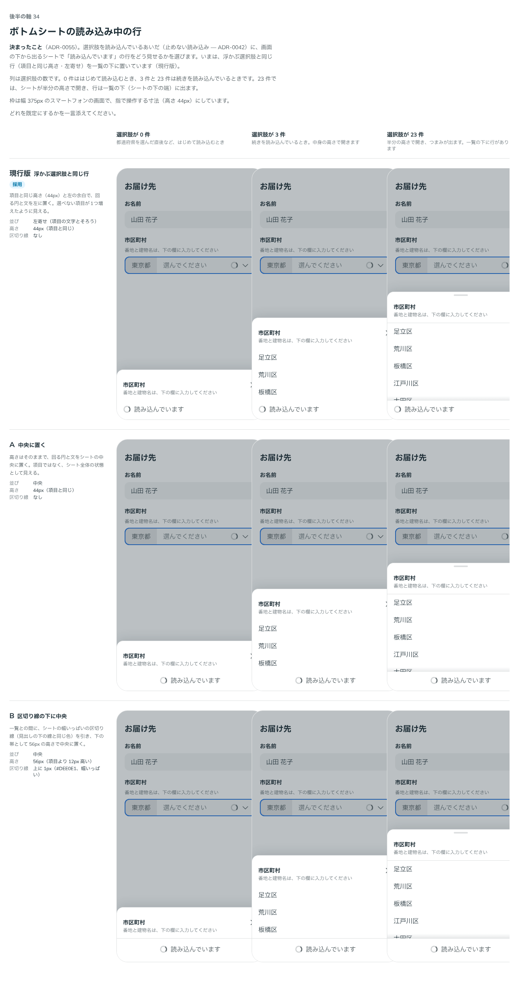

# 0055. ボトムシートの読み込み中の行と、読み込みの読み上げ

- ステータス: Accepted
- 日付: 2026-09-14
- ラウンド: 後半 軸34

## 背景

[ADR-0042](./0042-field-loading.md) で、Select の止めない読み込み（`loadingBehavior="non-blocking"`）は、開いた選択肢の最後に「読み込んでいます」の行（回る円＋文）を出すと決まりました。この行は、シートでも浮かぶ選択肢と同じ形（項目と同じ高さ・左寄せ）を一覧の下に置いていましたが、シートでの見た目は比べていませんでした。

読み上げについても、ADR-0042 は「本体の `aria-busy` と合わせて伝える」を前提にしていました。開くと同時に DOM に入る箱は、読み上げソフトによっては読まれず、`aria-busy` も多くの読み上げソフトで読まれません。2026-09-14 に、a11y の推奨（S2）としてこの前提を置き換える形を検討しました。

## 候補

### 見た目（軸34）

比較は Storybook の `Design Review/34 ボトムシートの読み込み中の行`（決めた時点のコミット `5de918a`。`git checkout 5de918a && pnpm storybook` で開けます）です。列は選択肢の数（0件・3件・23件）、行は現行版と2案です。変えたのは次のトークンだけです（`src/components/Select.tsx` のシートの読み込み中の行が読む）。

- `--select-sheet-loading-justify`: 並び（左寄せか中央か）
- `--select-sheet-loading-extra`: 項目の高さに足す高さ
- `--select-sheet-loading-line-width`: 上の区切り線の太さ（シートの幅いっぱい）

| 案     | 内容                                                                                   |
| ------ | -------------------------------------------------------------------------------------- |
| 現行版 | 浮かぶ選択肢と同じ行。項目と同じ高さ（44px）と左の余白で、回る円と文を左に置く         |
| A      | 中央に置く。高さはそのままで、回る円と文をシートの中央に置く                           |
| B      | 区切り線の下に中央。一覧との間に幅いっぱいの区切り線を引き、56px の高さで中央に置く    |

### 読み上げ（S2）

読み込んでいるあいだの知らせ方の案です。

| 案                     | 内容                                                                                                      |
| ---------------------- | ----------------------------------------------------------------------------------------------------------- |
| 現行版（ADR-0042）     | 見える読み込み中の行を `role="status"` にし、本体の `aria-busy` と合わせて伝える                            |
| S2（おすすめ）         | 閉じていても消えない見えない `status` の箱を本体のそばに置く。開いたときに「読み込んでいます」、読み込みが届いたときに「N 件の選択肢」を入れる。見える読み込み中の行は `role` の箱にしない（二重に読まないため） |

## 決定

**ボトムシートの読み込み中の行は、現行版（浮かぶ選択肢と同じ行）のままにします。読み上げは S2（本体のそばに置く、閉じていても消えない見えない status の箱）にし、ADR-0042 の「aria-busy と合わせて伝える」前提を置き換えます。**

| 項目                     | 決定                                                                                                                    |
| ------------------------ | ------------------------------------------------------------------------------------------------------------------------- |
| シートの読み込み中の行   | 現行版のまま。並びは左寄せ、高さは項目と同じ44px、区切り線なし                                                            |
| 読み上げの箱             | 本体のすぐ後ろに、`role="status"` の見えない箱（`sr-only`）を、Select を描いているあいだずっと置く                        |
| 開いたとき               | 読み込み中なら `loadingText`（既定「読み込んでいます」）を箱に入れる                                                      |
| 読み込みが届いたとき     | 開いたまま読み込みが終わったら `loadedText(count)`（既定 `` `${count} 件の選択肢` ``）を箱に入れる。言い換えられる       |
| N の数え方               | 選べない選択肢も含む一覧の数                                                                                              |
| 閉じたとき               | 箱を空に戻す                                                                                                              |
| 見える読み込み中の行     | `role` の箱にしない（二重に読まないため）                                                                                 |
| 浮かぶ選択肢・シート共通 | この箱は presentation によらず共通。シートの見た目（現行版）は変わらない                                                  |

## 理由

ユーザーのメモです（見た目・読み上げの順）。

> 34 現行で。

読み上げ（S2）について、はじめに挙げたときのメモです。

> S2 はちょっと欲しいかもですね。もっとも S5 で語っているように、Provider ベースの実装が最近は多い気がするので、backlog に追加しておきたいですね。

実装のあと、いまの決まりのどこを変えるかを説明したうえでの答えです。

> S2, F7, Chip はそれでよさそうです。

N の数え方への答えです。

> 12 「N 件の選択肢」の N は選べない選択肢も含む。答えは「このまま」

以下は、メモと比較から読み取れることです。

- **シートの見た目は変えない**: 「34 現行で。」浮かぶ選択肢と同じ行を、そのままシートでも使います
- **読み上げは、箱を先に置く形にする**: 開くと同時に DOM に入る役割の箱や `aria-busy` は、読み上げソフトによっては読まれません。閉じていても消えない箱を先に置き、中身だけを入れ替えることで、多くの読み上げソフトに届くようにします
- **N は選べない選択肢も含む**: 「このまま」。読み込んだ一覧の総数をそのまま伝えます

## 却下した案と理由

見た目:

- **A（中央に置く）**: 選ばれませんでした
- **B（区切り線の下に中央）**: 選ばれませんでした

読み上げ:

- **現行版（ADR-0042 の「aria-busy と合わせて伝える」）**: 選ばれませんでした。開くと同時に DOM に入る箱は、読み上げソフトによっては読まれないため、S2 に置き換えました

## 影響

- `tokens.css`: `--select-sheet-loading-justify`（`flex-start`）・`--select-sheet-loading-extra`（0px）・`--select-sheet-loading-line-width`（0px）は現行版の値のまま変更していません
- `src/components/Select.tsx`:
  - 本体（`BaseSelect.Trigger`）のすぐ後ろに、`role="status"` の `data-slot="select-status"` の見えない箱（`sr-only`）を、`BaseSelect.Root` の中にいつも置きました。絶対配置なので、欄の並び（flex の間）には入りません
  - 開閉（`open`）と読み込み中の行の有無（`loadingRow`）を見て、箱の中身（`announcement.text`）を切り替えます。開いた瞬間に読み込み中なら `loadingText`、開いたまま読み込みが届いたら `loadedText(items.length)`、閉じたら空文字列にします
  - `loadedText`（既定 `(count) => \`${count} 件の選択肢\`` ）を props に足しました。言い換えられます
  - 見える読み込み中の行（一覧のすぐ下の `data-slot="select-loading"`）は `role` を持たず、飾りの表示のままです
- [ADR-0042](./0042-field-loading.md) の「読み込み中の行は、開いたときに一緒に出るので、読み上げソフトによってはすぐには知らせません。本体の `aria-busy` と合わせて伝えます」という前提は、この ADR で置き換えました
- backlog から、S2（Select の読み込み中の知らせ方）を消しました

## 原則への反映

反映なし。読み上げの仕組み（S2）は部品の実装の決まりで、principles.md が扱う見た目の原則には関わりません。

## 比較画像

シートの読み込み中の行の見た目です。現行版に採用の印を付けています。

読み上げ（S2）は、見た目の比較をしていない決定です。閉じていても消えない見えない status の箱に文字を出し入れするだけで、画面の見た目は変わりません。
