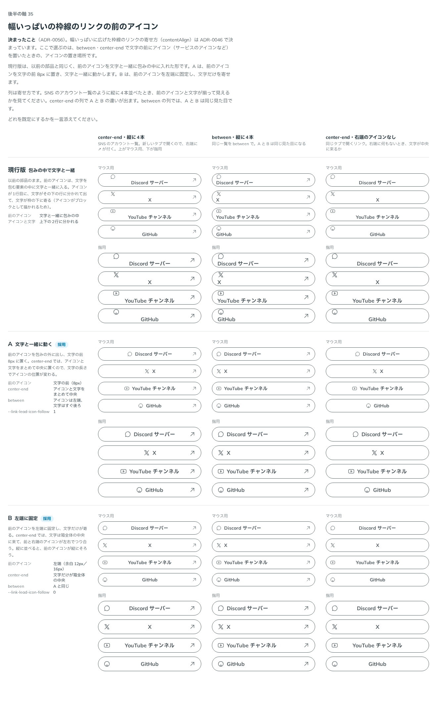
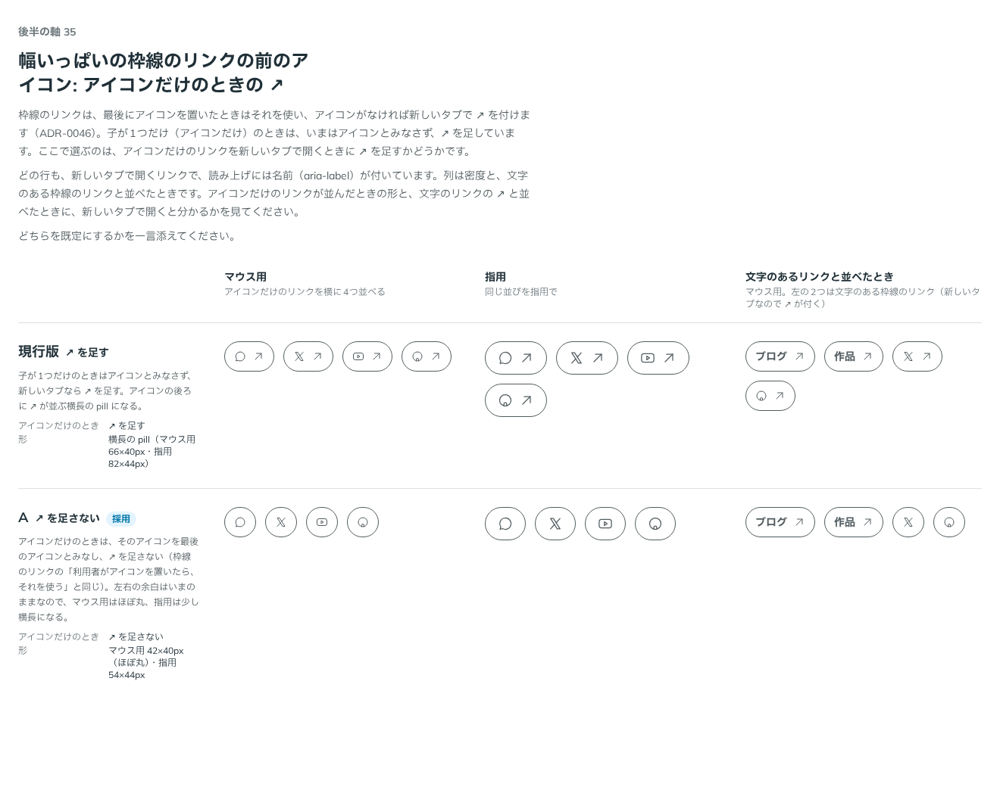

# 0056. 幅いっぱいの枠線のリンクの前のアイコン

- ステータス: Accepted
- 日付: 2026-09-14
- ラウンド: 後半 軸35

## 背景

[ADR-0046](./0046-link-rest.md) で、幅いっぱいに広げた枠線のリンクの寄せ方（`contentAlign`）が決まりました。以前の部品は、SNS のアカウント一覧などで文字の前に置くアイコン（サービスのアイコンなど）を、文字と一緒に1つの要素（`data-slot="link-label"` の包み）の中に入れていました。この形では、`between`・`center-end` で文字をまとめて寄せると、アイコンがブロックとして描かれて文字と上下2行に分かれてしまいます。

前のアイコンの置き場所と、`center-end` で文字と一緒に動かすか固定するかは、比べていませんでした。

あわせて、子が1つだけ（アイコンだけ）の枠線のリンクを新しいタブで開くとき、いまの部品は ↗ を足していました。アイコンだけかどうかの見分け方（推奨 L3）と、前のアイコンの見分け方（推奨 L4）も、2026-09-14 に a11y・慣例・API の推奨として合わせて確かめました。

## 候補

比較は Storybook の `Design Review/35 幅いっぱいの枠線のリンクの前のアイコン`（決めた時点のコミット `5de918a`（`git checkout 5de918a && pnpm storybook` で開けます））です。ストーリーは2つあります。

### 1. 前のアイコン（`Candidates`）

列は寄せ方（`center-end`・`between`・`center-end` で右端のアイコンなし）、行は現行版と2案です。前のアイコンを包みの外の自分の場所（`data-slot="link-lead"`）に置き、`center-end` での動きをトークン `--link-lead-icon-follow` で選びます。

| 案     | 内容                                                                                                       |
| ------ | ------------------------------------------------------------------------------------------------------------ |
| 現行版 | 包みの中で文字と一緒。以前の部品のまま。アイコンと文字が上下2行に分かれる                                    |
| A      | 文字と一緒に動く。前のアイコンを包みの外に出し、文字の前8px に置く。`center-end` ではアイコンと文字をまとめて中央 |
| B      | 左端に固定。前のアイコンを左端に固定し、文字だけが寄る。`center-end` では文字だけが箱全体の中央               |

### 2. アイコンだけのときの ↗（`IconOnly`）

列は密度と、文字のあるリンクと並べたときです。行は現行版と1案です。

| 案     | 内容                                                                                     |
| ------ | ------------------------------------------------------------------------------------------ |
| 現行版 | ↗ を足す。子が1つだけのときはアイコンとみなさず、新しいタブなら ↗ を足す                    |
| A      | ↗ を足さない。子が1つだけのときは、そのアイコンを最後のアイコンとみなし、↗ を足さない       |

## 決定

**A（前のアイコンは文字と一緒に動く）を既定にします。B（左端に固定）も `leadIconPlacement="start"` で選べます。アイコンだけの枠線のリンクには ↗ を足しません（IconOnly の A）。アイコンだけかどうかは、Link に `aria-label`（`aria-labelledby` を含む）があり、子が要素1つだけのときとします（推奨 L3）。前のアイコンの見分け方は、いまのまま（子が2つ以上で、最初の子が要素のとき — 推奨 L4）にします。**

| 項目                       | 決定                                                                                                                    |
| -------------------------- | -------------------------------------------------------------------------------------------------------------------------- |
| 前のアイコンの置き場所     | 包みの外の自分の場所（`data-slot="link-lead"`）                                                                            |
| 既定（`with-label`）       | 前のアイコンは文字と一緒に動く（`--link-lead-icon-follow: 1`）。`center-end` ではアイコンと文字をまとめて中央              |
| 選べる形（`start`）        | `leadIconPlacement="start"` で、前のアイコンを左端に固定し、文字だけを中央に寄せる（`--link-lead-icon-follow: 0`）         |
| `between` のとき           | `with-label`・`start` のどちらでも、前のアイコンは左端、文字はそのすぐ後ろ（8px）                                          |
| アイコンだけのときの ↗     | 足さない。子が1つだけ（アイコンだけ）のリンクは、そのアイコンを最後のアイコンとして使う                                    |
| アイコンだけの見分け方（L3）| `aria-label`・`aria-labelledby` があり、子（Fragment を開いた中身）が要素1つだけのとき                                     |
| 前のアイコンの見分け方（L4）| 変更なし。子が2つ以上あり、最初の子が要素のとき                                                                            |

## 理由

ユーザーのメモです。

> 35 A をデフォルトで、B も選べる。アイコンだけのときはたさない。

L3・L4 を含む、2026-09-14 の a11y・慣例・API の推奨をまとめて確かめたときの答えです。

> それ以外の項目は特に違和感はありませんでした。

以下は、メモと比較から読み取れることです。

- **既定は A**: SNS のアカウント一覧のように縦に並べたとき、アイコンと文字をひとかたまりとして中央に置きたい場面が既定に合います
- **B も選べる**: 縦に並べて前のアイコンをそろえたい場面（アイコンが目印になる一覧など）のために、`leadIconPlacement="start"` で選べるようにします
- **アイコンだけには ↗ を足さない**: 「アイコンだけのときはたさない。」利用者が置いたアイコンをそのまま使い、部品が追加のアイコンを重ねません
- **アイコンだけの見分け方は L3**: `aria-label`（`aria-labelledby` も含む）と子の数（1つだけ）で見分けます。これは推奨のままで受け入れられました
- **前のアイコンの見分け方は変えない（L4）**: 子が2つ以上で最初の子が要素、という現状の判定のままです

## 却下した案と理由

前のアイコン:

- **現行版（包みの中で文字と一緒）**: 選ばれませんでした。アイコンが1行目、文字がその下の行に分かれてしまいます

アイコンだけのときの ↗:

- **現行版（↗ を足す）**: 選ばれませんでした。アイコンの後ろに ↗ が並ぶ横長の pill になります

## 影響

- `src/components/Link.tsx`:
  - `leadIconPlacement`（`with-label`・`start`、既定 `with-label`）を足しました
  - 前のアイコンを `data-slot="link-lead"` として包みの外に置き、`center-end` の動きをトークン `--link-lead-icon-follow` から `--[--link-lead-icon-follow:0]` のクラスで切り替えます
  - アイコンだけの見分け（`iconOnly`）を、`aria-label`・`aria-labelledby` のいずれかがあり、`flattenChildren(children)` の長さが1かつ要素であることにしました。アイコンだけのときは ↗ を足しません（`outlineArrow` の判定に `!iconOnly` を加えました）
- `tokens.css`: `--link-lead-icon-follow`（既定 `1`）を足しました
- JSDoc: 「アイコンだけのリンクは、名前を `aria-label` で付けます（`svg` の `title` や見えない文字では付けません）。そのときは ↗ を足しません。」と書きました
- backlog から、L3（アイコンだけの見分け方）・L4（前のアイコンの見分け方）を消しました

## 原則への反映

反映なし。原則7（枠線のリンクの寄せ方・アイコンの扱い）の範囲内の決定です。

## 比較画像

前のアイコンの比較です。A・B に採用の印を付けています。

アイコンだけのときの ↗ の比較です。A に採用の印を付けています。

