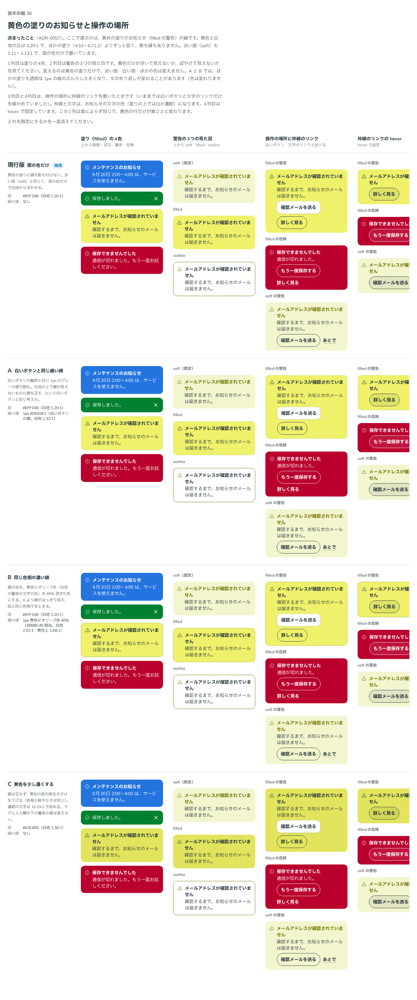

# 0057. 黄色の塗りのお知らせ

- ステータス: Accepted
- 日付: 2026-09-14
- ラウンド: 後半 軸36

## 背景

[ADR-0043](./0043-notice.md) で、お知らせの濃い塗り（`appearance="filled"`）の警告だけは、[ADR-0038](./0038-warning.md) どおり黄色の塗り（`#EFF16B`）に濃紺の文字にすると決まりました。黄色と白地の比は1.20:1で、ほかの塗り（4.53〜6.71:1）よりずっと低く、影も縁も付けていません（原則1: お知らせには影を付けない）。淡い面（`soft`）も1.11〜1.13:1で、面の色だけで置いています。

黄色の塗りに縁を足すかどうかと、操作の場所（`actions`）に枠線のリンクを置けるかは、比べていませんでした。ADR-0043 では、操作の場所は白いボタンと文字のリンクだけを確かめていました。

## 候補

比較は Storybook の `Design Review/36 黄色の塗りのお知らせと操作の場所`（決めた時点のコミット `5de918a`。`git checkout 5de918a && pnpm storybook` で開けます）です。1列目は塗りの4色、2列目は警告の3つの見た目（`soft`・`filled`・`outline`）、3列目と4列目は操作の場所に枠線のリンクを置いたとき（4列目は hover で固定）です。変えたのは次のトークンだけです（`src/components/Notice.tsx` が読む）。

- `--notice-filled-line-width`: 塗りのお知らせの縁の線の太さ（0 は線なし）
- `--color-notice-warning-filled-line`: 黄色の塗りの縁の線の色（ほかの塗りの線は透明）
- `--color-notice-warning-filled`: 黄色の塗りの面

| 案     | 内容                                                                                                    |
| ------ | --------------------------------------------------------------------------------------------------------- |
| 現行版 | 面の色だけ。黄色の塗りに線も影も付けない。淡い面（soft）と同じく、面の色だけで白地から浮かせる            |
| A      | 白いボタンと同じ細い線。白いボタンの輪郭と同じ1px のグレーの線（`#DEE0E1`）で囲む                          |
| B      | 同じ色相の濃い線。線の色を、黄色にオリーブ色（白地の警告の文字の色）を40%混ぜた色にする                    |
| C      | 黄色を少し濃くする。線は足さず、黄色の面の明るさだけを下げる（`#E2E45D`。白地1.36:1）                     |

## 決定

**現行版（面の色だけ。線も影もなし）のままにします。操作の場所には、枠線のリンクを置けることを確かめました。**

| 項目           | 決定                                                                                         |
| -------------- | ---------------------------------------------------------------------------------------------- |
| 黄色の塗り     | `#EFF16B`（白地1.20:1）。線を付けない（`--notice-filled-line-width: 0px`）                     |
| ほかの塗り     | 変更なし（透明な線のまま）                                                                     |
| 操作の場所     | 白いボタン・文字のリンクに加えて、枠線のリンクも置ける。枠線と文字はお知らせの文字の色になる     |

## 理由

ユーザーのメモです。

> 36 は既定でお願いします。

以下は、メモと比較から読み取れることです。

- **既定（面の色だけ）を維持**: 「既定でお願いします。」淡い面（soft）と同じ考え方（面の色だけで白地から浮かせる）を、黄色の塗りにもそのまま適用します。縁を足す案（A・B）や、面を濃くする案（C）は選ばれませんでした
- **操作の場所に枠線のリンクを置ける**: 3列目・4列目の比較で、枠線と文字がお知らせの文字の色（塗りの上では白か濃紺）になり、案によらず同じ見た目で成り立つことを確かめました

## 却下した案と理由

- **A（白いボタンと同じ細い線）**: 選ばれませんでした
- **B（同じ色相の濃い線）**: 選ばれませんでした
- **C（黄色を少し濃くする）**: 選ばれませんでした。面の色そのものを変えず、`#EFF16B` のままにします

## 影響

- `tokens.css`: `--notice-filled-line-width`（0px）・`--color-notice-warning-filled-line`（`transparent`）・`--color-notice-warning-filled`（`var(--color-warning)`）は現行版の値のまま変更していません
- `src/components/Notice.tsx`: 変更なし
- 分かっていること: 操作の場所に確かめたのは白いボタン・文字のリンク・枠線のリンクの3つです。ほかの部品は確かめていません（backlog に記載のまま）

## 原則への反映

反映なし。原則1（お知らせに影を付けない。面の色だけで白地から浮かせる）の範囲内の決定です。

## 比較画像

