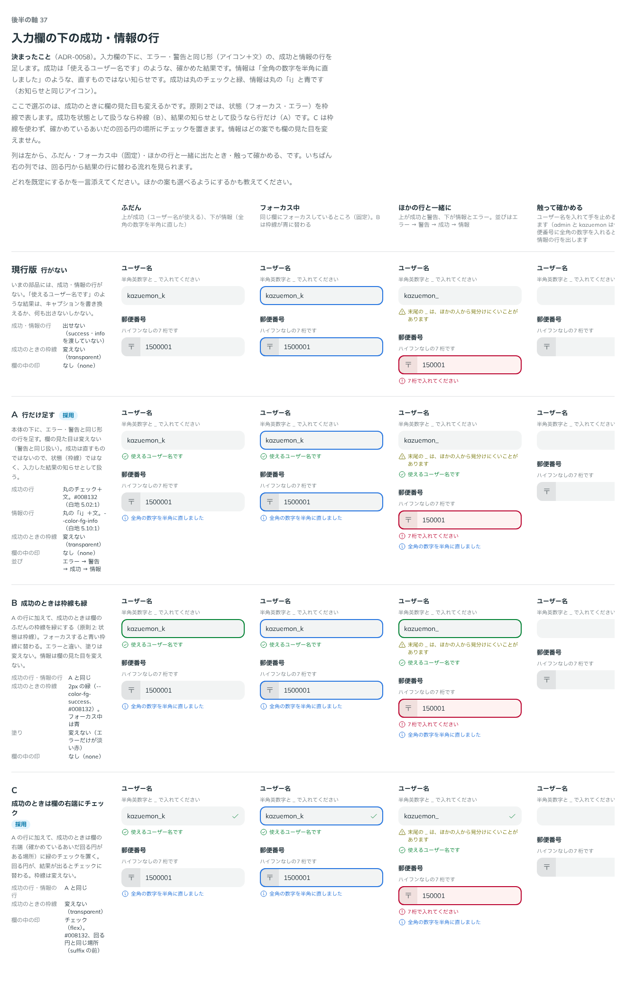

# 0058. 入力欄の下の成功・情報の行

- ステータス: Accepted
- 日付: 2026-09-14
- ラウンド: 後半 軸37

## 背景

原則4（ラベル / 本体 / キャプションの3層）では、エラーと警告を本体の下にアイコン付きの行で出します（[ADR-0041](./0041-caption-and-message.md)、[ADR-0044](./0044-message-announce.md)）。しかし、「使えるユーザー名です」のような確かめた結果（成功）や、「全角の数字を半角に直しました」のような直すものではない知らせ（情報）を出す行がありませんでした。これまでは、キャプションを書き換えるか、何も出さないしかありませんでした。

比較は Storybook の `Design Review/37 入力欄の下の成功・情報の行`（決めた時点のコミット `5de918a`。`git checkout 5de918a && pnpm storybook` で開けます）です。ここで選ぶのは、成功のときに欄の見た目（枠線・欄の中の印）も変えるかです。原則2（状態は枠線で表す）に関わります。情報はどの案でも欄の見た目を変えません。

## 候補

| 案     | 内容                                                                                                                                    |
| ------ | --------------------------------------------------------------------------------------------------------------------------------------- |
| 現行版 | 成功・情報の行がない。`success`・`info` を渡せない                                                                                       |
| A      | 本体の下に、エラー・警告と同じ形の行を足す。欄の見た目は変えない（`--color-field-success-line: transparent`、`--field-success-mark: none`） |
| B      | A に加えて、成功のときは欄のふだんの枠線を緑にする（`--color-field-success-line: var(--color-fg-success)`）。フォーカスすると青い枠線に替わる。塗りは変えない |
| C      | A に加えて、成功のときは欄の右端（確かめているあいだ回る円がある場所）に緑のチェックを置く（`--field-success-mark: flex`）。枠線は変えない  |

行の並びはどの案もエラー → 警告 → 成功 → 情報（重いものが上）です。成功は丸のチェックと緑（`--color-fg-success`。白地 5.02:1）、情報は丸の「i」と青（`--color-fg-info`。白地 5.10:1）で、エラー・警告と同じ形（アイコン＋文）です。

## 決定

**C（欄の右端にチェック）を既定にします。A（行だけ）は `successMark={false}` で選べます。B（枠線を緑にする）は採りません。**

Select にも `success`・`successMark`・`info` を足します。チェックは ▼ の左（回る円と同じ場所）です。ボトムシートの見出しには、成功と情報の行を出しません（エラー・警告は見出しにも出します — [ADR-0044](./0044-message-announce.md)）。

| 項目                 | 決定                                                                                             |
| -------------------- | -------------------------------------------------------------------------------------------------- |
| 既定                 | C。`success` を渡すと、行に加えて欄の右端にチェック                                                |
| 選べる形             | `successMark={false}` で、行だけ（A の見た目）                                                     |
| 情報の行             | 欄の見た目は変えない（枠線も印も付かない）                                                         |
| エラーと両方あるとき | 行はエラー → 警告 → 成功 → 情報の順ですべて出す。欄の見た目（枠線・塗り・印）はエラーを優先する      |
| Select               | `success`・`successMark`・`info` を同じ意味で持つ。チェックは ▼ の左（回る円と同じ場所）           |
| ボトムシートの見出し | 成功・情報は出さない（エラー・警告だけ出す）                                                       |

## 理由

ユーザーのメモです。

> 37 は C をデフォルトで、A も選べるにしたいです。

Select の成功・情報をシートの見出しに出すかを確認したときの返事です。

> 確認1: 出さない でOKです。

推奨（F1〜F3）への答えは、まとめて「それ以外の項目は特に違和感はありませんでした。」でした。F1〜F3 は次のとおりです。

- F1〜F3: 入力欄の下の成功・情報の行を作る。props は success・info に分ける。エラーと両方あるときは行を両方出し、欄の見た目はエラーを優先する

## 却下した案と理由

- **現行版（行がない）**: 成功・情報を出す手段がありませんでした
- **B（枠線を緑にする）**: 既定にも、選べる形にも採りませんでした

## 影響

- `tokens.css`: `--color-field-success-line`（既定 `transparent`。B を再現するために残す）、`--field-success-mark`（既定 `flex`）を足しました
- `src/components/Field.tsx`:
  - `MessageKind` に `success`・`info` を足し、並び（エラー → 警告 → 成功 → 情報）で `FieldMessageLine` を描きます
  - `success`・`info` の props を足しました。成功は丸のチェックと緑、情報は丸の「i」と青で、読み上げ（polite）と開閉の動きはエラー・警告の行と同じです（[ADR-0044](./0044-message-announce.md)）
  - `FieldSuccessMark`（欄の右端に置くチェック。読み上げは下の行が担うので `aria-hidden`）を足しました
  - `BaseField.Root` に `data-success`（成功かつエラーでないとき）を足しました
- `src/components/TextField.tsx`: `success`・`successMark`（既定 `true`）・`info` の props を足しました。チェックは回る円と同じ場所（suffix の前）に置き、待っているあいだ・エラーのときは出しません
- `src/components/Select.tsx`: 同じく `success`・`successMark`・`info` を足しました。チェックは ▼ の左（回る円と同じ場所）に置きます。ボトムシートの見出し（ラベル・ヘルプテキスト・欄のエラー・警告）には、成功・情報の行を足していません
- backlog: 記録待ちの該当行を消します

## 原則への反映

原則4の「エラーと警告は、入力した結果です。本体の下に、アイコン付きの行として足します」「エラーは丸の「!」と赤、警告は三角とオリーブ色です。色だけでなく形でも見分けます。警告は送信を止めないので、欄の見た目は変えません」「両方あるときは、両方出します。エラーが上です」の記述を、成功・情報を含めた形に書き換えます。並びはエラー → 警告 → 成功 → 情報（重いものが上）、成功は丸のチェックと緑、情報は丸の「i」と青です。欄の見た目（枠線・塗り・印）を変えるのはエラーだけで、成功・情報では変えないことも書き加えます。原則2（状態は枠線で表す）は書き換えません。成功を状態として枠線で表す案（B）を採らなかったためです。

## 比較画像

