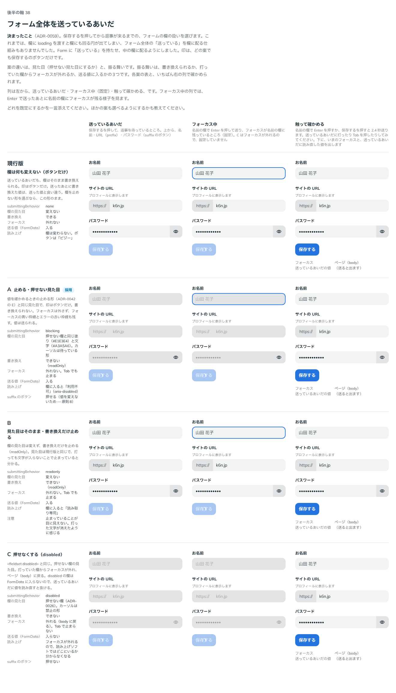

# 0059. フォーム全体を送っているあいだ

- ステータス: Accepted
- 日付: 2026-09-14
- ラウンド: 後半 軸38

## 背景

[ADR-0042](./0042-field-loading.md) で欄が待っている（`loading`）あいだの扱いを決めましたが、`loading` を渡すと欄にも必ず印（回る円）が出てしまい、フォーム全体の「送っている」を中の欄に配る仕組みがありませんでした（ADR-0042 の残り）。

`<Form>` に `submitting`（送っている）と `submittingBehavior`（欄の扱い）を足し、`FormSubmitContext`（`src/components/form-context.ts`）で中の欄に配るようにしました。案は欄の扱いです。見た目だけでなく振る舞い（書き換え・フォーカス・送る値）も違うため、トークンではなく props で行ごとに変えます。

比較は Storybook の `Design Review/38 フォーム全体を送っているあいだ`（決めた時点のコミット `5de918a`。`git checkout 5de918a && pnpm storybook` で開けます）です。印は、どの案でも送信のボタン（`Button` の `loading`）だけで、欄には回る円を出しません。

## 候補

| 案     | 内容                                 | 欄の見た目                                                                                                    | 書き換え               | フォーカス                                | 送る値（FormData） |
| ------ | ------------------------------------ | ------------------------------------------------------------------------------------------------------------- | ---------------------- | ----------------------------------------- | ------------------ |
| 現行版 | 欄は何も変えない（ボタンだけ）       | 変えない                                                                                                      | できる                 | 外れない                                  | 入る               |
| A      | 止める・押せない見た目               | 押せない欄と同じ塗り（`--color-field-disabled`）と文字（`--color-on-field-disabled`）。カーソルは待っている形 | できない（`readOnly`） | 外れない。Tab でも止まる                  | 入る               |
| B      | 見た目はそのまま・書き換えだけ止める | 変えない                                                                                                      | できない（`readOnly`） | 外れない。Tab でも止まる                  | 入る               |
| C      | 押せなくする（`disabled`）           | 押せない欄（[ADR-0026](./0026-disabled.md)）。カーソルは禁止の形                                              | できない               | 外れる（`body` に戻る）。Tab で止まらない | 入らない           |

C は `<fieldset disabled>` と同じ扱いです。`disabled` の欄は FormData に入らないので、送っているあいだに値を読み直すと抜けます。

## 決定

**A（`submittingBehavior="blocking"`。押せない欄の見た目で書き換えを止める）を既定にします。何もしない形（`none`）も選べます。B（readonly）・C（disabled）は部品の props として持たず、比較のストーリーの中でだけ再現します。**

Select も Form の送信中を受け取ります。開けず、値も書き換えられません（`readOnly`・`aria-disabled`）。値は残したまま出し、回る円は出しません。▼ は押せない Select と同じ色のまま残し、カーソルは待っている形にします。

2026-09-16 には、チェックボックス・ラジオ・トグルも同じく止めることに決めました。`form-context.ts` の `useChoiceLock` が `readOnly` で切り替えを止め、押せない見た目の規則が読む `data-disabled` を付けます。`disabled` は付けないので、フォーカスは外れず、値も送られます。RadioGroup も同じく止めます。カーソルは押せないときと同じ禁止の形です（入力欄の送信中は待つ形のまま）。

| 項目                             | 決定                                                                                                                                        |
| -------------------------------- | ------------------------------------------------------------------------------------------------------------------------------------------- |
| 既定                             | `submittingBehavior="blocking"`（A）                                                                                                        |
| 選べる形                         | `submittingBehavior="none"`（現行版と同じ。何も変えない）                                                                                   |
| 部品に持たない形                 | B（readonly）・C（disabled）。比較のストーリーの中でだけ、欄に直接 `readOnly`・`disabled` を渡して再現                                      |
| 印                               | どの案も送信のボタンだけ。回る円は押したボタン（`submitter`）にだけ出す（F11）                                                              |
| Form の props                    | `submitting`（送っているか）。既定 `false`（F10）                                                                                           |
| Select                           | 開けず、値は残す。回る円は出さない。▼ は押せない色のまま、カーソルは待っている形                                                            |
| チェックボックス・ラジオ・トグル | `readOnly` で止め、`data-disabled` を付けて押せない見た目にする。`disabled` は付けない（フォーカスは外れず値も送られる）。RadioGroup も同じ |

## 理由

ユーザーのメモです。

> 38 は A をデフォルトで、何もしないも選べる。

Select の送信中の扱いを確認したときの返事です。

> 2: 押せない状態になっているのでOKです。
> 3: おっけーです。

2026-09-16 に、チェックボックス・ラジオ・トグルも止めるかを確認したときの返事です。

> 3 それでよさそう。押せない見た目で

## 却下した案と理由

- **B（readonly。見た目はそのまま）**: 部品の props としては持ちません。止まっていることが目に見えず、打った文字が消えたように感じるためです（比較のストーリーの注意）
- **C（disabled）**: 部品の props としては持ちません。フォーカスが外れて `body` に戻り、Tab でも止まらないため、送っているあいだにどこにいるか分からなくなります。値も FormData に入らず、送っているあいだに読み直すと抜けます

## 影響

- `src/components/Form.tsx`: `submitting`（既定 `false`）・`submittingBehavior`（既定 `'blocking'`）の props を足しました。送っているあいだの送信（Enter など）は `onSubmit` を呼ばずに止めます。送信のボタンは、`loading` を渡さなくても自動で送信中になります（F11）。回る円は押したボタン（`submitter`。Enter で送ったときはフォームの最初の送信のボタン）にだけ出し、ほかの送信のボタンは押せない見た目にするだけです
- `src/components/form-context.ts`: `FormSubmittingBehavior`（`'blocking' | 'none'`）と `FormSubmitState` に `submitting`・`submittingBehavior`・`submitter` を足しました。`useFormSubmittingLock()` で欄が `blocking` かを読みます。`useChoiceLock(disabled)` を足しました。`blocking` かつ自身が `disabled` でないときに `{ readOnly: true, data: { 'data-disabled': '' } }` を返します
- `src/components/Field.tsx`・`TextField.tsx`: `useFormSubmittingLock()` を読み、`loadingBehavior="blocking"` と同じ見た目（`data-loading="blocking"`）にします
- `src/components/Select.tsx`: `useFormSubmittingLock()` を読み、`loadingBehavior="blocking"` と同じ扱いにします。ただし選んだ値は `loadingText` に置き換えず、回る円も出しません
- 比較のストーリー: 既定で現行版と A に採用の印（`current,A`）。B・C は Form を `none` にし、欄に直接 `readOnly`・`disabled` を渡して再現します
- backlog: 記録待ちの該当行を消します

## 原則への反映

反映なし。原則1（影はレイヤーの離れを表す）に、押せなくなったもの（無効、送信中）は影を消し、色を持つものは色を残して薄くし、色を持たないものはグレーに寄せる、送信中も押せない見た目にするが動いている印は薄くしない、という記述がすでにあります。この決定は、その記述の範囲内で、フォーム全体の送信中を中の欄（入力欄・Select・チェックボックス・ラジオ・トグル）に配る仕組み（props と context）を作ったものです。

## 比較画像

