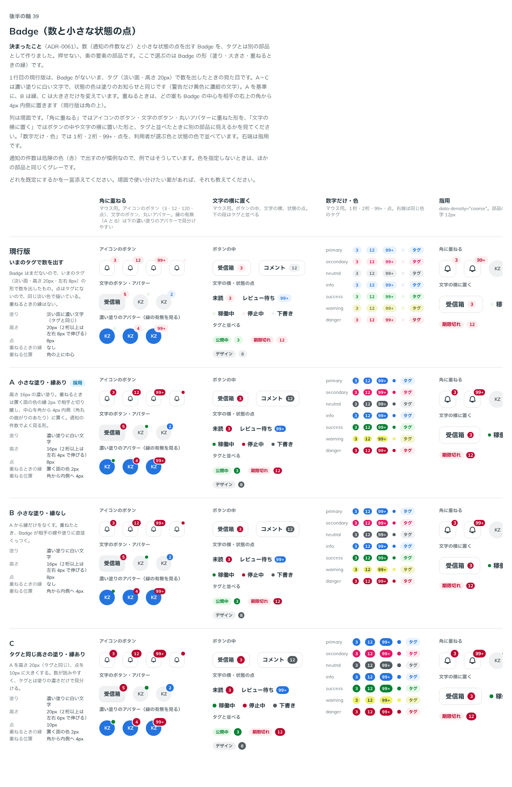

# 0061. Badge（数と小さな状態の点）

- ステータス: Accepted
- 日付: 2026-09-14
- ラウンド: 後半 軸39

## 背景

数（通知の件数など）と小さな状態の点を出す部品がありませんでした。タグ（`src/components/Tag.tsx`。淡い面・文字はキャプションの大きさ・高さ 20px・pill）は文字のラベル用で、数や点を出すと形や色の使い分けがあいまいになります。

比較は Storybook の `Design Review/39 Badge（数と小さな状態の点）`（決めた時点のコミット `5de918a`（`git checkout 5de918a && pnpm storybook` で開けます））です。Badge はタグとは別の、押せない素の要素の部品として作りました。ここで選ぶのは Badge の形（塗り・大きさ・重ねるときの縁）です。

## 候補

| 案     | 内容                                                                                                 |
| ------ | ------------------------------------------------------------------------------------------------------ |
| 現行版 | いまのタグの形（淡い面・高さ 20px・左右 8px）で数を出したもの。点は同じ淡い色。重ねるときの縁はない     |
| A      | 高さ 16px の濃い塗り。重ねるときは置く面の色の縁 2px で相手と切り離し、中心を角から 4px 内側に置く       |
| B      | A から縁だけをなくす。重ねたとき、Badge が相手の線や塗りに直接くっつく                                 |
| C      | A を高さ 20px（タグと同じ）、点を 10px に大きくする                                                    |

A〜C は濃い塗りに白い文字で、状態の色は塗りのお知らせ（[ADR-0043](./0043-notice.md)）と同じです（警告だけ黄色に濃紺の文字）。文字の大きさはどの案もキャプション（マウス用 11px・指用 12px）で、タグと同じです。

## 決定

**A（高さ 16px の濃い塗り、重ねるときは縁 2px）を既定にします。**

あわせて、backlog の推奨 T1〜T7 を採ります。

| 項目                       | 決定                                                                                                                        |
| -------------------------- | ------------------------------------------------------------------------------------------------------------------------------ |
| 形（軸39）                 | A。高さ 16px の濃い塗り、重ねるときは置く面の色の縁 2px、中心は角から 4px 内側                                                |
| 役割の分け方（T1）         | Tag は文字のラベル、Badge は数と点、Chip（まだない）は押せる・消せる小物                                                      |
| 色（T2〜T4）               | Tag と同じ7色（primary・secondary・neutral・info・success・warning・danger）。既定はグレー（neutral）。大きさの段は作らない   |
| 重ねるときの読み上げ（T5） | Badge は `aria-hidden`。相手（ボタンなど）の名前に数を含める。文字の横に置くときは `label` で「未読 3 件」のように読ませる    |
| 重ね方（T6）               | `children` で相手を包む。0 件（`count` が 0 以下）のときは出さない                                                            |
| 警告の点（T7）             | 白地ではオリーブ（`--color-badge-warning-dot`）。警告の数の丸は、黄色に濃紺の文字のまま                                       |
| 0 件を出す props（確認6）  | 作らない                                                                                                                       |

## 理由

ユーザーのメモです。

> 39 は A で。

推奨（T1〜T7）への答えは、まとめて「それ以外の項目は特に違和感はありませんでした。」でした。0 件の扱いを確認したときの返事です（会話の番号6）。

> 6 Badge の 0 件は出さないまま、0 を出す props は作らない。「一旦は要件外で良さそう」

## 却下した案と理由

- **現行版（いまのタグで数を出す）**: 淡い面はタグと見分けにくく、点を出す色も持ちませんでした
- **B（縁なし）**: 選ばれませんでした。重ねたとき、Badge が相手の線や塗りに直接くっつきます
- **C（タグと同じ高さ 20px）**: 選ばれませんでした。A（16px）を既定にしました

## 影響

- `tokens.css`: `--badge-size`（16px）・`--badge-pad-x`（4px）・`--badge-dot`（8px）・`--badge-ring-width`（2px）・`--badge-overlay-inset`（4px）、`--color-badge-*`・`--color-on-badge-*`（primary・secondary・neutral・info・success・warning・danger）、`--color-badge-warning-dot`（`--color-fg-warning`）、`--color-badge-ring`（`--color-surface`）を足しました
- `src/components/Badge.tsx`（新規）: `count`（数。渡さないと点）・`max`（既定 99。超えると「99+」）・`color`・`label`（読み上げの文。関数も渡せる）・`children`（重ねる相手）の props を持ちます。`count` が 0 以下のときは出しません
- backlog: 記録待ちの該当行（軸39・T1〜T7・確認6）を消します

## 原則への反映

反映なし。

- 色（T2〜T4）は、原則6の「色を指定しないとき、色を持つ部品はすべてグレーです」「選んでいることを示す印...も、部品の色に従います。指定しないときはグレーです」の記述の範囲内です
- 警告の点（T7）は、原則6の「白地に置く文字、枠線、アイコンは、同じ色相で暗くしたオリーブ色です」の記述の範囲内です
- 形（pill）は、原則5の「小物は pill です」の記述の範囲内です

## 比較画像

