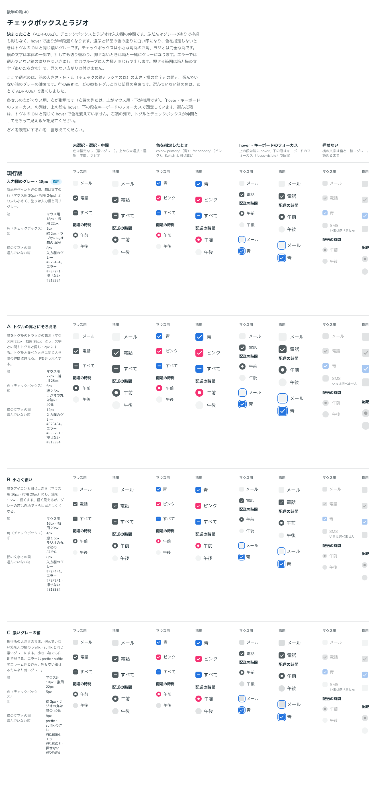

# 0062. チェックボックスとラジオ

- ステータス: Accepted
- 日付: 2026-09-14
- ラウンド: 後半 軸40

## 背景

チェックボックスとラジオは、[ADR-0047](./0047-principles-probe.md) で「入力欄の仲間」と決まったものの、部品自体はまだありませんでした。原則8・原則5（[原則への反映](#原則への反映)参照）の範囲で、新しく作った部品の値（箱の大きさ・角・印の太さ・横の文字との間・選んでいない箱のグレー）を比べます。

同じラウンドで、a11y・慣例・API の推奨（会話で C1〜C7 の番号で出したもの）にも答えました。軸42（[ADR-0063](./0063-choice-press.md)）は、この中の C7（押したときの動き）への「パターンを見てみたいですね」という返事から生まれたものです。

## 候補

比較は Storybook の `Design Review/40 チェックボックスとラジオ`（[`stories/axis-40-checkbox-radio.stories.tsx`](../stories/axis-40-checkbox-radio.stories.tsx)）です。変えたのは箱の大きさ・チェックボックスの角・印の太さ・ラジオの丸の比・横の文字との間・選んでいない箱の塗りだけで、行の高さはどの案もトグルと同じ部品の高さです。

| 案     | 内容                                                                                                                                    |
| ------ | --------------------------------------------------------------------------------------------------------------------------------------- |
| 現行版 | 箱はマウス用 18px・指用 22px、角 5px、印の太さ 2px、ラジオの丸は箱の 40%、横の文字との間 8px。選んでいない箱は入力欄と同じグレー         |
| A      | 箱をトグルのトラックの高さ（マウス用 22px・指用 28px）にそろえ、間も 12px にする。角 6px、印の太さ 2.5px                                |
| B      | 箱をアイコンと同じ大きさ（マウス用 16px・指用 20px）にし、線を 1.5px に細くする。角 4px、ラジオの丸は 37.5%                             |
| C      | 大きさは現行版のまま、選んでいない箱を入力欄の prefix・suffix と同じ濃いグレーにする。エラーは prefix・suffix のエラーの赤み、押せない箱はふだんより薄いグレー |

## 決定

**現行版（箱はマウス用 18px・指用 22px、角 5px、印の太さ 2px、ラジオの丸は箱の 40%、横の文字との間 8px）のまま決めます。**

同じラウンドで、a11y・慣例・API の推奨のうち、次を採用します。

- C1: indeterminate に加えて、「すべて選ぶ」の親の箱を部品で持ちます
- C2: グループは role="group"・"radiogroup" と aria-labelledby を持ちます
- C3: グループに aria-describedby を付けます
- C4: RadioGroup は required にできます。CheckboxGroup の必須はキャプションの文で書きます。1つだけ置く箱は required にできます
- C5: 1つだけ置くチェックボックスは、箱の行の下にエラーの行を出します
- C6: グループのエラーの行は、選択肢の下に出します
- 確認8: 「すべて選ぶ」のあるグループのエラーでは、送信時のフォーカスを子の最初の箱へ移します（親の箱には移しません）
- 確認9: 1つだけ置く箱のエラー・警告の行は、ヘルプテキストと同じく横の文字の始まりにそろえます

## 理由

軸40のユーザーのメモです。

> 40 現行版で良さそう。スマホで触った感じ問題ありませんでした。

a11y・慣例・API の推奨は、まとめて次の返事でした。

> それ以外の項目は特に違和感はありませんでした。

送信時のフォーカスの移し先（確認8）への返事です。

> 推奨で良さそう

1つだけ置く箱のエラー・警告の行の字下げ（確認9）への返事です。

> ヘルプテキストと同じ、インデントが欲しいです。

以下は、メモと比較から読み取れることです。

- **現行版のまま**: 「スマホで触った感じ問題ありませんでした。」実機で指の操作を確かめたうえでの答えで、A（トグルにそろえる大きさ）・B（アイコンの大きさ）・C（濃いグレー）のどれにも動きませんでした
- **エラーの行は選択肢の下**: C6 は、グループのエラーの文が見出しではなく選択肢の下に出ることを明示したものです。1つだけ置く箱（C5）とそろえ、どちらも入力欄と同じ形の行にします
- **フォーカスは子の箱へ**: 確認8 は、「すべて選ぶ」の親の箱は値を送信しないため、送信時のエラーの一覧やフォーカス移動の対象にしないという確認です
- **字下げをそろえる**: 確認9 は、1つだけ置く箱のエラー・警告の行を、キャプションと同じ字下げ（横の文字の始まり）にする確認です

## 却下した案と理由

- **A（トグルの高さにそろえる）**: 選ばれませんでした。箱が大きくなり、文字との間も広がるぶん、チェックボックスとラジオの並びが間延びして見えます
- **B（小さく細い）**: 選ばれませんでした。グレーの箱が白地でさらに見えにくくなります
- **C（濃いグレーの箱）**: この時点では選ばれませんでした。選んでいない箱をもっと濃くする方向自体は、のちの軸47の決定（別の ADR で記録）で採られています（下の「影響」参照）

## 影響

- 部品を新規作成: `src/components/Checkbox.tsx`（Checkbox・CheckboxGroup）・`src/components/Radio.tsx`（Radio・RadioGroup）。見た目のトークンは `choiceStyles`（Checkbox.tsx）にまとめ、Radio もこれを使います
- `tokens.css`: `--choice-size-fine`（18px）・`--choice-size-coarse`（22px）・`--checkbox-radius`（5px）・`--checkbox-mark-width`（2px）・`--radio-dot-ratio`（0.4）・`--choice-gap`（8px）・`--color-choice`（この時点では入力欄と同じグレー）を現行版の値にしました
- **選んでいない箱の色は、あとで濃くなっています**: この ADR の時点で選んだのは、入力欄と同じ薄いグレー（現行版）でした。のちの軸47の決定（`design/tokens.css` の `--color-choice` を参照するもう1本の ADR）で、チェックボックス・ラジオ・トグルの選んでいない色をまとめて濃く（入力欄の prefix・suffix と同じグレー）しています。この値は、この ADR で却下した候補 C の色に近いものです。いまの `tokens.css` の `--color-choice` は、その後の値です
- `backlog.md` の「Checkbox・Radio」の節に、まだ決めていないこと（グループのエラーの読み上げ、キーボードの Space での押下の見た目、大きい指用での箱の大きさなど）を残しました

## 原則への反映

原則8（[入力欄の様式は「編集できるか」で決まる](../principles.md)）の、チェックボックスとラジオのエラーについての一文を書き換えます。

- 書き換え前:「エラーでは、箱の塗りを淡い赤にします。エラーの文は、グループの見出しに、入力欄と同じ形（アイコン付きの行）で付けます」
- 書き換え後: エラーの文が見出しではなく選択肢の下に付くことが伝わるように書き換える（C6・確認9 の決定を反映）

C1〜C5・確認8 は、a11y・API の実装の決定で、原則の記述の範囲内です（反映なし）。

## 比較画像

