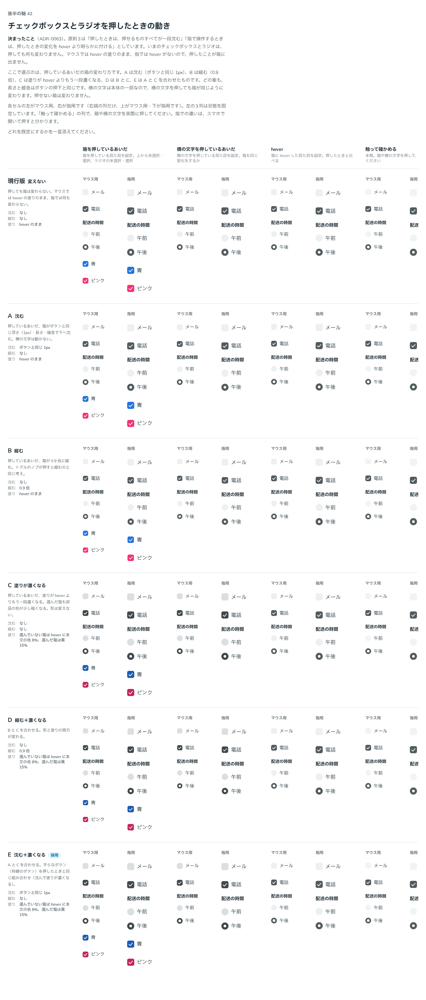

# 0063. チェックボックス・ラジオを押したときの動き

- ステータス: Accepted
- 日付: 2026-09-14
- ラウンド: 後半 軸42

## 背景

原則3は「押したときは、押せるものすべてが一段沈む」「指で操作するときは、押したときの変化を hover より明らかに付ける」としています。[ADR-0062](./0062-checkbox-radio.md) で決めたチェックボックスとラジオは、押しても何も変わりませんでした。マウスでは hover の塗りのまま、指では hover がないので、押したことが箱に出ません。

この軸は、[ADR-0062](./0062-checkbox-radio.md) と同じラウンドで答えた a11y・慣例・API の推奨のうち、C7（押したときの動き）への「パターンを見てみたいですね」という返事から生まれました。

## 候補

比較は Storybook の `Design Review/42 チェックボックスとラジオを押したときの動き`（決めた時点のコミット `5de918a`（`git checkout 5de918a && pnpm storybook` で開けます））です。どの案も、動きの長さと緩急はボタンの押下と同じ（`--duration-press`・`--ease-press`）です。

| 案     | 内容                                                                                                             |
| ------ | ------------------------------------------------------------------------------------------------------------------ |
| 現行版 | 押しても箱は変わらない。マウスでは hover の塗りのまま、指では何も変わらない                                        |
| A      | 押しているあいだ、箱がボタンと同じ深さ（1px）で下へ沈む。横の文字は動かない                                        |
| B      | 押しているあいだ、箱が 0.9 倍に縮む。トグルのノブが押すと縮むのと同じ考え                                          |
| C      | 押しているあいだ、塗りが hover よりもう一段濃くなる。選んだ箱も部品の色が少し暗くなる。形は変えない                |
| D      | B と C を合わせる。形と塗りの両方が変わる                                                                          |
| E      | A と C を合わせる。平らなボタン（枠線のボタン）を押したときと同じ組み合わせ（沈んで塗りが濃くなる）                |

## 決定

**E（沈む＋塗りが濃くなる）に決めます。** 選んでいない箱は hover の塗りに本文の色を 8%、選んだ箱は部品の色に黒を 15% 混ぜます。箱を押しても横の文字を押しても同じ変化です。

## 理由

C7（押したときの動きの推奨）への返事です。

> C7 はパターンを見てみたいですね。

軸42のユーザーのメモです。

> 42 は E でお願いします。

以下は、メモと比較から読み取れることです。

- **平らなボタンと同じ組み合わせ**: E は、枠線のボタン（原則3・[ADR-0027](./0027-flat-press.md)）と同じ「沈む＋塗りが濃くなる」の組み合わせです。チェックボックスとラジオは入力欄の仲間（原則8）ですが、押したときの動きは枠線のボタンに寄せています
- **箱と横の文字は同じ本体**: 横の文字は箱の一部（[ADR-0062](./0062-checkbox-radio.md)、原則8）なので、どちらを押しても同じ変化にします

## 却下した案と理由

- **A（沈むだけ）**: 選ばれませんでした。塗りが変わらないので、指で操作するときに手応えが弱いままです
- **B（縮むだけ）**: 選ばれませんでした
- **C（塗りが濃くなるだけ）**: 選ばれませんでした。沈む動きと合わせた E になりました
- **D（縮む＋濃くなる）**: 選ばれませんでした。形が変わる分、B と同じ余分な動きに見えます

## 影響

- `tokens.css`: `--choice-press-depth`（`var(--flat-press-depth)`）・`--choice-press-scale`（1。縮まない）・`--choice-press-darken`（8%）・`--choice-on-press-darken`（15%）を追加しました
- `src/components/Checkbox.tsx`: `choiceStyles` の `box` に、押しているあいだの沈み（`translate`）と塗りの混ぜ合わせ（`color-mix`）を足しました。箱を直接押したときと、横の文字（`label`）を押したときのどちらでも `--choice-press: 1` になります
- **塗りの動き（transition）は、あとで外しています**: この ADR の時点では、沈み（`translate`・`scale`）と同じく、塗りの変化にも `transition` を付けていました。その後、backlog の「ちらつきの続き」で報告された不具合（「全て選ぶを何回か押しているとネオン管がつくときのようになりますね」）の原因が、チェックの印はすぐ出入りするのに箱の塗りだけが 100ms かけて変わることだと分かりました（外すと印のない濃い箱、付けると薄い箱の上の白い印が一瞬見える）。印も塗りと一緒に動かす案（A）と、状態の切り替えを一瞬にする案（B、おすすめ）を出し、「B にしてみてもらえますか？」との返事を受けて、チェックボックス・ラジオの塗りの `transition` を外しました。押したときに沈む動き（`translate`・`scale`）とフォーカスの線の動きはそのまま残しています。同じ調査で、トグルのトラックの塗りの動きも一度外し、その後の見え方の指摘（「いきなり色が明るくなるので、グレーではなく一瞬白くなったように錯覚しますね」）を受けて戻しています（Switch は別の部品なので、この ADR の対象には含みません）
- **分かっていること**: キーボードの Space で切り替えたときは、押したときの見た目（沈んで濃くなる）になりません。ボタンは Space でも出ます。そろえるかは決めていません（backlog の「Checkbox・Radio」の節）

## 原則への反映

原則3（[hover は手応え、押すと沈む](../principles.md)）は、すでに「押したときは、押せるものすべてが一段沈む」「指で操作するときは、押したときの変化を hover より明らかに付ける」と述べています。原則3の枠線のボタンの箇条（「枠線のボタンとリンクは、hover で文字の色を淡く敷きます。（中略）押すと敷く色が濃くなり、沈みます」）に、チェックボックスとラジオも同じ「沈む＋塗りが濃くなる」動きをすることを一文加えます。原則8（チェックボックスとラジオの記述）自体の書き換えはありません。

## 比較画像

