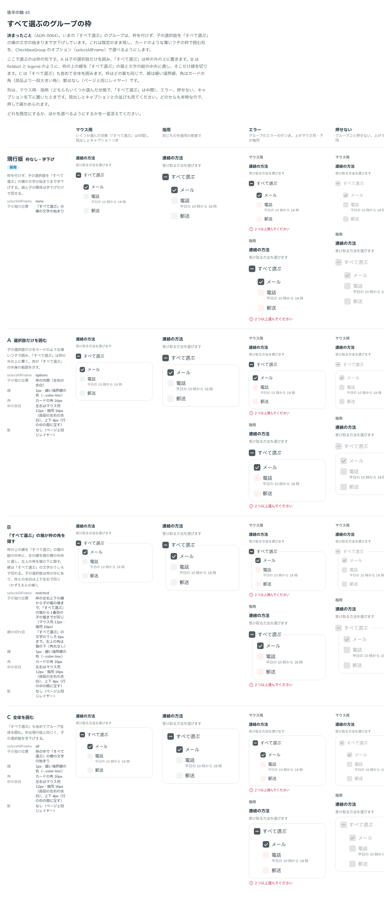

# 0064. 「すべて選ぶ」のグループの枠

- ステータス: Accepted
- 日付: 2026-09-14
- ラウンド: 後半 軸43

## 背景

「すべて選ぶ」の子の選択肢を字下げする形（枠なし）は、すでに決まっていました。押せない状態の一覧を確認したとき、字下げに加えて枠で囲む案も見たいという返事があり、この軸で比べました。

## 候補

比較は Storybook の `Design Review/43 すべて選ぶのグループの枠`（決めた時点のコミット `5de918a`。`git checkout 5de918a && pnpm storybook` で開けます）です。枠を付ける案はどれも同じ見た目（線は細い境界線の色、角はカードの角、影なし）です。

| 案     | 内容                                                                                                                                                             |
| ------ | ------------------------------------------------------------------------------------------------------------------------------------------------------------------ |
| 現行版 | 枠を付けず、子の選択肢を「すべて選ぶ」の横の文字の始まりまで字下げする                                                                                             |
| A      | 子の選択肢だけをカードのような薄いフチで囲み、「すべて選ぶ」は枠の外の上に置く                                                                                     |
| B      | 枠の上の線を「すべて選ぶ」の箱の縦の中央に、左の線を箱の横の中央に通し、左上の角を箱の下に隠す（`notched`）。線は「すべて選ぶ」の文字のうしろで切れる。子の選択肢は枠の中で、枠との余白を上下左右で同じにする |
| C      | 「すべて選ぶ」も含めてグループ全体を囲む。中は現行版と同じく、子の選択肢を字下げする                                                                               |

B は、はじめ fieldset と legend の形（左の角を角丸が収まる幅だけあけ、「すべて選ぶ」を線に載せる）で作り、その後2度作り直しています（下の「理由」）。

## 決定

**現行版（枠なし・字下げ）だけを採用します。A・B・C は採りません。** `CheckboxGroup` の `selectAllFrame`（`none`・`options`・`notched`・`all`）は部品に残しますが、既定は `none` のままです。

## 理由

B を作り直したときのメモです。はじめの fieldset と legend の形への返事です。

> 43 の B 案は、インデントはありつつ、全て選ぶのチェックボックスに角が隠れつつ、字下げされているように見える位置を考えていました。反映してみてもらえますか？

作り直したあとの、字下げの位置についての返事です。

> 43 の B ですが、字下げのイメージがズレていそうです。元の字下げのイメージではなく、囲いに対して上下・左右で均一な余白になることを期待しています。もっとも、マウス用の場合、「すべて選ぶ」と1番目の選択肢の距離をちょっと近づけてほしいです

余白をそろえたあとの返事です。

> 43 の B、今度はちょっと近すぎるかも。

軸43の決定のメモです。

> 43 はいろいろ作っていただいて申し訳ないですが、一旦現行版のみ採用にします。また見た目を練り直します。

以下は、メモと比較から読み取れることです。

- **B は2度作り直した**: fieldset と legend の形から、「すべて選ぶ」の箱が枠の角を隠す形へ、余白の基準（字下げの位置ではなく上下左右で均一な余白）へ、「すべて選ぶ」の箱と1番目の子の箱の間の詰め方へと、3段階で作り直しています
- **見た目を練り直す**: 「一旦現行版のみ採用にします。また見た目を練り直します。」なので、枠で囲む方向自体を諦めたわけではなく、この回で出した A・B・C のどれも決定には至らなかったという結果です

## 却下した案と理由

- **A（選択肢だけを囲む）**: 選ばれませんでした
- **B（「すべて選ぶ」の箱が枠の角を隠す）**: 選ばれませんでした。2度の作り直しを経て、枠の線から子の箱までの余白と、「すべて選ぶ」の箱から1番目の子の箱までの間は詰めましたが、エラーのとき枠の線を赤にするか、押せないとき薄くするかなど、残る論点があります
- **C（全体を囲む）**: 選ばれませんでした

## 影響

- 部品（`src/components/Checkbox.tsx`）はそのままです。`selectAllFrame` の `options`・`notched`・`all` はコードに残しますが、見た目を練り直すまで、既定の `none` 以外は使いません
- `backlog.md` の「比べている途中」に、B の残る論点（エラーのとき枠の線を赤にするか、押せないとき薄くするか）を残しています
- **比較画像は撮り直していません**: [ADR 索引の規則](./README.md)のとおり、比較画像はこの軸を決めたときの記録です

## 原則への反映

反映なし。現行版（枠なし・字下げ）を維持したので、原則5・原則8の記述は変わりません。全候補（A・B・C）を却下したラウンドですが、「また見た目を練り直します」と、この方向自体を反例とは断定していないため、判断の基準の「反例」への追加はしません。

## 比較画像

