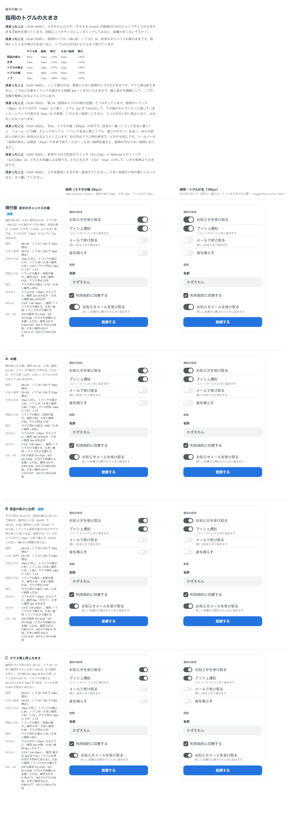

# 0065. 指用と大きい指用のトグルの大きさ

- ステータス: Accepted
- 日付: 2026-09-14
- ラウンド: 後半 軸45

## 背景

指用のトグル（トラック 48×28px・ノブ 22px）と大きい指用（56×32px・ノブ 26px）は、[ADR-0045](./0045-coarse-size.md) で、前半のキャンバスの値をそのまま「実物」の値として決めたものでした。

指用にしたときの伸び方を、部品の高さ（マウス用 40px → 指用 44px、+10%）・文字（14px → 16px、+14%）と比べると、トグルの高さ（22px → 28px）だけ +27% と大きく伸びていました。かずえもんのメモです。

> そもそも Switch の指用のためのジャンプサイズが大きすぎる可能性を感じています。実際にスマホサイズにレンダリングしてみると、結構大きくないですか？

トグルのトラック（28px）はラベルの行（24px）より上下に 2px はみ出し、下端がキャプションに接する問題（軸44「指用のトグルの縦の位置」）もありました。この軸で先にトグル自体の大きさを見直し、軸44はそのあとで決めることにしました。

## 候補

比較は Storybook の `Design Review/45 指用のトグルの大きさ`（[`stories/axis-45-switch-coarse-size.stories.tsx`](../stories/axis-45-switch-coarse-size.stories.tsx)）です。マウス用（40×22px・ノブ 16px）はどの案も変えません。ノブはどの案もトラックの高さから隙間 3px × 2 を引いた大きさです。

| 案     | 指用（トラック・ノブ） | 大きい指用（トラック・ノブ） | 内容                                                                                                     |
| ------ | ---------------------- | ----------------------------- | ---------------------------------------------------------------------------------------------------------- |
| 現行版 | 48×28px・22px           | 56×32px・26px                  | 前半のキャンバスの値。マウス用から高さ +27% 伸びる。ラベルの行（24px）から上下に指用 2px・大きい指用 4px はみ出す |
| A      | 46×26px・20px           | 52×30px・24px                  | 現行版と B の間。指用のはみ出しは上下 1px                                                                    |
| B      | 44×24px・18px           | 52×28px・22px                  | マウス用の 40×22 を部品の高さと同じ比で伸ばす。指用は 1.1 倍、大きい指用は 1.3 倍。指用はラベルの行と同じ高さになり、はみ出しがなくなる |
| C      | 40×22px・16px           | 44×24px・18px                  | 指用もマウス用と同じ大きさ。大きい指用だけ少し大きくする。トラックの高さが WCAG 2.5.8（24×24px）を指用で下回る（ラベルも押せるので例外に当たる） |

## 決定

**指用は現行版（48×28px・ノブ 22px）のまま、大きい指用は B（52×28px・ノブ 22px）に決めます。** 指用と大きい指用のトラックの高さがそろいます（どちらも 28px）。

## 理由

ユーザーのメモです。

> 45 は大きい指はB、通常の指は現行でいいかなと思いました。

以下は、メモと比較から読み取れることです。

- **指用は変えない**: 「通常の指は現行でいいかな」なので、指用のトグル（48×28px）は変わりません。ラベルの行（24px）からの上下 2px のはみ出しは残ります
- **大きい指用は B**: 「大きい指はB」なので、大きい指用は 56×32px から 52×28px に小さくなります。B は部品の高さに比例させた値で、はみ出しは指用と同じ上下 2px に収まります（前の 56×32px では上下 4px でした）

## 却下した案と理由

- **A（46×26px・52×30px）**: 選ばれませんでした
- **B の指用の値（44×24px）**: 選ばれませんでした。大きい指用の値（52×28px）だけを採用し、指用は現行版のまま残しました
- **C（マウス用と同じ 40×22px、大きい指用 44×24px）**: 選ばれませんでした。トラックの高さが WCAG 2.5.8（24×24px）を指用で下回ります

## 影響

- `tokens.css`: `--switch-w-coarse-large`（56px → 52px）・`--switch-h-coarse-large`（32px → 28px）・`--switch-knob-coarse-large`（26px → 22px）を変更しました。`--switch-w-coarse`・`--switch-h-coarse`・`--switch-knob-coarse`（48px・28px・22px）は変えていません
- `src/styles/globals.css`・`src/components/Switch.tsx`: 変えていません。`.coarse-large` の計算式と Switch の実装は、どちらも `tokens.css` の値を読むだけです（[ADR-0045](./0045-coarse-size.md) と同じ）
- **軸44は決めずに終わりました**: 指用のトラック（28px）がラベルの行（24px）より上下に 2px はみ出す問題は、この軸のあとも指用側では残ります。軸44（指用のトグルの縦の位置）は、この軸単体では決めないまま、のちの軸48の決定（別の ADR で記録）に置き換わりました
- **分かっていること**: 大きい指用のトグルの大きさについて、あとで確かめてもらったところ「トグルの大きさは今で OK です」との返事でした（[ADR-0045](./0045-coarse-size.md) の追記と同じ確認）

## 原則への反映

反映なし。原則11（[密度は入力方式で、構造は指の動きで切り替える](../principles.md)）の「トグルも高さに比例して大きくなります」の記述の範囲内です。指用の値は変えず、大きい指用の値だけを見直しました。

## 比較画像

