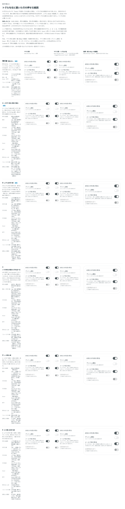

# 0066. トグルの行の形と押せる範囲

- ステータス: Accepted
- 日付: 2026-09-14
- ラウンド: 後半 軸46

## 背景

トグルのトラックを右に置く（`togglePlacement="end"`）行は、押せる範囲がラベルの文字とトラックだけです。文字とトラックのあいだの空白は押せず、行が複数並ぶと、どの文字がどのトグルに対応するかも分かりにくくなります。

押せる範囲は見た目の範囲と一致させる、という決まりから（原則7・原則11、[ADR-0048](./0048-hit-area.md)）、行全体を押せるようにするときは、押せる範囲を線や囲みで見せる必要があります。この軸では、Switch の `frame` で選べる行の形を決めます。

## 候補

比較は Storybook の `Design Review/46 トグルを右に置いた行の押せる範囲`（決めた時点のコミット `5de918a`。`git checkout 5de918a && pnpm storybook` で開けます）です。

| 案     | 内容                                                                 |
| ------ | --------------------------------------------------------------------- |
| 現行版 | 囲みなし（`frame="none"`）。押せるのはラベルの文字とトラックだけ       |
| A      | `frame="card"`。1行ずつ細い線の角丸（部品の角）で囲む。行の間 8px      |
| B      | `frame="divided"`。行の上下に区切り線。続けて並べると線は1本           |
| C      | `frame="grouped"`。続けた行を1つの角丸の囲みにまとめ、行間に区切り線   |
| D      | A の線を一段薄いグレーにしたもの                                       |
| E      | B の線を一段薄いグレーにしたもの                                       |

A・B・C はどれも、囲みの内側全部（線を含む）を押せるようにし、hover・押しているあいだは行の塗りで押せる範囲を示します。行の形（線・囲み・余白）以外は同じ値を使い、キーボードのフォーカスの線も行に出します。

## 決定

**部品の既定は現行版（`frame="none"`）のままにします。A（`card`）と B（`divided`）を選べるようにします。C（`grouped`）と、線を薄くした D・E は採りません。**

囲み（`card`・`divided`）があるときは、トラックを行の縦の中央に置きます。囲みなし（`none`）は、いまと同じくラベルの行の中央です。

## 理由

ユーザーのメモです。

> Select で右側トグルを選んだ場合、トグルできる領域がかなり狭いのと、対応が分かりづらいので、薄い四角で括られて内部領域に全部判定がある形式や、上下に divider を配置して、divider の中は全部判定がある、とかにしたほうがいいかもですね。そのサンプルも貰えると助かります。

> 46 にも左トグルバージョンが欲しいです。デフォルトって右トグルでしたっけ

トグルの既定の位置（`togglePlacement="start"`、左）を確かめる質問で、答えは「トグルは左右両方を選べるようにしたいです。デフォルトは左トグルにしたい気持ちがあります。」（backlog の記録待ちの節）でした。

> 46 で区切り線か囲みがあるときは、トグルが縦中央に来るようにしてほしいです（囲みなしではそのまま）

> 46 はA/B の divider の薄い版を作れますか？現行デフォルトで、A も B も選べる、とかを考えています。

薄い版（D・E）を作ったうえでの、最終の答えです。

> 46 はA・Bでお願いします。

以上から、押せる範囲は線か区切り線で見せ、囲みがあるときはトラックを縦の中央にそろえること、線の濃さは細い境界線のままでよいこと、行の形は既定を変えずに選べる形にすることが分かります。

## 却下した案と理由

- **C（grouped）**: 選ばれませんでした。「46 はA・Bでお願いします」で、行の形は A と B に絞られました
- **D（A の薄い線）・E（B の薄い線）**: 選ばれませんでした。線は A・B の細い境界線のままです

## 影響

- `src/components/Switch.tsx`: `SwitchFrame` は `'none' | 'card' | 'divided'` です。`grouped` は候補にはありましたが実装せず、比較のストーリーでは `frame="divided"` の行に CSS を当てて、比べたときの見た目を再現していました（そのストーリーと、CSS を持っていた `design/stories/pins.tsx` の節は、決めたあとに消しました。どちらもコミット `5de918a` に残っています）
- `tokens.css`: `--switch-row-line-width`・`--color-switch-row-line`・`--switch-row-radius`（card）・`--switch-group-radius`（grouped。部品からは未使用）・`--switch-row-gap`・`--switch-row-pad-y` を、行の形の見た目として持ちます
- 囲み（`card`・`divided`）があるとき、トラックの縦の位置は `--switch-row-track-rows`・`--switch-row-track-align` で行（ラベルとキャプションのまとまり）の縦の中央に決まります。囲みなしはラベルの行の中央（`--switch-track-rows`）のままです
- **残った問題**:
  - `divided` は、行のあいだの線を1本に重ねるため、行を間をあけずに続けて（兄弟として）置く必要があります。まとめ役の部品はまだありません
  - 行全体を押せる形にすると、押せる範囲がラベルの `::after` を行いっぱいに広げたものになるため、キャプションの文字を選択（テキスト選択）できません
  - hover・押下の行の塗りの上で OFF のトラックがほぼ見えなくなる問題は、この軸では残り、軸47（[ADR-0067](./0067-switch-row-press.md)）で扱いました

## 原則への反映

反映なし。押せる範囲を見た目と一致させる原則の書き換えは ADR-0048（原則7・原則11）で行っています。この決定は、その範囲内で Switch の `frame` の選択肢（`card`・`divided`）と、囲みがあるときのトラックの縦位置を決めたものです。

## 比較画像

