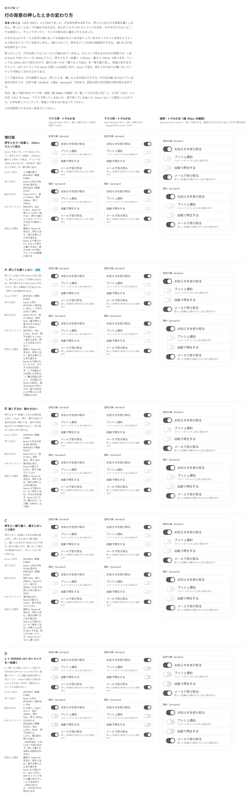

# 0067. トグルの行を押したときの塗りと、OFF・箱の色

- ステータス: Accepted
- 日付: 2026-09-14
- ラウンド: 後半 軸47

## 背景

行全体を押せるトグル（[ADR-0066](./0066-switch-row-frame.md)）は、hover で淡いグレーが 100ms で入り、押すともう一段濃く（100ms）、離すと 100ms で戻ります。クリックは 100ms ほどで終わるため、面の大きい行が「濃くなって戻る」を短時間で繰り返し、明滅して見えます。

もう1つ、OFF のトラックは hover の塗りとほぼ同じ色で、hover で溶け、押すと行のほうが濃くなってトラックが明るく浮かび上がる問題もありました。

## 候補

比較は Storybook の `Design Review/47 行の背景の押したときの変わり方`（決めた時点のコミット `5de918a`（`git checkout 5de918a && pnpm storybook` で開けます））です。

| 案     | 内容                                                                          |
| ------ | ------------------------------------------------------------------------------ |
| 現行版 | hover で 100ms、押すと本文の色を8%混ぜて100msでさらに濃く、離すと100msで戻る    |
| A      | 押しても hover と同じ塗りのまま（濃くしない）。押す動きは 0ms                   |
| B      | 現行版と同じ濃さの変化だが、動きの長さをすべて 0ms にする                       |
| C      | 押すのは一瞬（0ms）、離すときだけ 200ms かけて戻す                              |
| D      | A に加えて、行の中の OFF のトラックだけ一段濃い `#E1E3E4` にする                |

押して離すあいだ、hover の塗りより暗いフレームが出た時間を記録すると、現行版 12 フレーム（183ms）・B 6 フレーム（83ms）・C 15 フレーム（233ms）・A と D は 0 フレームでした。

## 決定

**A に決めます。行全体を押せる形でも、押しても行の背景を濃くしません。押したことはノブの縮みで伝えます。**

あわせて、D で試した OFF のトラックの色（一段濃いグレー `#E1E3E4`。`--color-field-addon` と同じ）を、行の中だけでなくトグルの OFF のトラックすべての既定にします。チェックボックス・ラジオの選んでいない箱の色も、同じ濃さの組（選んでいない箱 `#E1E3E4`・エラー `#F1E0DE`・押せない `#F2F4F4`）にそろえます。

## 理由

ユーザーのメモです。

> これ区切り線においても同様のちらつきが起こっていますか？テキストを押すとフォーカス色がちらついている気がします。

線ではなく押せるエリア全体の背景だと確かめたやりとりです。

> 線じゃなくて、押せるエリア全体の背景部分ですね

> 47 自体は A がよさそう。

OFF の色については、次のやりとりで決まりました。

> 47 の D のOFF の色、デフォルトでこれにしてもいいかもですね。既存の色はデザイントークンから引いてますか？

どこでも既定にするか行の中だけにするか、チェックボックスとの濃さのそろいを尋ねたあとの答えです。

> チェックボックスの色も濃くして揃えてOKです。

以上から、行の明滅は押したときの塗りの変化そのものが原因で、動きの長さを詰めるより押しても濃くしないほうが解決に合うこと、OFF の濃さは行の中だけの例外ではなく、トグルとチェックボックス・ラジオを通しての既定にすることが分かります。

## 却下した案と理由

- **B（動きをなくす）**: 選ばれませんでした。押して離すあいだ、hover より暗いフレームが 6 フレーム（83ms）残り、明滅は減っても消えませんでした
- **C（戻りだけゆっくり）**: 選ばれませんでした。暗いフレームがいちばん長く（15 フレーム・233ms）残りました
- **現行版**: 選ばれませんでした。暗いフレームが 12 フレーム（183ms）で、クリックのたびに明滅しました

## 影響

- `tokens.css`: `--switch-row-press-darken: 0%`・`--switch-row-duration: var(--duration-field)`（100ms）・`--switch-row-press-duration: 0ms` にしました。`--color-switch-off`・`--color-switch-row-off` を `var(--color-field-addon)`（`#E1E3E4`）にし、`--color-choice`・`--color-choice-hover` も同じ色から計算する値にしました
- `src/components/Switch.tsx`: 行の塗りの動き（`rowBase`）はトークンをそのまま読むので、コードの変更はありません
- 押せない OFF のトラック（`--color-switch-off-disabled`）は、押せる OFF（`#E1E3E4`）と紛れないよう、ふだんより薄い入力欄の塗り（`#F2F4F4`）のままにしました。押せない箱（`--color-choice-disabled`）も同じです
- **ADR-0011・軸40の決まりの書き換え**: OFF のトラックの色は、ADR-0011 が決めたグレーのボタンの塗り（`#EFF0F1`）から、この決定の `#E1E3E4` に変わります。チェックボックス・ラジオの選んでいない箱の色（軸40 の現行版で決めた入力欄の塗り `#F2F4F4`）も、この決定の `#E1E3E4` に変わります。ADR-0011・軸40 の記録は値の履歴として残し、この ADR がそのあとの値を上書きします
- 比較のストーリー: 過去の比較（`Design Review` の各軸）は、`design/stories/pins.tsx` の `keepToggleColorAsCompared` で、比べたときの色（OFF `#EFF0F1`・箱 `#F2F4F4`）に固定して再現します
- 押しているあいだの塗りの動きについて、動きを減らす設定・行の中の OFF の色以外は比べていません

## 原則への反映

反映なし。押しても行を濃くしない扱いは、原則3の「一覧の項目は…押しても沈みません。押した瞬間に一覧が閉じるためです」と同じ、押せるものの塗りが hover の反応にとどまる既存の型の範囲内です。OFF・箱の色の変更は、原則6・12が定める「色は役割で持つ」「基準を満たせない面には輪郭を足さない」という文の範囲内の値の変更で、文言は書き換えません。

## 比較画像

