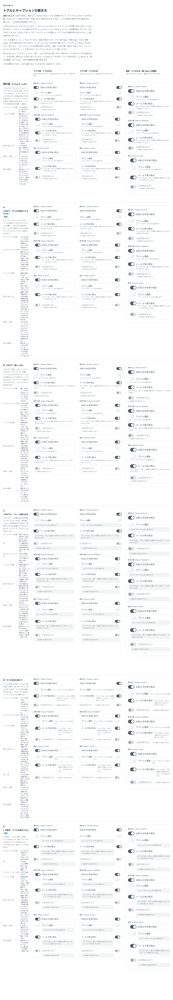

# 0068. トグルとキャプションの置き方

- ステータス: Accepted
- 日付: 2026-09-14
- ラウンド: 後半 軸48

## 背景

いままで、トグルのトラックとラベルは「ラベルとキャプションのまとまり」を部品の高さの中央に置いていました。キャプションがあると、そのぶんまとまりが背高くなり、ラベルとトラックが上に動きます。ユーザーからは、キャプションの位置によってトグルの位置が動くことに違和感があるとの指摘がありました。

## 候補

比較は Storybook の `Design Review/48 トグルとキャプションの置き方`（決めた時点のコミット `5de918a`（`git checkout 5de918a && pnpm storybook` で開けます））です。A〜E は共通のルールとして、トラックとラベルを部品の高さの1行（マウス用 40px・指用 44px・大きい指用 52px）の縦の中央にそろえ、キャプションはこの行の外に置きます。囲み（区切り線・囲み）があっても、トラックはこの1行の中です。

| 案     | 内容                                                                         |
| ------ | ------------------------------------------------------------------------------ |
| 現行版 | ラベルの列、ラベルのすぐ下。トラックはラベルの行の中央（キャプションで動く）    |
| A      | 1行の下、ラベルの列（ラベルの始まりにそろえる）                                 |
| B      | 1行の下、幅いっぱい（トラックの下から）                                         |
| C      | 1行の下、幅いっぱいの淡いグレーの面の中                                         |
| D      | ラベルの右に続けて、小さい文字で置く                                            |
| E      | C の面を、ラベルの列だけに敷く                                                  |

## 決定

**囲みなし（`frame="none"`）の A を既定にします。トラックとラベルは部品の高さの1行の縦の中央にそろえ、キャプションはその下にラベルの列で置きます。E（C の面をラベルの列に敷いたもの）も、`captionAppearance="surface"` で選べます。囲み（`card`・`divided`）を付けるときは、トラックを囲み（行全体）の縦の中央に置きます。**

この決定で、指用のトグルの縦位置を比べていた軸44は決めなくてよくなり、置き換わりました。

## 理由

ユーザーのメモです。

> 45, 46, 47 ですが、トグル＋ラベルに対して、キャプションの位置でかなり迷っていると思います。トグルとラベルが縦中央ぞろえとしたとき、いろいろなキャプションの位置の案（下にグレー地で出てくる など）を出してほしいです。キャプションの位置によってトグルの位置が変わるのがちょっと違和感がありまして。

C（面で出す案）を、ラベルの列だけに絞れないかを確かめたあとの答えです。

> 48 の C をスイッチの下ではなくラベルと同じ列で始められますか？

E を足して見せたあとの、最終の答えです。

> 失礼しました。では48は - frame none の A がデフォルト - E も選べる - 囲みを付ける場合は、トグルは囲みに対して縦中央の位置に置かれる

以上から、トラックとラベルの位置はキャプションの有無や長さで動かさないこと、キャプションはラベルの列に収めること（幅いっぱいに広げない）、面で強調する形も選べるようにすること、囲みがあるときのトラックの位置は軸46と同じく囲みの縦の中央にそろえることが分かります。

## 却下した案と理由

- **B（幅いっぱい）**: 選ばれませんでした。トグルが左のとき、キャプションの始まりがラベルとずれ、トラックの下に文字が回り込みます
- **C（幅いっぱいの面）**: 単独では選ばれませんでした。ラベルの列だけに絞った E に置き換わりました
- **D（ラベルの右に続ける）**: 選ばれませんでした。長いキャプションで3層の構造が崩れます
- **現行版**: 既定からは外れました。キャプションの有無・長さでトラックとラベルの位置が動く点が、違和感の原因でした

## 影響

- `src/components/Switch.tsx`: `SwitchCaptionAppearance` は `'plain' | 'surface'` です。`plain`（A）は面なし、`surface`（E）はラベルの列に入力欄の塗りの面を敷きます
- `tokens.css`: `--switch-line: 1`・`--switch-track-align: start`・`--switch-label-align: baseline` で1行に固定し、`--switch-columns-start`・`-end`・`--switch-caption-column: label`・`-row: 2`・`-gap: 0px`・`-hug: 1` でキャプションをラベルの列の下に置きます。`--switch-row-track-rows: 1 / -1`・`--switch-row-track-align: center` で、囲みがあるときのトラックを行全体の縦の中央にします。`surface`（E）の面は `--switch-caption-surface-*` に持たせ、`captionAppearance="surface"` のときに置き換えます
- 軸44（指用のトグルの縦の位置）は、この決定に置き換わり、決めなくてよくなりました
- 比較のストーリー: 過去の比較（軸48より前のもの）は、`design/stories/pins.tsx` の `keepSwitchCaptionAsCompared` で、比べたときの形（1行に固定しない、まとまりを部品の高さの中央に置く）に固定して再現します
- **分かっていること**: A〜E では、キャプションの有無・長さでトラックとラベルが動かないことを測って確かめました。囲みなしと囲みありで、キャプションのある行とない行を混在させたときの見え方の細部は、この軸では比べていません

## 原則への反映

反映なし。原則4「部品は『ラベル／本体／キャプション』の3層」の範囲内の決定です。トラックとラベルの位置をキャプションで動かさない扱いは、原則4の「キャプションは省略できます。省略してもレイアウトは崩しません」の考えをトグルにも適用したものです。

## 比較画像

