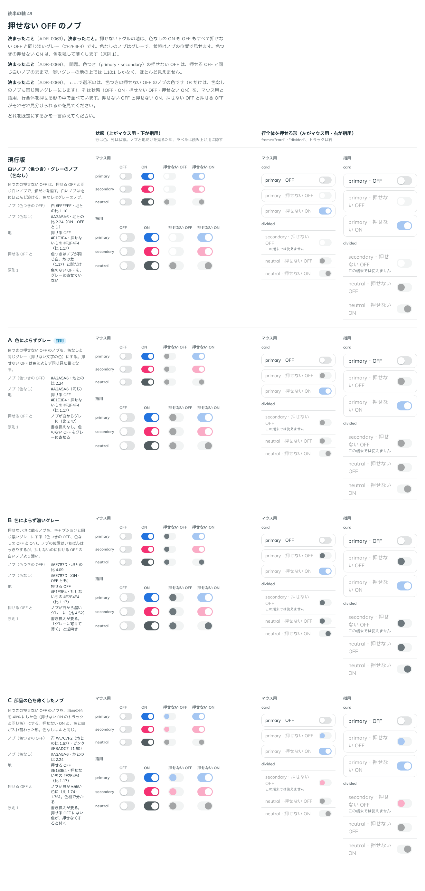

# 0069. 押せない OFF のノブ

- ステータス: Accepted
- 日付: 2026-09-15
- ラウンド: 後半 軸49

## 背景

押せないトグルの地は、色なしの ON も OFF もすべて `#F2F4F4` にそろえました（軸47・[ADR-0067](./0067-switch-row-press.md)のあとの直し）。色つき（primary・secondary）の押せない OFF は、押せる OFF と同じ白いノブのままで、この淡いグレーの地の上では 1.10:1 しかなく、ほとんど見えません。

## 候補

比較は Storybook の `Design Review/49 押せない OFF のノブ`（決めた時点のコミット `5de918a`（`git checkout 5de918a && pnpm storybook` で開けます））です。地の色（押せる OFF `#E1E3E4`・押せないもの `#F2F4F4`、比 1.17）は、どの案も同じです。

| 案     | 色つきの押せない OFF のノブ                                | 地との比    |
| ------ | ------------------------------------------------------------ | ----------- |
| 現行版 | 白（押せる OFF と同じ。影だけ消す）                            | 1.10        |
| A      | 色によらずグレー（色なしの押せないノブと同じ `#A3A5A6`）       | 2.24        |
| B      | 色によらず濃いグレー（キャプションと同じ濃さ `#6E787D`）       | 4.09        |
| C      | 部品の色を 40% 混ぜた薄い色（押せない ON のトラックと同じ考え） | 1.57〜1.60  |

## 決定

**A に決めます。色つきの押せない OFF のノブを、色によらず、色なしの押せないノブと同じグレー（`#A3A5A6`）にします。**

## 理由

ユーザーのメモです。

> 1 は同じ考えからすると、濃い色のノブも選択肢としてはありそうですが、作ってみるとどうでしょうか？

（問題1「色つきの押せない OFF のノブが見えない（白いノブが `#F2F4F4` の上で 1.10）」への答えを受けて A〜C を作りました。）

> 49 は A で、50 も A でよさそうですね。

## 却下した案と理由

- **B（濃いグレー）**: 選ばれませんでした。押せない地の上でいちばんはっきり見えますが、押せる OFF の白いノブより濃くなり、「グレーに寄せて薄くする」原則1の向きと逆になります
- **C（部品の色を薄くしたノブ）**: 選ばれませんでした。押せる OFF にはない色相が、押せなくすると付くことになります

## 影響

- `tokens.css`: `--color-switch-off-disabled-knob: var(--color-switch-neutral-disabled-knob)`（色なしの押せないノブと同じ）にし、`--switch-off-disabled-knob-own: 0%`（部品の色を混ぜない）にしました
- `src/components/Switch.tsx`: 変更はありません。ノブの色は `color-mix` で `--switch-off-disabled-knob-own` の割合だけ部品の色を混ぜる式のままで、既定の割合を 0% にしたことで、色によらず同じグレーになります
- 色なしの押せない ON・OFF の見分け（一覧の5「色なしの押せない ON と OFF」）は、この軸では扱わず、ノブの位置だけで見分ける形のまま残しました

## 原則への反映

反映なし。原則1の「色を持つものは色を残して薄くし、色を持たないものはグレーに寄せて文字も薄くします」は、押せない OFF のノブには元々色が残っていなかった（白）ため書き換えは不要です。色つきの押せない OFF のノブを色なしのノブと同じグレーにする決定は、原則1の「色を持たないものはグレーに寄せる」を、色つきの部品の「色を持たない部分」（OFF のノブ）にも適用したものです。

## 比較画像

