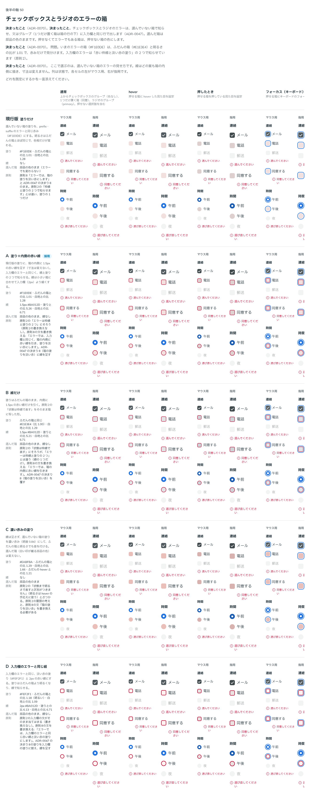

# 0070. チェックボックス・ラジオのエラーの箱

- ステータス: Accepted
- 日付: 2026-09-15
- ラウンド: 後半 軸50

## 背景

チェックボックスとラジオのエラーは、選んでいない箱の塗りで知らせています（[ADR-0047](./0047-principles-probe.md) 決まり8）。この塗り（`#F1E0DE`）は、ふだんの箱の塗り（`#E1E3E4`）と明るさの比が 1.01 で、赤みの色相だけで見分けています。入力欄のエラーは、赤い枠線と淡い赤の塗りの2つで知らせています（原則2）。

## 候補

比較は Storybook の `Design Review/50 チェックボックスとラジオのエラーの箱`（決めた時点のコミット `5de918a`（`git checkout 5de918a && pnpm storybook` で開けます））です。選んだ箱は、どの案も部品の色のまま（線も引かない）で、寸法は変えません。

| 案     | 塗り                                | 線                                     |
| ------ | ------------------------------------ | ---------------------------------------- |
| 現行版 | `#F1E0DE`（ふだんの箱との比 1.01）    | なし                                      |
| A      | `#F1E0DE`（同上）                     | 内側 1.5px `#BA012D`（塗りとの比 5.26）   |
| B      | ふだんの箱と同じ `#E1E3E4`             | 内側 1.5px `#BA012D`（塗りとの比 5.21）   |
| C      | 濃い赤み `#EABFBA`（比 1.29）          | なし                                      |
| D      | 入力欄のエラーと同じ `#FEF2F1`（比 1.18） | 2px `#BA012D`（塗りとの比 6.13）       |

## 決定

**A に決めます。エラーの箱は、塗り `#F1E0DE` に、箱の内側に 1.5px の赤い線を引きます。**

## 理由

ユーザーのメモです。

> 4 は他に改善策はありますか？

（一覧の問題4「エラーの箱と通常の箱の明るさの比が 1.01」への答えを受けて、入力欄と同じく赤い枠線を足す案などを作りました。）

> 49 は A で、50 も A でよさそうですね。

## 却下した案と理由

- **B（線だけ）**: 選ばれませんでした。塗りをふだんの箱に戻すと、原則8の「エラーでは、箱の塗りを淡い赤にします」（[ADR-0047](./0047-principles-probe.md) 決まり8）を覆すことになります
- **C（濃い赤みの塗り）**: 選ばれませんでした。明るさの差だけで状態を表すことになり、原則2の「状態まで明るさで表すと区別がつきません」とぶつかります
- **D（入力欄のエラーと同じ組）**: 選ばれませんでした。塗りが `#FEF2F1` になり、ふだんの箱より明るくなります（比 1.18）。A は塗りを変えずに線だけ足すので、既存の塗りとの整合が高い案です

## 影響

- `tokens.css`: `--choice-invalid-line-width: 1.5px`・`--color-choice-invalid-line: var(--color-danger)` にしました。`--color-choice-invalid` は `var(--color-field-addon-invalid)`（`#F1E0DE`）のままです
- `src/components/Checkbox.tsx`・`src/components/Radio.tsx`: 選んでいない、押せる箱だけに、`--choice-invalid-line-width` の inset の影で線を引きます（寸法は変えません）。押せなくてエラーでもある箱は、押せない箱の色を優先し、線も引きません
- 比較のストーリー: 過去の比較は `design/stories/pins.tsx` の `keepToggleColorAsCompared` で、塗りだけ（線なし）に固定して再現します

## 原則への反映

原則8の「エラーでは、箱の塗りを淡い赤にします」を、「エラーでは、入力欄と同じく、箱の内側に赤い線を引き、塗りを淡い赤にします」に書き換えます。[ADR-0047](./0047-principles-probe.md) の決まり8（「チェックボックスのエラーは、箱の塗りを淡い赤にし、エラーの文はグループの見出しに、入力欄と同じ形で付けます」）も、塗りに線を足す形に更新します。原則2の「エラーは枠線と塗りの2つで知らせます」は書き換えません。チェックボックス・ラジオの箱がその文にそろう形になります。

## 比較画像

