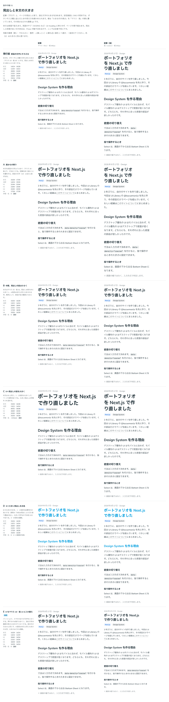
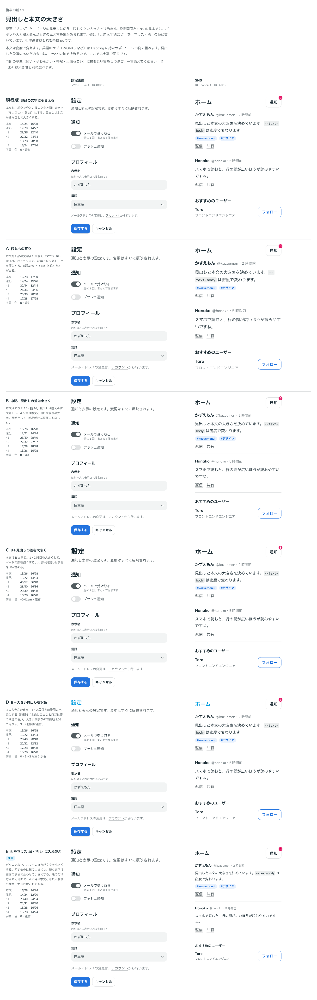

# 0078. 読む文字の大きさ

- ステータス: Accepted
- 日付: 2026-09-17
- ラウンド: 後半 軸51

## 背景

記事（ブログ）と、設定画面のような機能の画面の見出し・本文（Heading・Text の部品を想定した大きさ）を決めます。部品の中の文字（ボタンやラベルなど）とは別に持ちます。

決める前に、2つの前提を確かめました。

- 本文の大きさも密度（入力方式）で変えるか: 「変える」
- 英語のサブタイトルを Heading に持たせるか: 「持たせない」

## 候補

値は「マウス用/行の高さ・指用/行の高さ」（px）です。

| 案                                          | 本文         | 注記         | h1                     | h2                     | h3           | h4                                            |
| ------------------------------------------- | ------------ | ------------ | ---------------------- | ---------------------- | ------------ | --------------------------------------------- |
| 現行版（部品の文字にそろえる）              | 14/24・16/28 | 12/20・14/22 | 28/36・32/40           | 22/32・24/34           | 18/28・20/30 | 15/24・17/26                                  |
| A 読みもの寄り                              | 16/28・17/30 | 14/24・15/26 | 32/44・32/44           | 24/36・24/36           | 20/30・20/30 | 17/28・17/28                                  |
| B 中間、見出しの差は小さく                  | 15/26・16/28 | 13/22・14/24 | 28/40・28/40           | 22/32・22/32           | 17/28・18/28 | 15/26・16/28（4段目は本文と同じ大きさの太字） |
| C B＋見出しの差を大きく（字間 −0.01em）     | B と同じ     | B と同じ     | 40/52・36/48           | 28/40・26/36           | 20/30・19/28 | 16/26・16/28                                  |
| D B＋大きい見出し（1・2段目）を前景用の水色 | B と同じ     | B と同じ     | B と同じ（色だけ変更） | B と同じ（色だけ変更） | B と同じ     | B と同じ                                      |
| E B をマウス 16・指 14 に入れ替え           | 16/28・14/24 | 14/24・12/20 | 28/40・24/34           | 22/32・20/30           | 18/28・16/26 | 16/28・14/24（大きさはどれも偶数）            |

途中で、設定画面と SNS の見本を足してほしいという要望があり、機能的な部品と一緒に使われる様子も見られるようにしました。奇数の大きさでは行の高さとの差が奇数になり、上下の余白が 0.5px になる懸念を伝えたうえで、E を候補に足しました。

比較のストーリーは、コミットする前の作業中に作って消したため、決めた時点のコミットはありません。記録は比較画像です。

## 決定

**E を採用します。** さらに、読みもの（`data-reading` を付けた要素。Prose が付ける予定です）の中では、指で操作していてもマウス用の値（本文 16px）を保ちます。

## 理由

ユーザーのメモです。

> 51 ですが、SNS や設定画面 のようなサンプル画面で機能的コンポーネントが一緒に使われている様子も見てみたいです。

> そもそも、パソコンとスマホの考え方を間違えていたかもしれません。パソコンと比べて、スマホのほうが文字が小さく、触れるものは大きくなる、が正しい気がしてきました。51について、今の判定を逆転させてパソコンは16px、スマホは14px、B案で反映するとどうでしょうか。

> 見出しの考え方は B（E）をベースに ・パソコンの場合は常に16px ・スマホの場合、デフォルトは14pxを基準とする（機能的画面を対象にする）が、Prose のように読み物の場合は16pxを維持する としたいです。

- **段の付け方は B**: 見出しの差を小さくした段の付け方を採用しました。C の差を大きくする方向や、D の色を変える方向は採りませんでした
- **マウスとスマホの大小関係を反転**: 当初はスマホ（指）を大きく、パソコン（マウス）を小さくしていましたが、「スマホのほうが文字が小さく、触れるものは大きくなる」という考えに直しました。パソコンは常に 16px、スマホは既定 14px です
- **読みものは指でも 16px を保つ**: 機能の画面（設定画面など）は指で操作するときに文字を小さくしますが、記事のような読みものでは、指で操作していても読みやすさを優先し、マウス用と同じ大きさを保ちます

## 却下した案と理由

- **現行版（部品の文字にそろえる）**: 部品の文字と読む文字を別に持つことにしたため、そろえたままにはしませんでした
- **A（読みもの寄り）**: 選ばれませんでした。見出しの差が大きすぎ、機能の画面には向きません
- **B（中間）**: E の元になった段の付け方として採用しました。マウス・指の値の大小関係だけを反転させたのが E です
- **C（B＋見出しの差を大きく）**: 選ばれませんでした
- **D（B＋大きい見出しを水色）**: 見出しの色は水色にせず、濃紺のままにしました

## 影響

- `tokens.css`: `@theme reference` に `--text-body`・`--text-body-sm`・`--text-heading-1`〜`4` と、対になる `--leading-*` を足しました。`:root` に、それぞれの `-fine`・`-coarse` の値を足しました
- `src/styles/theme.css`: 密度の規則にこれらのトークンを足し、`[data-reading]` の要素では `-fine` の値（マウス用と同じ）を使う規則を足しました
- `src/internal/tv.ts` の `twMergeConfig` に、足したトークン名を足しました
- Heading・Text の部品自体は、この記録の時点ではまだ作っていません。あとで足します
- `design/backlog.md` に「見出しの途中での折り返し」を足しました

## 原則への反映

原則 11 の文を書き換えました。読む文字は機能の画面か読みものかで決めること、見出しは本文に合わせて段を付けることを書きました。

## 比較画像

1本の ADR につき比較画像は1枚が原則ですが、この軸は場面を分けて撮ったため、例外として2枚を置きます。

