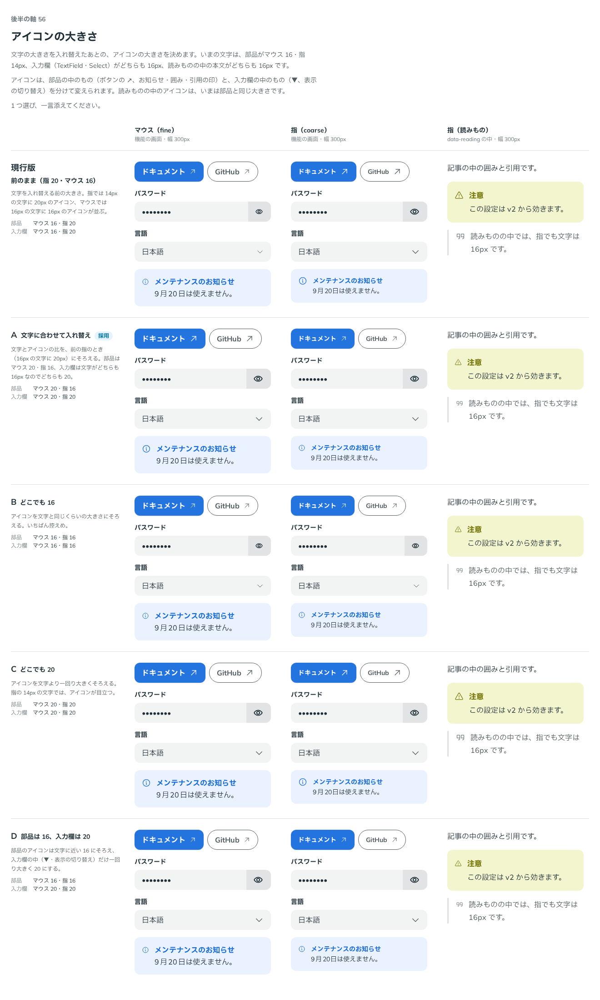

# 0080. アイコンの大きさ

- ステータス: Accepted
- 日付: 2026-09-17
- ラウンド: 後半 軸56

## 背景

[ADR-0079](./0079-control-type-and-height.md) で部品の文字の大小関係を入れ替えたあと、アイコンだけは前の大きさ（指 20px・マウス 16px）のままでした。指で操作すると、14px の文字に 20px のアイコンが並んで見えました。

入力欄の中のアイコンだけを分けて変えられるよう、`--spacing-icon-input` を足し、`controlBox` と Select の選択肢の中で `--spacing-icon` の代わりに当てました。

## 候補

列は「部品（マウス・指）／入力欄（マウス・指）」です。

| 案                       | 部品（マウス・指） | 入力欄（マウス・指） |
| ------------------------ | ------------------ | -------------------- |
| 現行版                   | 16・20             | 16・20               |
| A 文字に合わせて入れ替え | 20・16             | 20・20               |
| B どこでも 16            | 16・16             | 16・16               |
| C どこでも 20            | 20・20             | 20・20               |
| D 部品は現行のまま       | 16・20             | 20・20               |

比較のストーリーは、コミットする前の作業中に作って消したため、決めた時点のコミットはありません。記録は比較画像です。

## 決定

**A を採用します。** 部品の中のアイコンはマウス 20px・指 16px、入力欄の中のアイコンはマウス・指とも 20px にします。

## 理由

ユーザーのメモです。

> 56 については A が自然かなと思いました。上の変更をした後再度見たいです。

高さを 44px にそろえたあと、見本のページで見直し、「一旦これで行きましょう。」との返事でした。

- **文字とアイコンの比をそろえる**: 「16px の文字に 20px」の比を、部品でも入力欄でも保つようにしました。部品はマウス 16px の文字に 20px、指 14px の文字に 16px のアイコンです
- **高さを見直したあとに再確認**: マウス用の高さを 44px にそろえたことで見え方が変わるため、その変更を反映した見本のページで改めて確認してから決めました

## 却下した案と理由

- **現行版**: 選ばれませんでした。指の文字が 14px に小さくなったあとも、アイコンだけ前の大きさ（20px）のままでは比が崩れます
- **B（どこでも 16）**: 選ばれませんでした
- **C（どこでも 20）**: 選ばれませんでした
- **D（部品は現行のまま）**: 選ばれませんでした

## 影響

- `tokens.css`: `--spacing-icon-coarse`（16px）・`-fine`（20px）と、新しく足した `--spacing-icon-input-coarse`（20px）・`-fine`（20px）を更新しました
- `src/styles/theme.css`: 密度の規則に `--spacing-icon-input` を足しました
- `src/internal/field/field-styles.ts`・`src/components/select/Select.tsx`: 入力欄の中のアイコンに `--spacing-icon-input` を当てました
- 見た目の基準画像を撮り直しました

## 原則への反映

反映なし（既存の原則の範囲内）。

## 比較画像

