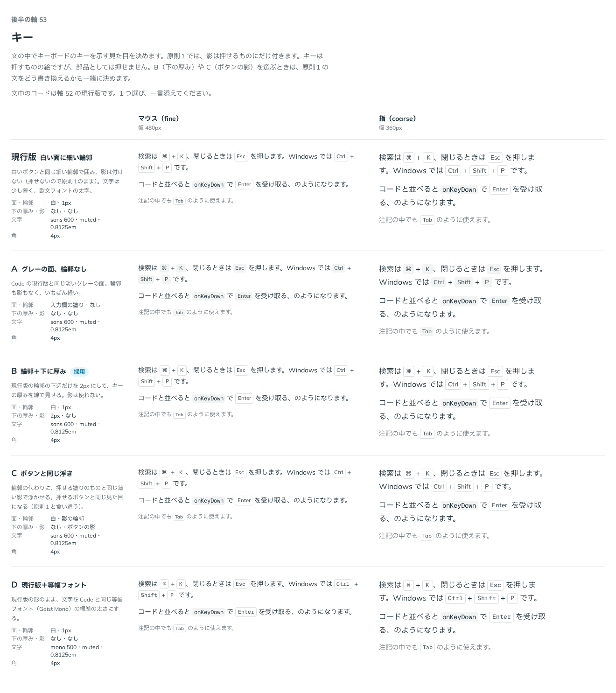

# 0082. キー

- ステータス: Accepted
- 日付: 2026-09-17
- ラウンド: 後半 軸53

## 背景

文中でキーボードのキーを示す部品（`Kbd`）の見た目を決めます。原則1（影は押せるものだけに付く）と原則5（角丸は部品と包むもので分ける）に関わります。

キーは「押すものの絵」ですが、部品としては押せません。原則1 のとおりに進めるなら影は付けられませんが、影や下の厚み（B・C）を選ぶ案もあり、選べば原則1 の文をどう書き換えるかも一緒に決める必要がありました。

## 候補

大きさと余白は、周りの文字に対する比（em）です。

| 案     | 面・輪郭               | 下の厚み・影     | 文字                      | 角  |
| ------ | ---------------------- | ---------------- | ------------------------- | --- |
| 現行版 | 白・1px                | なし・なし       | sans 600・muted・0.8125em | 4px |
| A      | 入力欄の塗り・輪郭なし | なし・なし       | sans 600・muted・0.8125em | 4px |
| B      | 白・1px                | 2px・なし        | sans 600・muted・0.8125em | 4px |
| C      | 白・影の輪郭           | なし・ボタンの影 | sans 600・muted・0.8125em | 4px |
| D      | 白・1px                | なし・なし       | mono 500・muted・0.8125em | 4px |

現行版は白い面に細い輪郭で囲み、影は付けません。A はグレーの面で輪郭もなし。B は輪郭の下辺だけを太くして厚みを線で見せます。C は押せる塗りのボタンと同じ薄い影で浮かせる案（原則1 と食い違います）。D は現行版のまま文字だけを等幅フォント（Geist Mono）にする案です。

比較のストーリーは、コミットする前の作業中に作って消したため、決めた時点のコミットはありません。記録は比較画像です。

## 決定

**B を採用します。** 白い面に、白いボタンと同じ細い輪郭。下辺だけを太い線（`--border-width-thick`）にして、キーの厚みを表します。影は付けません（原則1 のまま）。

## 理由

ユーザーのメモです。

> 53 は B が好みですね。

- **原則1 を保ったまま厚みを表す**: C（ボタンと同じ影）は押せるものの見た目と同じになり、キーが押せるという誤解を生みます。B は影を使わず、下辺の線を太くするだけで厚みを見せるため、原則1（影は押せるものだけ）を変えずに済みます
- **フォントは変えない**: D（等幅フォント）は採らず、現行版の欧文フォントの太字のままにしました

## 却下した案と理由

- **現行版（白い面・輪郭のみ）**: 選ばれませんでした。厚みの表現がなく、キーらしさが弱いままでした
- **A（グレーの面・輪郭なし）**: 選ばれませんでした
- **C（ボタンと同じ浮き）**: 選ばれませんでした。影を使うと押せるボタンと見分けが付かなくなります
- **D（現行版＋等幅フォント）**: 選ばれませんでした

## 影響

- `design/tokens.css`: `--kbd-size`（0.8125em）・`--kbd-min-width`（1.75em）・`--kbd-pad-x`（0.4em）・`--kbd-line-bottom-width`（`--border-width-thick`）を足しました
- `src/internal/reading/kbd.ts`（`src/internal/reading/code.ts` の `kbdStyles`）: `Kbd` 部品と Prose が使うクラス列を持ちます。白い面（`bg-surface`）、`text-fg-muted`、輪郭は `border`＋`border-b-(length:--kbd-line-bottom-width)`
- `src/components/kbd/Kbd.tsx`（新規）: props を持たない、見た目だけの部品です
- 文中のコードは軸 52（[ADR-0081](./0081-inline-code.md)）の A です
- `design/backlog.md` に足す未決事項の案: なし

## 原則への反映

原則1 の文を書き換えました（すでに適用済み）。「キーボードのキーは押すものの絵ですが、部品としては押せません。影は付けず、下辺の線を太くして厚みを見せます。」を足しました。

## 比較画像

