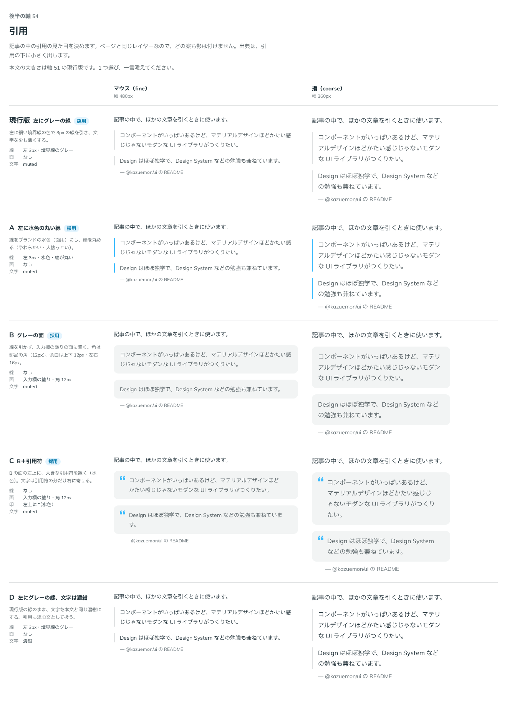

# 0083. 引用

- ステータス: Accepted
- 日付: 2026-09-17
- ラウンド: 後半 軸54

## 背景

記事の中で、ほかの文章を引くときの見た目（`Blockquote`）を決めます。原則1（影は押せるものだけ）・原則5（角丸）・原則6（色）に関わります。ページと同じレイヤーなので、どの案も影は付けません。

## 候補

| 案     | 線                                 | 面                                                | 文字               |
| ------ | ---------------------------------- | ------------------------------------------------- | ------------------ |
| 現行版 | 左 3px・境界線のグレー             | なし                                              | muted              |
| A      | 左 3px・水色（ブランド）・端が丸い | なし                                              | muted              |
| B      | なし                               | 入力欄の塗り・角 12px                             | muted              |
| C      | なし                               | 入力欄の塗り・角 12px＋左上に大きな引用符（水色） | muted              |
| D      | 左 3px・境界線のグレー             | なし                                              | 濃紺（本文と同じ） |

## 決定

**現行版を既定にします。** 加えて、次を足しました。

- `color`（`neutral`・`brand`・`primary`・`secondary`）で、線とアイコンの色を選べるようにする
- `appearance="surface"` で、B（入力欄の塗りの面）も選べるようにする
- `icon` を渡すと、お知らせと同じく 1 行目の中央にそろえて置く（C の引用符を、利用者が選ぶアイコンにした形）
- 線の端は丸めない（A の丸い端は採らない）

## 理由

ユーザーのメモです。

> 54 は全部の見た目が捨てがたいなと思いました。現行版とAが選べる（デフォルトは現行で、props で color が指定できる、とか？）で、B と C についても選べるようにしたい（アイコンなしがデフォルトで、アイコンを指定すると Notice と同じように1行目に揃える形、としたいです）

> 1: 引用の線の端は丸めない形でお願いします。

- **現行版を軸に、候補を props に畳む**: 「全部の見た目が捨てがたい」ため、1 つに絞らず、現行版（`line`）を既定にしたまま、色（`color`）と面（`appearance="surface"`）を props で選べる形にしました
- **C の引用符は、専用の見た目ではなく icon props にする**: C 案そのものは採らず、「アイコンを指定すると Notice と同じように1行目に揃える」形に一般化しました。これにより、引用符に限らず任意のアイコンを 1 行目に置けます
- **A の丸い線端は不採用**: 「線の端は丸めない形で」という指示のとおり、線は角のまま（`--blockquote-line-radius` のような丸める仕組みは持たない）にしました

## 却下した案と理由

- **A（水色の丸い線）**: 色は `color="brand"` として残しましたが、線の端を丸める部分は採りませんでした
- **B（グレーの面）**: 単独の既定にはせず、`appearance="surface"` として選べる形で残しました
- **C（B＋引用符）**: 単独の見た目としては採らず、引用符は利用者が渡す `icon` に一般化しました

## 影響

- `design/tokens.css`: `--blockquote-line-width`（3px）を足しました
- `src/internal/reading/blocks.ts`: `blockquoteStyles`（`Blockquote` 部品と Prose が使うクラス列）を持ちます。Prose は既定の見た目（左のグレーの線）だけを使います
- `src/components/blockquote/Blockquote.tsx`（新規）: `appearance`（`line`・`surface`、既定 `line`）、`color`（`neutral`・`brand`・`primary`・`secondary`、既定 `neutral`）、`icon`、`source`（出典。渡すと `figure`／`figcaption` で包みます）を持ちます
- 本文の大きさは軸 51（[ADR-0078](./0078-reading-type.md)）に従います
- `design/backlog.md` に足す未決事項の案: なし

## 原則への反映

原則1 の文（「ページと同じレイヤーにあるものには、影を付けません」の一文）に、記事の中の引用を含めました（すでに適用済み。「お知らせ、カード、入力欄、タグと、記事の中の引用、囲み、表、画像、コードです。」）。

## 比較画像

