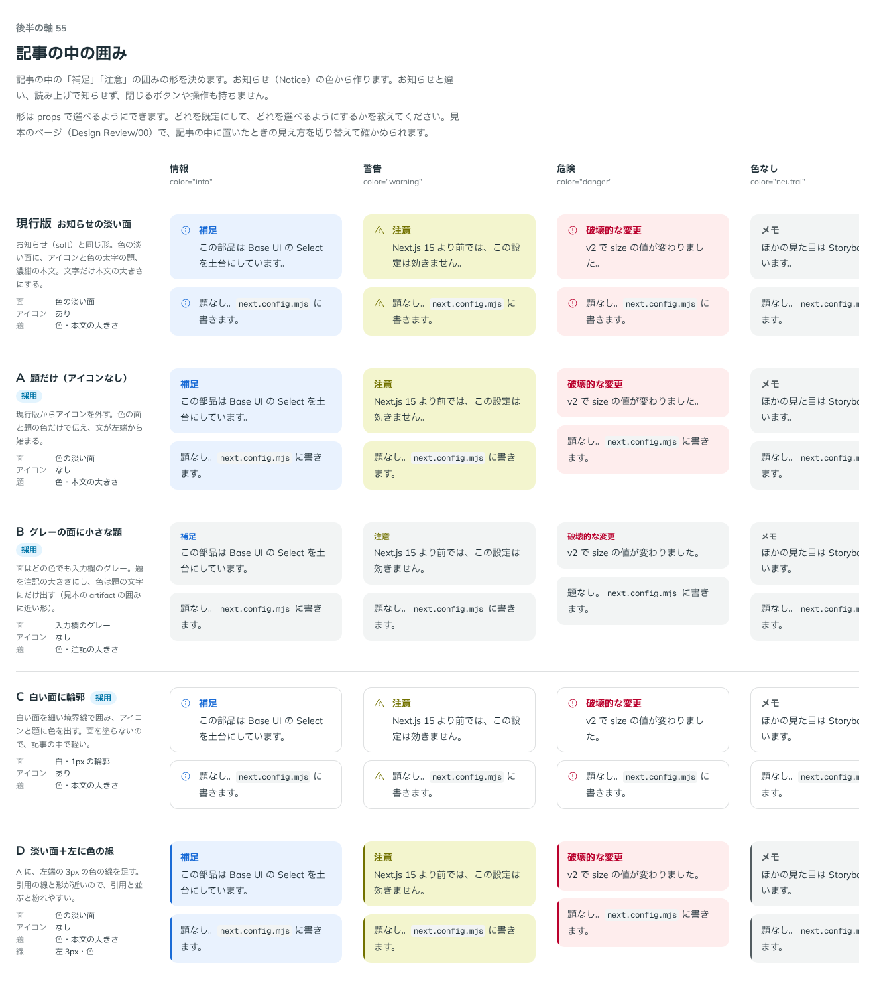

# 0084. 記事の中の囲みと、Callout・Notice の分け方

- ステータス: Accepted
- 日付: 2026-09-17
- ラウンド: 後半 軸55

## 背景

記事の中に、はじめから置く「補足」「注意」のような囲みの見た目（軸55）を決めます。あわせて、この囲みをお知らせ（`Notice`）から派生した別の部品（`Callout`）にするか、`Notice` 自体に見た目のバリエーションを足すだけにするかを決めます。原則1・原則5・原則6 に関わります。

はじめのメモでは「Notice から派生させたいです。アイコンなしのタイトルだけのものとかも欲しいです」とあり、以前に作った artifact の、グレーの面に小さな太字の見出しを付けた囲みが近いイメージとして挙がりました。

## 候補

Notice の色（状態の淡い面と濃い色）から作る前提で、次の5案を比べました。影は付けません（原則1）。

| 案     | 面                                  | アイコン | 題                           |
| ------ | ----------------------------------- | -------- | ---------------------------- |
| 現行版 | 色の淡い面（Notice の soft と同じ） | あり     | 色・本文の大きさ             |
| A      | 色の淡い面                          | なし     | 色・本文の大きさ             |
| B      | 入力欄のグレー（色によらず）        | なし     | 色・注記の大きさ（小さな題） |
| C      | 白・1px の輪郭                      | あり     | 色・本文の大きさ             |
| D      | 色の淡い面＋左に3pxの色の線         | なし     | 色・本文の大きさ             |

色は情報・警告・危険・色なし（`neutral`）の4色で見た。D は引用（Blockquote）の左線と形が近く、並ぶと紛れやすいことも分かりました。

比較のストーリーは、コミットする前の作業中に作って消したため、決めた時点のコミットはありません。記録は比較画像です。

## 決定

**A・B・C を、いずれも使える見た目として残します。** D は採りませんでした。

決定までに、部品の分け方そのものが2度変わりました。

1. はじめは「Notice から派生した別の部品 `Callout` を作り、A・B・C を props で選べるようにする」つもりでした
2. 比べたところ、C（白い面に輪郭）は Notice に既にある `appearance="outline"` とほぼ同じ見た目でした。そこで「Notice にグレー地・アイコンなし・プチ見出し色などのバリエーションがあるだけでいい」と考え直し、`Notice` 自体に `icon={false}`（A のアイコンなし）・`appearance="muted"`（B のグレーの面に小さな題）・`color="neutral"`（色を持たない灰色。それまでの `NoticeColor` は状態の色だけでした）を足しました。この時点では `Callout` を新しく作らない方針でした
3. その後、「Button と Link（ボタンの見た目）みたいに、機能的に異なる（note なのか alert なのか）場合は Callout と Notice で分けたほうが平和」と考え直し、最終的に `Callout` と `Notice` を別の部品として分けました。見た目（色・面・アイコン・題）は `src/internal/notice-surface` に共通の決まりとして置き、部品ごとに次の働きだけを持たせます
   - `Notice`（お知らせ）: あとから画面に出る知らせ。`role="status"`（危険は `role="alert"`）で読み上げに割り込み、閉じるボタン（`onClose`）と操作（`actions`）を持てます
   - `Callout`（記事の中の囲み）: 本文にはじめからある補足。`role="note"` にし、`title` があれば `aria-labelledby` で囲みの名前にします。読み上げに割り込まず、閉じる・操作は持ちません。文字の大きさは読む文字（`--text-body`。密度で変わる）で、部品の文字（`--text-control`）を使う `Notice` とは異なります

## 理由

ユーザーのメモです。

> Notice から派生させたいです。アイコンなしのタイトルだけのものとかも欲しいです。以前に作ってもらった artifact で使われているものがイメージに近いかもです。

> 54 は全部の見た目が捨てがたいなと思いました。（中略）B と C についても選べるようにしたい（アイコンなしがデフォルトで、アイコンを指定すると Notice と同じように1行目に揃える形、としたいです）

> Callout は A も B も C も使いたいですね。今思いましたが、Notice にグレー地・アイコンなし・プチ見出し色などのバリエーションがあるだけでいい説があります。

> 2: どうやったら見た目が良くなるでしょうか？他の地の色でも気になります。

（質問「C（白い面に輪郭）の扱い」への答え）C は既存の `outline` で足りる。（質問「小さな題の組み合わせ」への答え）小さな題はグレーの面（`muted`）と組にする。（質問「色なしを足すか」への答え）neutral は「足すでお願いします。そういえば、アクセシビリティ的な扱いが気になりますね。単に本文中のコールアウトとなると、role をどう付けるのが正しいのか迷います。」

> 先ほど言ったことと矛盾してしまいますが、Button と Link（ボタンの見た目） みたいに、機能的に異なる（note なのか alert なのか）場合は Callout と Notice で分けたほうが平和な気がしてきました。

- **見た目は Notice と共有し、部品は働きで分ける**: 「ボタンと、ボタンの見た目のリンク」（[ADR-0073](./0073-link-or-button.md)）とまったく同じ考え方です。見た目の決まりを `notice-surface` の1か所に置き、読み上げと操作だけを部品ごとに持たせることで、見た目がずれません
- **C は新しい見た目を作らず、既存の `outline` を再利用**: 比べた結果、C は Notice の `outline` とほぼ同じだったため、専用の案として残しませんでした
- **role は `note`**: 「role をどう付けるのが正しいのか迷います」という迷いに対し、記事にはじめからある補足・注意は、あとから知らせる情報（`status`・`alert`）ではないと判断し、`role="note"` としました。`title` は囲みの名前（`aria-labelledby`）になります

## 却下した案と理由

- **D（淡い面＋左に色の線）**: 選ばれませんでした。引用（Blockquote）の左の線と形が近く、並べると引用と紛れます
- **`Callout` を単独の新しい見た目で作る案**: 選ばれませんでした。見た目は Notice と共有し、`notice-surface` に一本化しました
- **見た目も1つの `Notice` にまとめる案**（決定の2番目の案）: 最終的には選ばれませんでした。見た目は同じでも、あとから出す知らせ（note ではなく alert・status）と、本文にはじめからある補足とでは働きが違うため、部品を分けました

## 影響

- `src/internal/notice-surface/notice-surface.ts`（新規）: `Notice` と `Callout` が共有する見た目（`noticeSurface`）。`appearance` に `muted`（グレーの面に状態の色の小さな題。アイコンは既定でなし）を足しました。色（`color`）に `neutral`（色を持たないグレー。淡い面は入力欄の塗り、濃い塗りはトグルの ON と同じ濃いグレー）を足しました。文字の大きさは `size`（`control`＝部品の文字、`body`＝読む文字）で分けられるようにしました
- `src/internal/notice-surface/NoticeIcon.tsx`（新規）: `icon` に `false` を渡すとアイコンを出さない共通の処理。既定のアイコンは状態の色ごと（`muted` と `neutral` ではなし）
- `src/components/notice/Notice.tsx`: `color` の型が状態の色（`info`・`success`・`warning`・`danger`）だけから `neutral` を含む形になりました。`icon` props（`ReactNode | false`）を足しました。見た目は `notice-surface` を使う形に書き換えました
- `src/components/callout/Callout.tsx`（新規）: `role="note"`、`aria-labelledby`（`title` があるとき）、`color`（既定 `neutral`）、`appearance`（既定 `soft`）、`icon`、`title` を持ちます。閉じる・操作の props は持ちません
- `design/backlog.md` の「本文（Prose・CodeBlock など）」節にある「決めること: Callout を Notice の形から作るか、別の部品にするか」は、この ADR で決まったため消してください
- `design/backlog.md` に足す未決事項の案: `Callout` の `role="note"` が、実際の読み上げソフト（VoiceOver・NVDA）でどう読まれるかは確かめていません。「Form・読み上げ」節にある、本物の読み上げソフトで確かめる項目（[ADR-0074](./0074-a11y-review-deferred.md) の F8）に、`Callout` の確かめも合わせて足すことを勧めます

## 原則への反映

原則6 の文を書き換えました（すでに適用済み）。「お知らせは、淡い面が既定です。白文字が載る濃い塗り、白い面に色の枠線、グレーの面に色の小さな題も選べます。警告の濃い塗りだけは、黄色に濃紺の文字です。色を持たないグレーのお知らせもあります。」に更新し、「記事の中にはじめからある補足や注意は、お知らせと同じ見た目の囲みにします。囲みは知らせるものではないので、読み上げでは補足として扱い、閉じる印や操作を持ちません。見た目が同じでも働きが違うので、部品を分けます。」を足しました。

## 比較画像

