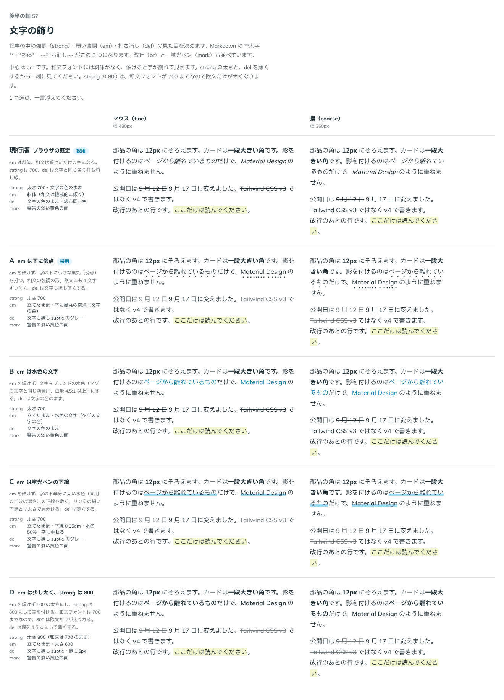

# 0085. 文字の飾り（strong・em・del・mark）

- ステータス: Accepted
- 日付: 2026-09-17
- ラウンド: 後半 軸57

## 背景

記事（Markdown を変換した HTML）の中で使う `<strong>`・`<em>`・`<del>`・`<mark>` の見た目を決めます。部品（Text など）と Prose が同じクラス列を使います。

## 候補

| 案                             | strong                      | em                               | del                         | mark               |
| ------------------------------ | --------------------------- | -------------------------------- | --------------------------- | ------------------ |
| 現行版（ブラウザの既定）       | 太さ 700・文字の色のまま    | 斜体（和文は機械的に傾く）       | 文字の色のまま・線も同じ色  | 警告の淡い黄色の面 |
| A（em は下に傍点）             | 太さ 700                    | 立てたまま・下に黒丸の傍点       | 文字も線も subtle のグレー  | 警告の淡い黄色の面 |
| B（em は水色の文字）           | 太さ 700                    | 立てたまま・水色の文字           | 文字の色のまま              | 警告の淡い黄色の面 |
| C（em は蛍光ペンの下線）       | 太さ 700                    | 立てたまま・下線 0.35em・水色50% | 文字も線も subtle のグレー  | 警告の淡い黄色の面 |
| D（em は少し太く、strong 800） | 太さ 800（和文は700のまま） | 立てたまま・太さ 600             | 文字も線も subtle・線 1.5px | 警告の淡い黄色の面 |

mark の色はこの決定には含みません。ADR-0091（軸63）で別に決めます。

比較のストーリーは、コミットする前の作業中に作って消したため、決めた時点のコミットはありません。記録は比較画像です。

## 決定

**strong と em はブラウザの既定のまま**にします（strong は太さ700、em は斜体）。**del だけを A の形（文字も線も `--color-fg-subtle` にする）**に変えます。

## 理由

ユーザーのメモです。

> 57 emは既定、delはAグレーに。strong はそのまま。

- **strong・em は変えない**: 太字・斜体という素直な形をそのまま使います。和文の em が機械的に傾くことも、直さずに受け入れます
- **del は薄くする**: 打ち消した文を目立たせない文として扱い、文字と線をどちらも `subtle` の色にしました

## 却下した案と理由

- **A の em（下に傍点）**: 選ばれませんでした。del の薄くする形だけを採りました
- **B（em を水色の文字）**: 選ばれませんでした
- **C（em を蛍光ペンの下線）**: 選ばれませんでした
- **D（em を600、strong を800）**: 選ばれませんでした

## 影響

- `src/components/prose/inline-styles.ts` に `inlineStyles`（tv の slots: strong・em・del・mark）を作りました。strong は `font-bold`、em は `italic`、del は `text-fg-subtle`・`line-through`・`decoration-fg-subtle` です。要素に直接当てても、Prose の根に当てても効く形です
- mark の slot も同じファイルにありますが、色は本 ADR ではなく ADR-0091（軸63）で決めました
- 比較のために置いた `--strong-*`・`--em-*`・`--del-*`・`--mark-*` の切り替えトークンは、決定後に部品のクラスへ畳み、`tokens.css` からは消しました。del の色は既存の役割トークン（`--color-fg-subtle`）をそのまま使い、専用のトークンは足していません

## 原則への反映

反映なし（既存の原則の範囲内）。

## 比較画像

