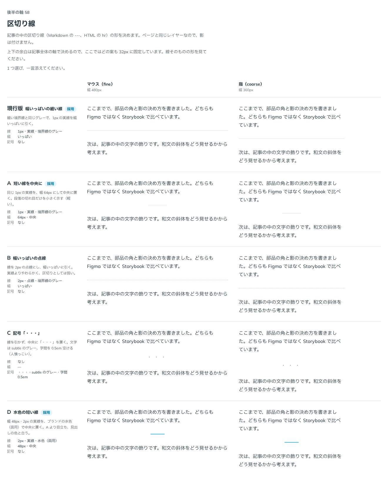

# 0086. 区切り線

- ステータス: Accepted
- 日付: 2026-09-17
- ラウンド: 後半 軸58

## 背景

記事の中の話題の切れ目に置く区切り線（`
`）の見た目を決めます。

## 候補

| 案                           | 線                        | 幅         | 記号                                   |
| ---------------------------- | ------------------------- | ---------- | -------------------------------------- |
| 現行版（幅いっぱいの細い線） | 1px・実線・境界線のグレー | いっぱい   | なし                                   |
| A（短い線を中央に）          | 1px・実線・境界線のグレー | 64px・中央 | なし                                   |
| B（幅いっぱいの点線）        | 2px・点線・境界線のグレー | いっぱい   | なし                                   |
| C（記号「・・・」）          | なし                      | —          | 「・・・」・subtle のグレー・字間0.5em |
| D（水色の短い線）            | 2px・実線・水色（面用）   | 48px・中央 | なし                                   |

比較のストーリーは、コミットする前の作業中に作って消したため、決めた時点のコミットはありません。記録は比較画像です。

## 決定

**現行版（幅いっぱいの細い線）を既定にします。** A（短い線を中央に）も `appearance="short"` で選べます。D（水色の短い線）も `appearance="accent"` で選べ、`color` で brand（水色）・primary・secondary の3色から選びます。ほかの色にしたいときは `--divider-accent` を上書きします。

## 理由

ユーザーのメモです。

> 58 現行デフォ、Aも選択可、任意色でDも可

- **幅いっぱいの細い線を既定に**: いちばん控えめで、汎用的な区切りです
- **短い線・色のある線は選べる形に残す**: 段落の切れ目を軽く示したいときは A、節の切れ目を目立たせたいときは D を使えるようにしました

## 却下した案と理由

- **B（幅いっぱいの点線）**: 選ばれませんでした
- **C（記号「・・・」）**: 選ばれませんでした

## 影響

- `src/components/divider/Divider.tsx` に `appearance`（`full` 既定・`short`・`accent`）と `color`（`brand` 既定・`primary`・`secondary`）の props を足しました。`decorative` で読み上げ上の区切りを外せます
- 見た目のクラス列のうち、既定（`full`）は `src/internal/reading/blocks.ts` の `dividerStyles`（Prose も同じものを使う）に置きました。`short`・`accent` は Divider 自身が持ちます
- 比較のために置いた `--divider-*` の切り替えトークンは、決定後に部品のクラスへ畳み、`tokens.css` からは消しました。部品は `border-line`・`border-width-thick` などの尺度のトークンを直接使います

## 原則への反映

反映なし（既存の原則の範囲内）。

## 比較画像

