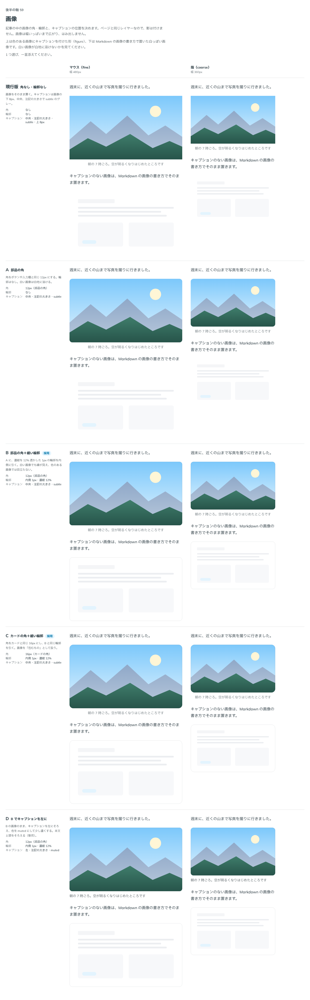

# 0087. 画像

- ステータス: Accepted
- 日付: 2026-09-17
- ラウンド: 後半 軸59

## 背景

記事の中の画像とキャプション（`<figure><figcaption>`）の見た目を決めます。白っぽい画像が白地に溶けないかを、色のある画像（風景）と白っぽい画像（画面のスクリーンショット風）の両方で確かめました。

## 候補

| 案                         | 角                 | 輪郭             | キャプション               |
| -------------------------- | ------------------ | ---------------- | -------------------------- |
| 現行版（角なし・輪郭なし） | なし               | なし             | 中央・注記の大きさ・subtle |
| A（部品の角）              | 12px（部品の角）   | なし             | 中央・注記の大きさ・subtle |
| B（部品の角＋細い輪郭）    | 12px（部品の角）   | 内側1px・濃紺12% | 中央・注記の大きさ・subtle |
| C（カードの角＋細い輪郭）  | 16px（カードの角） | 内側1px・濃紺12% | 中央・注記の大きさ・subtle |
| D（Bでキャプションを左に） | 12px（部品の角）   | 内側1px・濃紺12% | 左・注記の大きさ・muted    |

比較のストーリーは、コミットする前の作業中に作って消したため、決めた時点のコミットはありません。記録は比較画像です。

## 決定

**輪郭は B の内側1px・濃紺12%を採用し、角は C のカードの角（16px）を組み合わせます。** `outline={false}` で輪郭なしにできます。キャプションは中央のままにします。

## 理由

ユーザーのメモです。

> 59 輪郭ありB、角丸C、輪郭なし設定可、キャプションは中央

- **輪郭は付ける**: 白っぽい画像が白地に溶けないよう、濃紺を薄く透かした輪郭を既定にしました。色のある画像では目立ちません
- **角はカードの角**: 画像を「包むもの」として扱い、部品の角（12px）よりカードの角（16px）を採りました
- **キャプションは中央のまま**: 左にそろえて濃くする D の案は採りませんでした

## 却下した案と理由

- **現行版（角なし・輪郭なし）**: 選ばれませんでした。白っぽい画像が白地に溶けます
- **A（部品の角のみ）**: 選ばれませんでした。輪郭は付けることにしたためです
- **D（キャプションを左に・muted）**: 選ばれませんでした。キャプションは中央・subtle のままにしました

## 影響

- `src/components/figure/Figure.tsx` に `outline`（既定 `true`）の props を足しました
- 見た目のクラス列は `src/internal/reading/blocks.ts` の `figureImageStyles`（Prose の素の `` にも同じ見た目を当てる）に置きました。角は `rounded-card`、輪郭は `outline` プロパティ（内側 1px・濃紺12%）で描きます
- 比較のために置いた `--figure-*` の切り替えトークンは、決定後に部品のクラスへ畳み、`tokens.css` からは消しました

## 原則への反映

原則 5 の文を書き換えました。角の決まりの箇条書きに「記事の中の画像はカードと同じ角です。コードの枠と、外枠を付けた表は、部品の角です」を足しました。

## 比較画像

