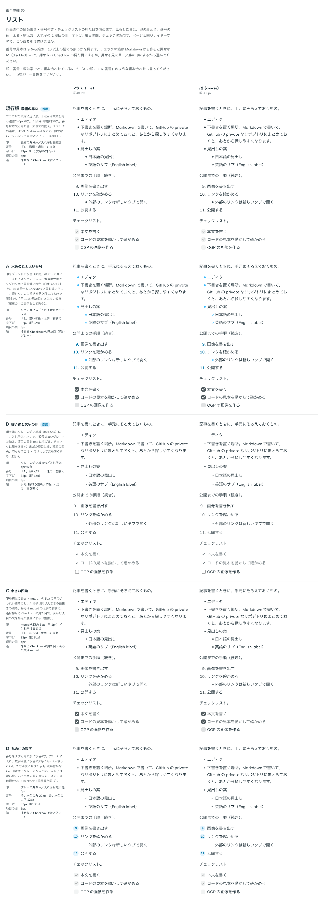

# 0088. リスト

- ステータス: Accepted
- 日付: 2026-09-17
- ラウンド: 後半 軸60

## 背景

記事の中の箇条書き・番号付き・チェックリストの見た目を決めます。

## 候補

値は `--spacing`（4px 単位）から計算した px です。

| 案                      | 印                                 | 番号                                 | 項目の間 | 箱                                        |
| ----------------------- | ---------------------------------- | ------------------------------------ | -------- | ----------------------------------------- |
| 現行版（濃紺の黒丸）    | 濃紺の丸6px／入れ子は白抜き        | 「1.」濃紺・通常・右揃え             | 4px      | 押せない Checkbox（淡いグレー）           |
| A（水色の丸と太い番号） | 水色の丸7px／入れ子は水色の白抜き  | 「1.」濃い水色・太字・右揃え         | 4px      | 押せる Checkbox の見た目（濃いグレー）    |
| B（短い線と文字の印）   | グレーの短い線8px／入れ子は4pxの点 | 「1.」薄いグレー・通常・左揃え       | 8px      | まだ: 輪郭の四角／済み: ✓ だけ・文を薄く  |
| C（小さい四角）         | muted の四角5px／入れ子は白抜き    | 「1.」muted・太字・右揃え            | 4px      | 押せる Checkbox の見た目・済みの文はmuted |
| D（丸の中の数字）       | グレーの丸5px／入れ子は短い線6px   | 淡い水色の丸22px・濃い水色の太字12px | 6px      | 押せない Checkbox（淡いグレー）           |

比較のストーリーは、コミットする前の作業中に作って消したため、決めた時点のコミットはありません。記録は比較画像です。

## 決定

**既定は B（短い線の印、入れ子は点、項目の間8px、チェックは輪郭の四角と✓）にします。** ただし番号は B の左揃えではなく、現行版と同じ右揃えにします。現行版の濃紺の丸い印は `marker="dot"` で選べる形で残します。済んだ項目の文は既定でグレー（subtle）、`checkedTone="default"` で本文と同じ色にできます。

## 理由

ユーザーのメモです。

> 60 デフォBただし数字は右寄せ、現行の黒点も選択可、チェックリストB、選択済みはデフォルトグレー、同じ文字色も選択可

- **印は軽い形に**: 濃紺の丸より、薄いグレーの短い線のほうが軽く見えます。ただし現行版の丸は好みが残るため、切り替えとして残しました
- **番号は右揃えのまま**: B の左揃えは採らず、「10.」のように桁が増えても「.」がそろう右揃えを保ちました
- **チェックの箱は押せない見た目に**: B の「まだ: 輪郭の四角／済み: ✓ だけ」を採りました。済んだ項目の文は既定でグレーにし、本文と同じ色にする選択肢も残しました

## 却下した案と理由

- **A（水色の丸・太い番号・押せる見た目の箱）**: 選ばれませんでした。押せないのに押せる見た目になり、原則1の「押せない見た目」と食い違います
- **C（小さい四角）**: 選ばれませんでした
- **D（丸の中の数字）**: 選ばれませんでした

## 影響

- `src/components/list/List.tsx` に `marker`（`dash` 既定・`dot`）と `checkedTone`（`subtle` 既定・`default`）の props を足しました。入れ子のリストは外側の `marker` を引き継ぎます
- 番号の右揃え（`--lm-align: flex-end`）は `marker` の選択によらず固定です（`src/internal/reading/list.ts` の `ol` variant）
- 見た目のクラス列は `src/internal/reading/list.ts`（Prose の素の `<ul>`・`<ol>` にも同じ見た目を当てる）に置きました
- `tokens.css` に B の値を `--list-*` として残しました（`--list-bullet-width: 8px`・`--list-bullet-height: 1.5px`・`--list-bullet-nested-width/height: 4px`・`--list-item-gap: calc(var(--spacing) * 2)` など）。marker="dot"・checkedTone="default" は、これらの一部を部品のクラスで上書きします

- 追記（2026-09-17、決めたあとの調整）: マウスでは、印・番号・チェックの箱と文字のあいだを 4px 広げました（6px → 10px）。印の位置を変えないよう、字下げも同じだけ広げています（32px → 36px）。指では 6px・32px のままです。`--list-marker-gap-fine`・`-coarse` と `--list-indent-fine`・`-coarse` にし、src/styles/theme.css の密度の規則で入れます。ユーザーのメモ: 「List について、パソコンの場合は marker に関わらず +4px 文字左の余白を広げられますか？チェックの形も含めてです。em 指定になっている場合は em に揃えてください。」（字下げと間はどちらも px で持っているので、px で足しました。番号の箱の幅 1.4em は変えていません）

## 原則への反映

反映なし（既存の原則の範囲内）。

## 比較画像

