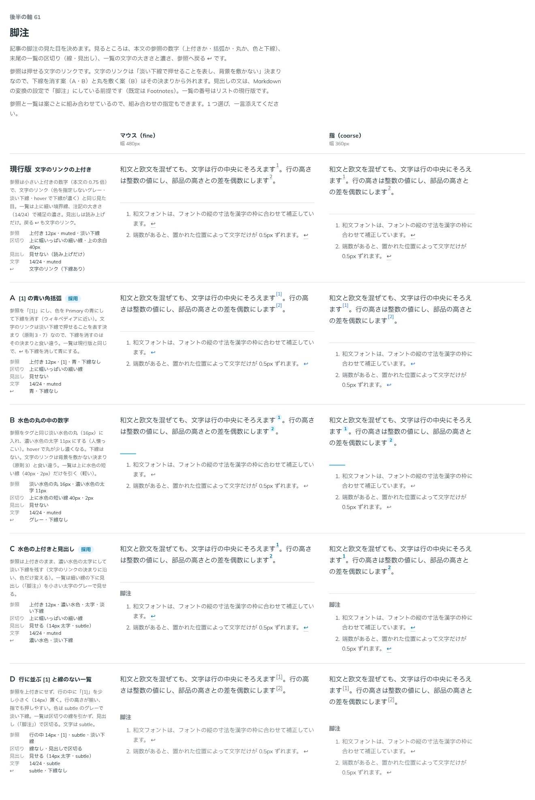

# 0089. 脚注

- ステータス: Accepted
- 日付: 2026-09-17
- ラウンド: 後半 軸61（と、そのあとの調整）

## 背景

記事の中の脚注（本文の参照と、末尾の一覧）の見た目を決めます。決定後、下線の位置や戻るリンクの形について、何度かやり取りをして詰めました。

## 候補

| 案                             | 参照                                 | 区切り                         | 見出し                     | 一覧の文字    | 戻るリンク（↩）          |
| ------------------------------ | ------------------------------------ | ------------------------------ | -------------------------- | ------------- | ------------------------ |
| 現行版（文字のリンクの上付き） | 上付き12px・muted・淡い下線          | 上に幅いっぱいの細い線・上40px | 見せない（読み上げのみ）   | 14/24・muted  | 文字のリンク（下線あり） |
| A（[1]の青い角括弧）           | 上付き12px・[1]・青・下線なし        | 上に幅いっぱいの細い線         | 見せない                   | 14/24・muted  | 青・下線なし             |
| B（水色の丸の中の数字）        | 淡い水色の丸16px・濃い水色の太字11px | 上に水色の短い線40px・2px      | 見せない                   | 14/24・muted  | グレー・下線なし         |
| C（水色の上付きと見出し）      | 上付き12px・濃い水色・太字・淡い下線 | 上に幅いっぱいの細い線         | 見せる（14px太字・subtle） | 14/24・muted  | 濃い水色・淡い下線       |
| D（行に並ぶ[1]と線のない一覧） | 行の中14px・[1]・subtle・淡い下線    | 線なし・見出しで区切る         | 見せる（14px太字・subtle） | 14/24・subtle | subtle・下線なし         |

比較のストーリーは、コミットする前の作業中に作って消したため、決めた時点のコミットはありません。記録は比較画像です。

## 決定

**参照は A（[1] の角括弧・Primary の青）をベースにしますが、のちに「Link と同じ挙動、はじめから下線がある形」に直しました。** 下線の位置は `underline-offset` 0.3em です。**戻るリンクは C の色（濃い水色 `--color-on-tag`）を採り**、文字の ↩ をやめて `ArrowUDownLeft` のアイコンにし、下の枠線で淡い下線を引いて hover で濃くし、アイコンを 0.1em 上へずらしました。一覧の文字は muted、見出しは読み上げだけ（現行版・A と同じ）です。一覧の上の区切り（Divider など）は、Footnotes 自身は持たず、置く側にゆだねます。

## 理由

ユーザーのメモです。

> 61 本文中A、脚注側戻るリンクC、脚注文字色muted、divider はユーザーに委ねるのでデフォルトなし

> 1: Link と同じ挙動にしたいです。はじめから下線があるカタチで。

> あとそうだ。脚注の戻る矢印はアイコンにしたいかもです。文字でだと、vrt差分も出やすい気がします。

> 脚注ですが、Link と見た目は同じですが、下線が近すぎますね（カッコが下になる仕様？）矢印は arrow-u-down-left が近そう？

> 脚注[n]の下線はもう少し下にしたいですね

> もう少し下に、という直前のが一番良かったかもです。戻るリンクについては、逆にアイコンの方を少しだけうえにずらせますか?

- **参照は角括弧＋青、下線は文字のリンクと同じ淡さ**: A の色をベースにしつつ、下線を消さず、文字のリンク（原則3・7の「押せることを淡い下線で示す」決まり）に合わせました。下線の位置は、近すぎる（0.5em）→ 遠すぎる（0.45em や 0.75em を試した末に 0.3em）と調整しました
- **戻るリンクはアイコンに**: 文字の ↩ は端末で絵文字になり形が揺れ、見た目の回帰テストの差分も出やすいため、`ArrowUDownLeft` のアイコンに変えました。文字のリンクと同じ下線（アイコンなので下の枠線で描く）を付け、字の中央に見えるよう 0.1em 上へずらしました
- **一覧の上の区切りは持たない**: 記事のどこに置くかは利用者が決めるべきことなので、Footnotes 自身は線を引かず、Divider などを置くかは利用者にゆだねます

## 却下した案と理由

- **B（水色の丸の中の数字）**: 選ばれませんでした。文字のリンクは背景を敷かない決まり（原則3）と食い違います
- **C の見出しを見せる形**: 見出しは読み上げだけのまま（現行版・A と同じ）にし、見せる形は採りませんでした。色（濃い水色）だけを戻るリンクに採りました
- **D（行に並ぶ[1]と線のない一覧）**: 選ばれませんでした

## 影響

- `src/components/footnote/Footnote.tsx`: `FootnoteRef`・`Footnotes`・`FootnoteItem`。戻るリンクのアイコンは `ArrowUDownLeftIcon`（`src/internal/icons.tsx`）
- 見た目のクラス列は `src/internal/reading/footnote.ts`（Prose の素の HTML にも同じ見た目を当てる）に置きました。参照の下線は `underline-offset-[0.3em]`、戻るリンクのアイコンは `-translate-y-[0.1em]` です
- Prose では、GFM の HTML が出す文字の ↩ を隠し（幅を1emに切り、行の高さを0にする）、`ArrowUDownLeftIcon` と同じ形の SVG を `::before` に `mask` で描きます。形と太さがアイコンと同じことは `src/components/prose/prose-styles.test.ts` が確かめます
- 一覧の上の区切りを Prose からも外しました（記事の見本では、脚注の上に利用者が `Divider` を置いています）

## 原則への反映

原則 3 の文を書き換えました。「文章の中の小さなリンク（脚注の番号や、戻る印）も文字のリンクと同じです。アイコンだけのリンクにも、下線を引きます」を足しました。

## 比較画像

