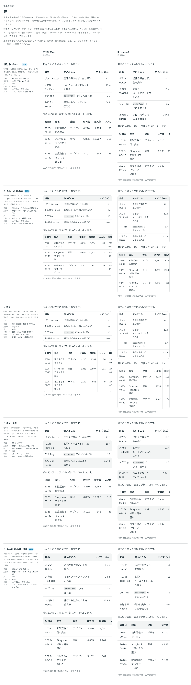

# 0090. 表

- ステータス: Accepted
- 日付: 2026-09-17
- ラウンド: 後半 軸62

## 背景

記事の中の表の罫線・見出し・余白・文字の大きさを決めます。

## 候補

| 案                        | 罫線                         | 見出し                         | 縞                         | 外枠・角                   | 余白               | 文字                                  |
| ------------------------- | ---------------------------- | ------------------------------ | -------------------------- | -------------------------- | ------------------ | ------------------------------------- |
| 現行版（横線だけ）        | 行のあいだの横線1px          | 太字・下に1pxのグレー          | なし                       | なし                       | 上下8px・左右12px  | 本文（16/28）・等幅の数字             |
| A（外枠＋見出しの面）     | 外枠1px＋行のあいだの横線1px | 太字・グレーの面               | なし                       | あり・12px（部品の角）     | 上下8px・左右12px  | 注記（14/24）・等幅の数字             |
| B（格子）                 | 外枠＋縦線＋横線 すべて1px   | 太字だけ                       | なし                       | あり・16px（包むものの角） | 上下8px・左右12px  | 注記（14/24）・等幅の数字             |
| C（線なし＋縞）           | 見出しの下だけ1.5px          | 太字・下に1.5pxの濃いグレー    | あり・偶数行・両端12pxの角 | なし                       | 上下8px・左右12px  | 本文（16/28）・等幅の数字             |
| D（丸い見出しの帯＋横線） | 行のあいだの横線1px          | 太字・グレーの帯・両端12pxの角 | なし                       | なし                       | 上下12px・左右16px | 本文（16/28）・数字はプロポーショナル |

比較のストーリーは、コミットする前の作業中に作って消したため、決めた時点のコミットはありません。記録は比較画像です。

## 決定

**既定は現行版（横線だけ）にします。** A（外枠＋見出しの面）と D（丸い見出しの帯＋横線）も `appearance` で選べます。縦線は `columnLines` の props でどの見た目にも足せます（既定はなし）。文字の大きさは、記事の中でもパソコン16px・スマホ14px にします（`--density-coarse` から計算します）。

## 理由

ユーザーのメモです。

> 62 表中文字サイズ スマホの場合は 14px に、デフォルト既定、AとD選択可、縦線もそれぞれ props で出せるように、デフォルトはなし

- **既定は横線だけ**: いちばん軽い形を既定にしました
- **外枠・帯は選べる形に残す**: 数字を並べた表を締めたいときは A、余白を広げてゆったり見せたいときは D を使えるようにしました
- **縦線は独立した props に**: どの `appearance` にも `columnLines` で足せるようにし、既定では引きません
- **文字はスマホでも14px**: 表は一度に見える列の数を優先するため、読みもの（`data-reading`）の中でも指では14pxのままにします（本文の16pxは適用しません）

## 却下した案と理由

- **B（格子）**: 選ばれませんでした
- **C（線なし＋縞）**: 選ばれませんでした

## 影響

- `src/components/table/Table.tsx` に `appearance`（`lines` 既定・`framed`・`banded`）と `columnLines`（既定 `false`）の props を足しました
- 見た目のクラス列は `src/internal/reading/table.ts`（Prose の素の `<table>` にも同じ見た目を当てる）に置きました。文字の大きさは `calc(var(--text-body-fine) + var(--density-coarse) * (var(--text-body-coarse) - var(--text-body-fine)))` で計算し、読みものの中でも `--density-coarse` の値（指1・マウス0）をそのまま使います
- 比較のために置いた `--table-*` の切り替えトークン（`--table-text-sm` を含む）は、決定後に部品のクラス・計算式へ畳み、`tokens.css` からは消しました。部品は `border-line`・`rounded-control`・`rounded-card`・`bg-field` などの役割・尺度のトークンを直接使います
- 狭い列で和文が1〜2文字ずつ折れる件は、この決定には含みません（利用者にゆだねる。ADR-0099）

## 原則への反映

原則 5 と原則 11 の文を書き換えました。原則 5 には、外枠を付けた表は部品の角であることを、原則 11 には「一度に見える量を優先するものは、読みものの中でも指で小さくします。表は、指では機能の画面の本文と同じ大きさです」を足しました。

## 比較画像

