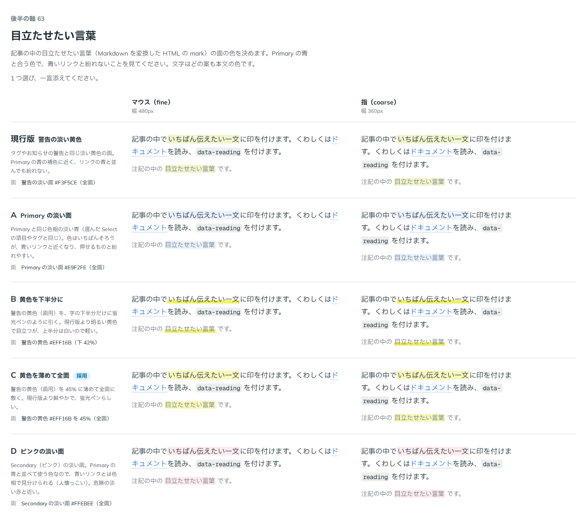

# 0091. 目立たせたい言葉（mark）

- ステータス: Accepted
- 日付: 2026-09-17
- ラウンド: 後半 軸63

## 背景

記事の中で、Markdown を変換した HTML の `mark`（目立たせたい言葉）に敷く面の色を決めます。原則6（色は役割で持つ）に関わります。

1 ラウンド目で、警告の淡い黄色を全面に敷く現行版で仮に進めていました。「mark の色は primary と一番合う色がいいですね。今もいいですが、案はありますか？」という問いを受け、Primary の青と合う色、かつ記事の中の青いリンクと紛れない色を比べ直しました。

## 候補

| 案     | 面                                                 |
| ------ | -------------------------------------------------- |
| 現行版 | 警告の淡い面（全面）                               |
| A      | Primary の淡い面（全面）                           |
| B      | 警告の黄色（面用）を字の下半分だけに（蛍光ペン風） |
| C      | 警告の黄色（面用）を 45% に薄めて全面              |
| D      | Secondary（ピンク）の淡い面（全面）                |

A は色相をいちばんそろえられますが、青いリンクと近くなり押せるものと紛れやすい懸念がありました。D はピンクの淡い面で、危険の淡い赤とも近い色でした。

## 決定

**C を採用します。** 警告の黄色（面用）を 45% の濃さに薄め、字の全面に敷きます。文字の色はどの案も変えません（周りの文字の色のまま）。

## 理由

ユーザーのメモです。

> mark の色は primary と一番合う色がいいですね。今もいいですが、案はありますか？

- **Primary の補色を選ぶ**: 警告の黄色は Primary の青の補色に近く、記事の中の青いリンクと並んでも紛れません。A（Primary の淡い面）は色はそろいますが、リンクと見分けにくくなるため避けました
- **現行版より鮮やかに**: 現行版の警告の淡い面より、C（45%）のほうが蛍光ペンらしい鮮やかさになりました
- **全面に敷く**: B（下半分だけ）は蛍光ペンらしさは出ますが、いちばん自然に「文字に印を付けた」形に見えたのは全面の C でした

## 却下した案と理由

- **現行版（警告の淡い面）**: 選ばれませんでした。C（45%）のほうが目立たせたい言葉らしい鮮やかさがありました
- **A（Primary の淡い面）**: 選ばれませんでした。青いリンクと紛れやすくなります
- **B（黄色を下半分に）**: 選ばれませんでした
- **D（ピンクの淡い面）**: 選ばれませんでした。危険の淡い赤と近く、色相の役割（原則6）と紛れます

## 影響

- `src/components/prose/inline-styles.ts`: `inlineStyles` の `mark` スロットに `bg-[color-mix(in_oklab,var(--color-warning)_45%,transparent)]` を足しました。角は `rounded-xs`、折り返した行ごとに角と余白を付ける `box-decoration-clone`、左右に `px-[0.1em]` を持ちます。文字色は `text-inherit`（周りの文字の色のまま）です
- `mark` は Prose が素の HTML の `<mark>` に当てる見た目で、専用の部品は作っていません
- `design/backlog.md` に足す未決事項の案: なし

## 原則への反映

原則6 の文を書き換えました（すでに適用済み）。「目立たせたい言葉は、黄色を薄く敷きます。Primary の青の補色なので、青いリンクと紛れません。」を足しました。

## 比較画像

