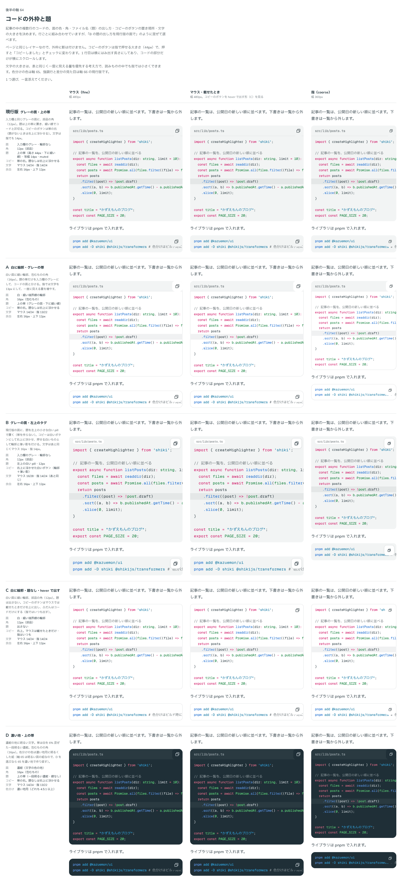
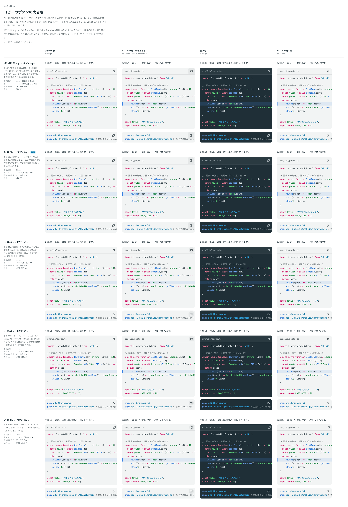

# 0092. コードの外枠と題

- ステータス: Accepted
- 日付: 2026-09-17
- ラウンド: 後半 軸64・67

## 背景

複数行のコード（CodeBlock）の、面の色・角・ファイル名（題）の出し方・コピーのボタンの置き場所・文字の大きさを決めます（原則1・原則5・原則11）。ページと同じレイヤーなので、外枠には影を付けません（原則1）。

軸64 の比較で、帯とコピーのボタンの重なりが見つかりました。帯を 44px にし、その内側（下の 1px）に区切りの線を引いたうえで、同じ 44px のボタンを帯いっぱいに置いていたため、ボタン（浮かせたときの面の塗りと hover の面）が線の右端を隠していました。この重なりを軸67 で改めて比べ、直しました。

## 候補

### 軸64: 外枠と題

値は主な項目だけを挙げます（ほかは比較のストーリーの控えにあります）。

| 案                        | 面                       | 角               | 題                                 | コピー                                   | 文字（マウス/指） |
| ------------------------- | ------------------------ | ---------------- | ---------------------------------- | ---------------------------------------- | ----------------- |
| 現行版（グレーの面・帯）  | 入力欄のグレー・輪郭なし | 12px（部品）     | 上の帯（44px・下に線）・等幅 muted | 帯の右。題なしは右上に浮かせる           | 14/24・14/24      |
| A（白に輪郭・グレーの帯） | 白・細い輪郭             | 16px（包むもの） | 上の帯（グレーの面・下に線）       | 帯の右。題なしは右上に浮かせる           | 14/24・13/22      |
| B（左上のタグ）           | 入力欄のグレー・輪郭なし | 12px（部品）     | 左上の白い pill・12px              | 右上に浮かせた白いボタン（輪郭＋影）     | 16/28・14/24      |
| C（題なし・hover で出す） | 白・細い輪郭             | 12px（部品）     | 出さない                           | 右上。マウスは載せたときだけ・指はいつも | 14/24・14/24      |
| D（濃い地・上の帯）       | 濃紺（文字の色の地）     | 16px（包むもの） | 上の帯（一段明るい濃紺・線なし）   | 帯の右。題なしは右上に浮かせる           | 14/24・13/22      |

### 軸67: 帯の高さとコピーのボタンの大きさ（重なりを直したあと）

| 案               | 帯の高さ | ボタン           | 題がないとき | 原則11（指で押せる 44px） |
| ---------------- | -------- | ---------------- | ------------ | ------------------------- |
| 現行版（44・44） | 44px     | 44px・上下右 0px | 右上から 4px | 満たす                    |
| A（52・44）      | 52px     | 44px・上下右 4px | 右上から 4px | 満たす                    |
| B（44・36）      | 44px     | 36px・上下右 4px | 右上から 6px | 例外（36px）              |
| C（44・32）      | 44px     | 32px・上下右 6px | 右上から 8px | 例外（32px）              |
| D（40・32）      | 40px     | 32px・上下右 4px | 右上から 8px | 例外（32px）              |

## 決定

**軸64 は現行版（グレーの面・上の帯）を既定にします。** さらに、`appearance="dark"` で D（濃い地・上の帯）も選べるようにします。角は、現行版・D とも 12px（`rounded-control`）にそろえます。D の候補で持っていた 16px の角は採りません。

**軸67 は A（帯 52px・ボタン 44px、上下右に 4px）にします。** 題がないときのボタンには、細い輪郭を付けます（A の候補にはなかった追加の決定です）。

**文字の大きさは、マウスでも指でも、読みものの中でも 14/24px にそろえます。** 密度によって変えません。

## 理由

ユーザーのメモです。

> 64: デフォルト現行版、Dも選択可。ボタンが divider に被ってそうです。

> 3: ダークも考えておきたいです

> 67 は A で良さそうですが、帯がないときはボタンにアウトラインが欲しいですね。

> 2: 14px でお願いします。

> コードブロックの文字サイズは PC/スマホ統一で 14px にしてもいいかもですね。こうすると元のサイズでも原則に反しなくなりますか？

- **現行版を既定に**: 入力欄と同じグレーの面が、部品の中で浮きすぎず馴染みました。濃い地（D）は、記事の雰囲気に合わせて選べる形として残しました
- **角は 12px に統一**: D の候補は 16px（包むものの角）でしたが、現行版と角をそろえ、appearance の違いが角の違いに見えないようにしました
- **帯を 52px に**: 44px の帯に 44px のボタンをぴったり合わせると、線とボタンの hover の面が重なりました。帯を 8px 広げ、ボタンの上下右に 4px の間を空けることで、押せる大きさ（44px）を保ったまま重なりをなくしました
- **題なしのボタンに輪郭**: 帯があるときはボタンが帯に馴染みますが、題がなく右上に浮かせるときは、コードの上に浮いていることが分かるよう、白いボタンと同じ細い輪郭を付けました
- **文字は密度によらず 14px**: コードは、表と同じく一度に見える量を優先する対象です。マウスで大きくスマホで小さくする通常の読む文字（原則11）とは違う扱いにし、読みものの中でも同じ小さめの大きさに固定しました

## 却下した案と理由

- 軸64 A（白に輪郭・グレーの帯）: 選ばれませんでした
- 軸64 B（左上のタグ）: 選ばれませんでした
- 軸64 C（題なし・hover で出す）: 選ばれませんでした。題があるコードでは常に見える帯の形を残しました
- 軸67 現行版（44・44）: 選ばれませんでした。線とボタンが重なる不具合の原因でした
- 軸67 B・C・D（ボタンを 36px・32px に縮める案）: 選ばれませんでした。原則11 の指で押せる大きさ（44px）の例外になるためです

## 影響

- `src/components/code-block/CodeBlock.tsx`: `appearance`（`'surface' | 'dark'`。既定 `'surface'`）、`title`、`copyButton` などの props を持ちます。帯の高さは `--cb-head-h`（`calc(var(--spacing-control) + var(--spacing) * 2)` = 52px）、コピーのボタンは `--spacing-control`（44px）をコンポーネントの中で直接計算し、比較用に足していた `--codeblock-head-h` などのトークンは tokens.css から消しました
  - 題があるとき（`group-data-titled`）はボタンの輪郭を消し、ないときは `box-shadow: inset 0 0 0 var(--border-width-thin) var(--cb-copy-line)` で輪郭を付けます
- `src/internal/reading/code-block.ts`: 部品（figure）と Prose の中の素の `pre.shiki` が同じクラス列（面は `rounded-control`・`bg-(color:--cb-bg)` など）を使います。文字は `--text-body-sm-fine`・`--leading-body-sm-fine`（14/24px）を密度に関わらず使います
- `tokens.css`: `--color-codeblock-bg`・`--color-codeblock-dark-bg` などの色のトークンと、`--palette-code-*`（軸68・69）が残ります
- `design/backlog.md` に足す案: コピーのボタンが 44px より小さい候補（B・C・D）は原則11 の例外として比べましたが、44px を保つ形に決めたため、backlog に足す未決事項はありません

## 原則への反映

原則11 の文を書き換え済みです（メインの作業者が書きました）。「コードは、入力方式によらず、読みものの中でもいつも同じ小さめの大きさです」という一文が、表と同じ「一度に見える量を優先するもの」の扱いとして、原則11 に入っています。

## 比較画像

1本の ADR につき比較画像は1枚が原則ですが、この記録は軸64・67の2つの比較をまとめたため、例外として2枚を置きます。

