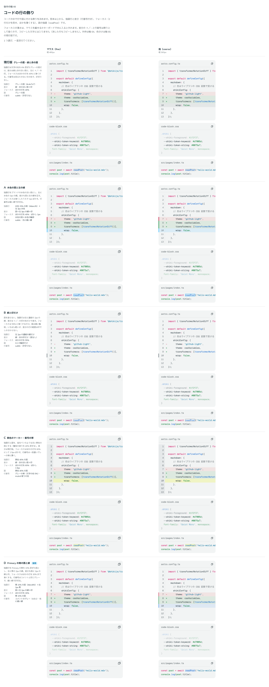

# 0093. コードの行の飾り

- ステータス: Accepted
- 日付: 2026-09-17
- ラウンド: 後半 軸66

## 背景

複数行のコード（CodeBlock）の中で、行や語に付ける飾り（強調行・差分・フォーカス・語の強調・行番号の区切り）を決めます（原則6・原則12）。面はどれも、グレーの面（`#f2f4f4`）に色を混ぜた相対輝度 0.78 以上の色にし、色分けの文字（軸65）が 4.5:1 を保つようにしました。外枠は軸64、色分けの色は軸65 の現行版のまま比べました。

## 候補

| 案                            | 強調行                     | 差分                         | フォーカス                   | 語             | 行番号                           |
| ----------------------------- | -------------------------- | ---------------------------- | ---------------------------- | -------------- | -------------------------------- |
| 現行版（グレーの面・緑と赤）  | グレーの面（文字色 6%）    | 緑・赤の淡い面＋＋／−の印    | ほかの行を 40%               | グレーの面     | subtle・区切りなし               |
| A（水色の面と左の線）         | 水色 15% の面＋左 3px 水色 | 面＋左 3px の線＋印          | ほかの行を 40%・ぼかし 1px   | 水色の面＋輪郭 | subtle・右に細い線               |
| B（線と印だけ）               | 左 2px の濃紺の線だけ      | 緑・赤の印だけ（面なし）     | ほかの行を 55%               | 3:1 の輪郭だけ | subtle・区切りなし               |
| C（黄色のマーカー・番号の帯） | 黄色 40% の面              | 緑・赤の淡い面＋印（現行版） | ほかの行を 60%・ぼかし 1.5px | 黄色 40% の面  | グレーの帯・muted 寄り           |
| D（Primary の青の面と線）     | 青 10% の面＋左 2px 青     | 面＋左 2px の線＋印          | ほかの行を 30%               | 青 10% の面    | コメントと同じグレー・右に細い線 |

## 決定

**D（Primary の青の面と左の線）を採用します。** 強調行と語の強調は Primary の青を 10% 混ぜた面、強調行と差分は左に 2px の青い線を付けます。フォーカスは、見せたい行以外を 30% まで薄くします。差分の記号（＋／−）の文字色は、そのままの緑・赤で問題ありません。

## 理由

ユーザーのメモです。

> 66: D で。

> 差分記号の文字色は問題なし。

- **D を選んだ理由**: Primary の色を使うことで、部品の他の場所（フォーカスの線やリンク）と同じ色の言葉で「ここに注目」を伝えられます。線を付けることで、色を判別しにくい人にも強調行の範囲が伝わります（A の水色案と似た考え方ですが、D は既存のブランドの青をそのまま使い、新しい色相を持ち込みません）
- **差分の記号色はそのまま**: 緑・赤の記号は 3:1 以上のコントラストを保っており、変更の必要はありませんでした

## 却下した案と理由

- 現行版（グレーの面・緑と赤）: 選ばれませんでした。強調行がグレーの面だけでは、コードの地（グレーの面）に溶けて見えにくいままでした
- A（水色の面と左の線）: 選ばれませんでした
- B（線と印だけ）: 選ばれませんでした。面を塗らないため、差分の行の範囲が印だけでは分かりにくいという弱点がありました
- C（黄色のマーカー・番号の帯）: 選ばれませんでした

## 影響

- `src/internal/reading/code-block.ts`: 強調行・語の強調は `--cb-highlight-bg`（`color-mix(in oklab, var(--cb-bg), var(--cb-highlight) 10%)`）、強調行・差分は `inset` の `box-shadow` で左に太さ `--border-width-thick` の線を引きます。フォーカスは `.line:not(.focused)` に `opacity-30` を当てます
- `tokens.css`: `--color-codeblock-highlight`・`--color-codeblock-inserted`・`--color-codeblock-deleted` と、濃い地用の `--color-codeblock-dark-highlight` などを持ちます。比較用に足していた A・B・C の面・線・ぼかしのトークンは畳んで消しました
- 行番号の色そのものの濃さは軸69 で別に決めます。この ADR では「コメントと同じグレー・右に細い線で区切る」という D の形だけを採用しました
- `design/backlog.md` に足す未決事項はありません

## 原則への反映

反映なし（既存の原則の範囲内）。

## 比較画像

