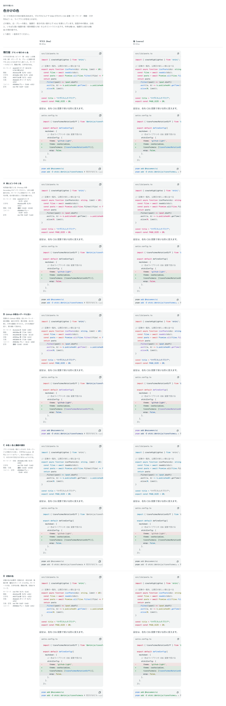
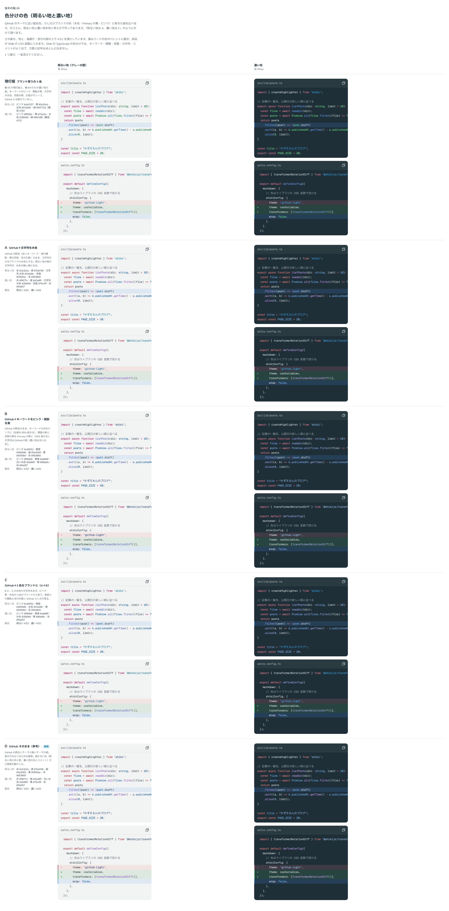

# 0094. 色分けの色とコードの色のパレット

- ステータス: Accepted
- 日付: 2026-09-17
- ラウンド: 後半 軸65・68

## 背景

コードの色分け（キーワード・関数・文字列・定数・引数・コメント・記号）の色を決めます（原則6・原則12）。色分けは、ブログのビルド時に Shiki が行い、`createCssVariablesTheme` の CSS 変数（`--shiki-token-*`）に部品が色を入れます。

1回目（軸65）は、ブランドの色（水色・Primary の青・ピンク）を基準にした組を比べました。答えは「github テーマに近く、ちょっとだけブランドカラー寄り、とかどうでしょうか⋯ダークも同様にしたいですね」「コードカラーパレットを別で作ると良さそう」で、GitHub のテーマに寄せる方向と、色を `--shiki-token-*` に直接書くのではなく、コードの色専用のパレット（`--palette-code-*`）を別に作る方向が決まりました。この答えを受けて、2回目（軸68）で GitHub のテーマに近い組と、ブランドの色を混ぜた組を、明るい地・濃い地の両方で比べ直しました。

どの案も、design/tools/color.mjs の contrast で、地・強調行・差分・帯の面のうち最も低いものの上で 4.5:1 以上です。GitHub の値が届かない色は、色相を保って明度だけ動かしました。

## 候補

### 軸65（1回目）: ブランド寄りの組

| 案                               | 考え方                                                                   |
| -------------------------------- | ------------------------------------------------------------------------ |
| 現行版（ブランド寄り5色）        | タグの文字の色（ピンク・青・水色）と状態の色（緑・オリーブ）を暗くした組 |
| A（青とピンクの2色）             | Primary の青と Secondary のピンクだけにし、ほかは濃紺のまま              |
| B（GitHub の明るいテーマに近い） | 赤・紫・紺・青・茶の GitHub の配色に寄せる                               |
| C（水色1色と濃紺の濃淡）         | ブランドの水色だけをキーワードと定数に使う                               |
| D（状態の色）                    | 危険・成功・情報・警告の前景用の色から作る                               |

### 軸68（2回目）: GitHub 寄りとブランドの組み合わせ（明るい地・濃い地）

| 案                                        | キーワード       | 関数           | 文字列         | 定数         | 引数               |
| ----------------------------------------- | ---------------- | -------------- | -------------- | ------------ | ------------------ |
| 現行版（ブランド寄り5色）                 | ピンク `#cb0157` | 青 `#0c63cd`   | 水色 `#016d9c` | 緑 `#00772d` | オリーブ `#6a6a01` |
| A（GitHub＋文字列を水色）                 | 赤 `#cb1b2a`     | 紫 `#7b47d6`   | 水色 `#016d9c` | 青 `#0550ae` | 茶 `#953800`       |
| B（GitHub＋キーワードをピンク・関数を青） | ピンク `#cd0052` | 青紫 `#4959d6` | 紺 `#0a3069`   | 青 `#0050b0` | 茶 `#953800`       |
| C（GitHub＋3色をブランドに）              | ピンク `#cd0052` | 青紫 `#4959d6` | 水色 `#016d9c` | 青 `#0050b0` | 茶 `#953800`       |
| D（GitHub そのまま・参考）                | 赤 `#cb1b2a`     | 紫 `#7b47d6`   | 紺 `#0a3069`   | 青 `#0550ae` | 茶 `#953800`       |

濃い地は、どの案も同じ組を明るくした値です（例: D の濃い地はキーワード `#ff877e`、関数 `#d2a8ff`、文字列 `#a5d6ff`、定数 `#79c0ff`、引数 `#ffa657`）。

## 決定

**D（GitHub そのまま）を、明るい地・濃い地の両方で採用します。** 色は `--palette-code-light-*`・`--palette-code-dark-*` という、コードの色分け専用のパレットに置きます。パレットは公開のトークン（`@theme`）です。GitHub の値のうち 4.5:1 に届かない色（明るい地の赤と紫、濃い地の赤とコメント）だけ、色相を保って明度を動かしました。

## 理由

ユーザーのメモです。

> github テーマに近く、ちょっとだけブランドカラー寄り、とかどうでしょうか⋯ダークも同様にしたいですね

> 4: コードカラーパレットを別で作ると良さそう

> 68 はやはり GitHub テーマがとても安定していますね⋯ブランドカラー入りだと、3色の青と紫の区別がつかないですね。

> 公開のトークンでいいと思います。

- **GitHub そのままが安定**: ブランドの色を混ぜた案（A・B・C）は、青系の色が増えることで関数の紫や定数の青との区別がつきにくくなりました。見慣れた GitHub の配色をそのまま使うほうが、色分け同士の見分けやすさで安定していました
- **パレットを別に持つ**: 色分けの色を部品やコンポーネントの色（Primary・Secondary など）から借りず、コード専用のパレットに独立させることで、あとでブランドの色を変えても色分けの見え方に影響しません
- **公開のトークンにする**: 利用者がブログ側でコードの色を上書きしたい場合に備え、`@theme`（Tailwind のクラスになる層）に置きました

## 却下した案と理由

- 軸65 A（青とピンクの2色）・B（GitHub の明るいテーマに近い、方向性のみ）・C（水色1色と濃紺の濃淡）・D（状態の色）: いずれも選ばれず、「GitHub 寄り」という方向だけを引き継ぎました
- 軸68 A（GitHub＋文字列を水色）・B（GitHub＋キーワードをピンク・関数を青）・C（GitHub＋3色をブランドに）: 選ばれませんでした。ブランドの色を混ぜるほど、関数・定数など複数の役割が青系に寄り、区別が付きにくくなりました
- 軸68 現行版（ブランド寄り5色）: 選ばれませんでした

## 影響

- `tokens.css`: `--palette-code-light-*`（`keyword`・`function`・`string`・`constant`・`parameter`・`comment`・`punctuation`・`line-number`）と `--palette-code-dark-*` を `@theme` に足しました
- `tokens.css` の `:root`: `--shiki-token-*`（Shiki の CSS 変数のテーマが読む名前。ブログ側との約束があるため名前は変えません）と `--color-codeblock-*` が、appearance ごとにこのパレットを指します
- `src/internal/reading/code-block.ts`・`src/components/code-block/CodeBlock.tsx`: 面の要素（`surface`・`dark` の variants）で `--shiki-token-*` をパレットの値に指し直します
- `design/backlog.md` に足す未決事項はありません。色のばらつきを整える軸（backlog の「トークン・テーマ」）とは別に、コードのパレットはこの ADR で決めた値のまま残ります

## 原則への反映

反映なし（既存の原則6・12 の範囲内）。

## 比較画像

1本の ADR につき比較画像は1枚が原則ですが、この記録は軸65（1回目）と軸68（2回目）の2つの比較をまとめたため、例外として2枚を置きます。

