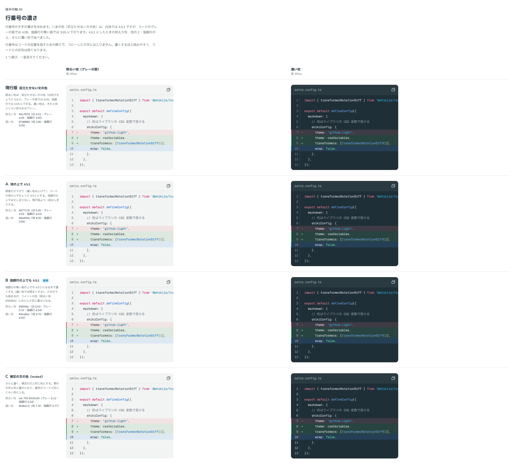

# 0095. 行番号の濃さ

- ステータス: Accepted
- 日付: 2026-09-17
- ラウンド: 後半 軸69

## 背景

コードの行番号（軸66 の D で決めた、右に細い線で区切る形）の文字の濃さを決めます（原則12）。それまでの色（目立たせない文の色 `--color-fg-subtle`）は、白地でちょうど 4.5:1 でしたが、コードのグレーの面では 4.09、強調行の青い面（軸66 の D。明るい地 `#dee8f3`）では 3.65 に下がっていました。

## 候補

| 案                           | 明るい地                                       | 濃い地                            |
| ---------------------------- | ---------------------------------------------- | --------------------------------- |
| 現行版（目立たせない文の色） | `#6e787d`（白 4.52・グレー 4.09・強調行 3.65） | `#7d888d`（地 3.80・強調行 3.00） |
| A（地の上で 4.5:1）          | `#677176`（白 5.00・グレー 4.53・強調行 4.03） | `#8a959a`（地 4.50・強調行 3.56） |
| B（強調行の上でも 4.5:1）    | `#5f696e`（白 5.63・グレー 5.10・強調行 4.54） | `#9ea8ae`（地 5.70・強調行 4.50） |
| C（補足の文の色・muted）     | `#525c60`（ink-700。グレー 6.22・強調行 5.54） | `#b4bec3`（地 7.30・強調行 5.77） |

## 決定

**B（強調行の上でも 4.5:1）を採用します。** 明るい地は `#5f696e`、濃い地は `#9ea8ae` です。強調行の青い面の上でも 4.5:1 を満たします。

## 理由

ユーザーのメモです。

> 5: 4.5:1 くらい濃くするとどうなりますか？

> 69 B でよさそう。行番号はある程度はっきりしてたほうがうれしいです。

- **強調行の上でもはっきり読める**: 現行版・A は、コードの地の上では読めても、強調行の面に載ると 3.65・4.03 まで下がっていました。行番号は強調した行でも消えては困るので、いちばん低い面（強調行）を基準に濃さを決めました
- **コメントとほぼ同じ濃さで問題なし**: B の濃さは、コメントの色（明るい地 `#5f686d`）とほとんど同じになりますが、行番号は位置を示す飾りで、コピーした文字には入らないため、コードの文字と紛れても実害はありません

## 却下した案と理由

- 現行版（目立たせない文の色）: 選ばれませんでした。強調行の上で 3.65 まで下がり、原則12 のコントラスト基準を満たしませんでした
- A（地の上で 4.5:1）: 選ばれませんでした。地の上では基準を満たしますが、強調行の上ではまだ 4.03 でした
- C（補足の文の色・muted）: 選ばれませんでした。「ある程度はっきり」という要望に対して、コードの題と同じ濃さまで上げる必要はありませんでした

## 影響

- `tokens.css`: `--color-codeblock-number: var(--palette-code-light-line-number)`（`#5f696e`）、`--color-codeblock-dark-number: var(--palette-code-dark-line-number)`（`#a1abb1`。差分の消した行の面の上で 4.5 を確かめた値）を持ちます
- `src/internal/reading/code-block.ts`: 行番号は `::before` の疑似要素で描き、コピーした文字列には入りません（`codeTextOf` が拾いません）
- `design/backlog.md` に足す未決事項はありません

## 原則への反映

反映なし（既存の原則12 の範囲内）。

## 比較画像

