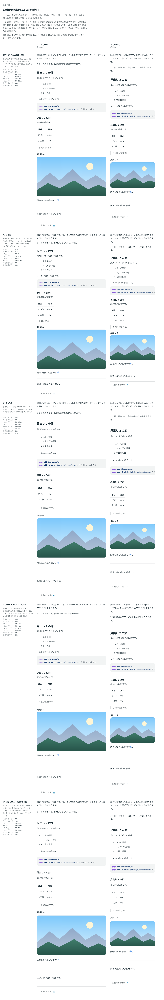

# 0097. Prose の余白

- ステータス: Accepted
- 日付: 2026-09-17
- ラウンド: 後半 軸70

## 背景

Prose（[ADR-0096](./0096-prose.md)）の中で、段落・見出し・区切り線・脚注の一覧のあいだに空ける余白を決めます（原則11）。値は、見本の記事に仮に付けていた余白（現行版）を基準に、詰めた案・広げた案・見出しの上だけを広げる案・本文の1行の高さ（28px）を単位にする案を比べました。

## 候補

値は「上・下」（px）です。段落のあいだ・かたまりの上下は、どの案も上下の区別がありません。

| 案                            | 段落 | かたまり | h2 上・下 | h3 上・下 | h4〜6 上・下 | h1 上・下 | 区切り線の上下 | 脚注の線の下 |
| ----------------------------- | ---- | -------- | --------- | --------- | ------------ | --------- | -------------- | ------------ |
| 現行版（見本の記事と同じ）    | 16   | 20       | 40・12    | 32・8     | 24・8        | 40・16    | 40             | 24           |
| A（詰めた）                   | 12   | 16       | 32・8     | 24・4     | 20・4        | 32・12    | 32             | 16           |
| B（ゆったり）                 | 24   | 32       | 56・16    | 40・12    | 32・8        | 56・20    | 56             | 32           |
| C（見出しの上をとくに広げる） | 16   | 20       | 72・8     | 48・4     | 32・4        | 72・16    | 72             | 24           |
| D（1行=28px が単位）          | 28   | 28       | 56・14    | 42・14    | 28・14       | 56・14    | 56             | 28           |

## 決定

**パソコン（マウス）は C、スマホ（指）は現行版を採用します。** 段落のあいだ・かたまりの上下・脚注の線の下は、密度によらず現行版の値（16・20・24px）のままです。見出しの上下と区切り線の上下だけが、マウスでは C の値（h2・区切り線の上 72px など）、指では現行版の値（40px など）に変わります。

## 理由

ユーザーのメモです。

> 70: スマホは現行版、パソコンはCで。

- **見出しと区切りの上だけを密度で変える**: マウスでは、節の切れ目をはっきりさせるために見出しの上を大きく空け（C）、指では画面の狭さを優先して詰めます（現行版）。段落のあいだのような、文章の途切れの小さい余白は、密度によらず一定にしました
- **A（詰めた）・B（ゆったり）・D（1行単位）は不採用**: 全体を一律に詰める・広げる・行の高さを単位にする案は選ばれず、「見出しの上だけを広げる」という C の考え方が、パソコンでの節の切れ目の作り方として選ばれました

## 却下した案と理由

- A（詰めた）: 選ばれませんでした
- B（ゆったり）: 選ばれませんでした
- D（1行の高さが単位）: 選ばれませんでした

## 影響

- `tokens.css`: `--prose-heading-1-before`〜`--prose-heading-4-after`・`--prose-divider-gap` を、`-fine`（C の値）・`-coarse`（現行版の値）の対で持ちます。`--prose-paragraph-gap`・`--prose-block-gap`・`--prose-footnotes-gap` は密度を分けず、現行版の値のまま1つです
- `src/styles/theme.css`: 密度の規則（`[data-density="coarse"]` など）に、上記の `-fine`・`-coarse` を割り当てる行を足しました
- `src/components/prose/Prose.tsx`: 要素のあいだの余白は、後ろの要素の `margin-top` にだけ付けます。最初の要素の上と最後の要素の下には付きません
- `design/backlog.md` に足す未決事項はありません

## 原則への反映

原則11 の文を書き換え済みです（メインの作業者が書きました）。「記事の中の見出しと区切りの上の余白は、マウスでは広く取って節の切れ目をはっきりさせ、指では画面が狭いので詰めます」という一文が、原則11 に入っています。

## 比較画像

比較のストーリーは、印を付けて撮る前に消してしまったため、決めた時点の比較を再現する画像がありません。代わりに、候補を見せる前に撮った画像（印なし）を記録として置きます。

