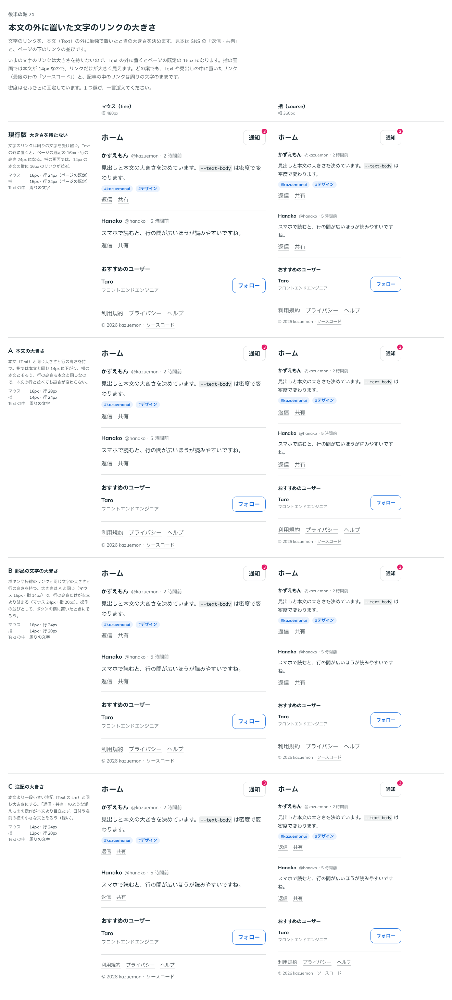

# 0098. 本文の外の文字のリンクの大きさ

- ステータス: Accepted
- 日付: 2026-09-17
- ラウンド: 後半 軸71

## 背景

文字のリンク（Link の `appearance="text"`）は、文の中では周りの文字の大きさを受け継ぎます。Text・Heading・Prose の外（見出しでも本文でもない場所。SNS の「返信・共有」のような単独の操作など）に置いたときの大きさを決めます。

## 候補

値は「マウス（fine）/行の高さ・指（coarse）/行の高さ」（px）です。

| 案                         | マウス | 指    | 考え方                                                                          |
| -------------------------- | ------ | ----- | ------------------------------------------------------------------------------- |
| 現行版（大きさを持たない） | 16/24  | 16/24 | ページの既定を受け継ぐだけ。指の画面では、14px の本文の横に 16px のリンクが並ぶ |
| A（本文の大きさ）          | 16/28  | 14/24 | Text と同じ大きさ・行の高さ                                                     |
| B（部品の文字の大きさ）    | 16/24  | 14/20 | ボタンや枠線のリンクと同じ大きさ・行の高さ                                      |
| C（注記の大きさ）          | 14/24  | 12/20 | 本文より一段小さい注記（Text の sm）と同じ                                      |

## 決定

**B（部品の文字の大きさ）を採用します。** 本文の外の文字のリンクは、マウスで 16/24px、指で 14/20px にします。Text・Heading・Prose の中に置いたときは、これまでどおり周りの文字の大きさ（1em・行の高さは未設定で周りを受け継ぐ）のままです。

## 理由

ユーザーのメモです。

> 71: Prose の中ではすべて親指定のサイズ（計算上媒体に関係なく16px）、そうでなければ交換してもらったようにスマホ14px、パソコン16pxでお願いします。

- **部品の並びとしてそろえる**: 本文の外に置く文字のリンクは、ボタンや枠線のリンクと並べて操作の並びを作ることが多いため、それらと同じ大きさ・行の高さ（[ADR-0079](./0079-control-type-and-height.md) で決めた部品の文字）にそろえました
- **本文の大きさ（A）は不採用**: 本文の行の高さ（マウス 28px）に合わせると、部品と並べたときに行の高さだけがずれます。B は部品と同じ行の高さ（マウス 24px・指 20px）なので、ボタンの横に置いても高さがそろいます
- **文の中は変わらない**: Text・Heading・Prose の中では、これまでどおり周りの文字を受け継ぎます（記事の中では 16px のまま）。この決定は文の外だけに関わります

## 却下した案と理由

- 現行版（大きさを持たない）: 選ばれませんでした。指の画面で、14px の本文の横に 16px のリンクが並ぶちぐはぐさが残ります
- A（本文の大きさ）: 選ばれませんでした。行の高さが本文基準（マウス 28px）になり、部品と並べたときにそろいません
- C（注記の大きさ）: 選ばれませんでした

## 影響

- `tokens.css`: `--link-text-size`・`--link-text-leading` を、`--text-control`・`--leading-control`（[ADR-0079](./0079-control-type-and-height.md) の部品の文字。マウス 16/24・指 14/20）を指すようにしました
- `src/styles/theme.css`: 密度の規則（`[data-density="coarse"]` など）に `--link-text-size`・`--link-text-leading` の割り当てを足しました
- `src/components/link/Link.tsx`: `text-(length:--link-text-size) leading-(--link-text-leading)` で大きさを受け取ります
- `src/internal/reading/text-link.ts`: `textLinkSizeReset`（`--link-text-size: 1em; --link-text-leading: initial`）を、Text・Heading・Prose の見た目のクラス列に含め、文の中では周りの文字に戻します
- `design/backlog.md` に足す未決事項はありません

## 原則への反映

原則7 の文を書き換え済みです（メインの作業者が書きました）。「文字のリンクは、文の中では周りの文字の大きさのままです。文の外に置いたときは、部品の文字と同じ大きさになります」という一文が、原則7 に入っています。

## 比較画像

比較のストーリーは、印を付けて撮る前に消してしまったため、決めた時点の比較を再現する画像がありません。代わりに、候補を見せる前に撮った画像（印なし）を記録として置きます。

