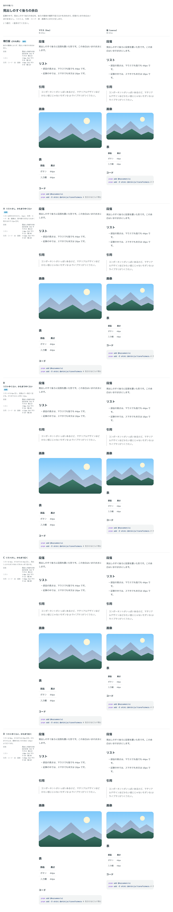

# 0100. Prose の見出しのすぐ後ろの余白

- ステータス: Accepted
- 日付: 2026-09-17
- ラウンド: 後半 軸72

## 背景

[ADR-0097](./0097-prose-spacing.md) で、Prose の見出しの後ろの余白を決めました（h2 はマウス 8px・指 12px）。この余白は、見出しのすぐ後ろが何でも同じでした。見本の記事で見たところ、ユーザーから次のメモがありました。

> 細かい気になりとして、Prose の見出しの下の余白が、リストの場合ちょっと近くて、段落の場合ちょうどよくて、引用や画像の場合かなり小さいなと思いました。調整したいです。

段落のときの余白はそのままにし、リストのときと、引用・コード・表・画像だけの段落のときに、見出しの後ろの余白へ足す量を比べました。

## 候補

値は h2 のすぐ後ろの余白で、「マウス／指」（px）です。h1・h3・h4〜6 の見出しにも同じ量を足します。

| 案     | 段落  | リスト（足す量） | 引用・コード・表・画像（足す量） |
| ------ | ----- | ---------------- | -------------------------------- |
| 現行版 | 8／12 | 8／12（0）       | 8／12（0）                       |
| A      | 8／12 | 12／16（4）      | 20／24（12）                     |
| B      | 8／12 | 16／20（8）      | 20／24（12）                     |
| C      | 8／12 | 12／16（4）      | 24／28（16）                     |
| D      | 8／12 | 16／20（8）      | 28／32（20）                     |

比較は Storybook の `Design Review/72 見出しのすぐ後ろの余白` と、見本のページ（`Design Review/00 見本のページ` の「Markdown（Prose）」の Controls）で見ました。

## 決定

- リストは、入力方式によらず 4px 足します（A の量）
- 引用・コード・表・画像だけの段落は、マウスで 12px 足し（B の量）、指では足しません（現行版）

h2 のすぐ後ろは、マウスでリスト 12px・かたまり 20px、指でリスト 16px・かたまり 12px になります。

## 理由

ユーザーのメモです。

> リストは統一でAの少し、引用や画像についてはスマホだと現行、パソコンだとBの中くらいですかね。

- リストは印があるぶん段落より詰まって見えるので、少しだけ空けます
- 引用・画像などは線や面で文字より大きく見えるので、マウスでは空けます。指では画面が狭く、見出しの上もすでに詰めている（ADR-0097）ので、足しません

## 却下した案と理由

- **C・D**: 選ばれませんでした。ユーザーは案ごとではなく、リストとかたまりの量をそれぞれ A・B・現行版から選びました

## 影響

- `design/tokens.css`: `--prose-heading-list-extra`（4px）、`--prose-heading-block-extra-fine`（12px）・`-coarse`（0）を足しました
- `src/styles/theme.css`: 密度の規則に `--prose-heading-block-extra` を足しました
- `src/components/prose/Prose.tsx`: 見出しのすぐ後ろがリストのとき、引用・コード・表・画像だけの段落のときの規則を足しました
- Prose の見た目の基準画像を撮り直しました

## 原則への反映

原則 11 の文を書き換えました。記事の中の余白の箇条書きに、見出しのすぐ後ろのリストとかたまりの余白を足しました。

## 比較画像

比較のストーリーは、コミットする前の作業中に作って消したため、決めた時点のコミットはありません。記録は比較画像です。

