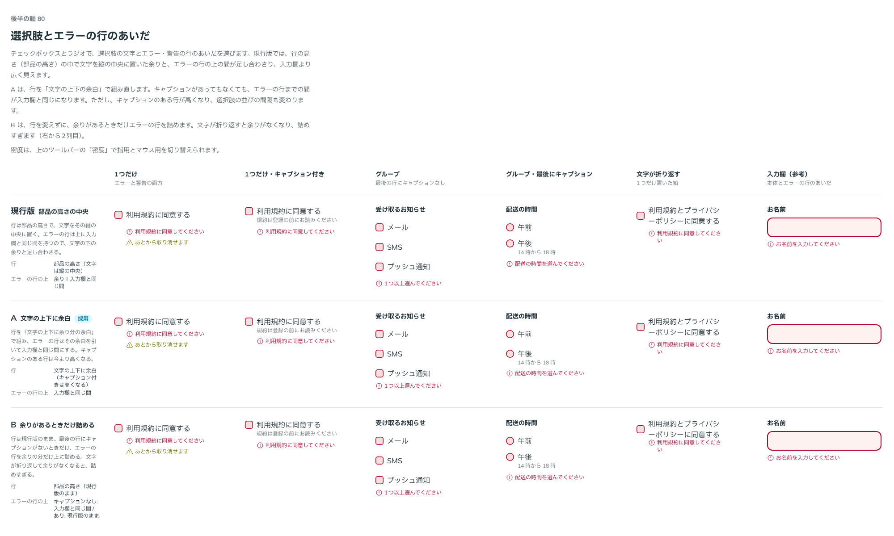

# 0101. 選択肢とエラーの行のあいだ

- ステータス: Accepted
- 日付: 2026-09-17
- ラウンド: 後半 軸80

## 背景

チェックボックス・ラジオで、選択肢の文字とエラー・警告の行のあいだが、入力欄より広く空いていました（マウス用 18px、指用 20px）。行を部品の高さで組み、文字を縦の中央に置いていたため、下に残る余りと、エラーの行の上に持つ間（入力欄と同じ間）が足し合わさっていました。1つだけ置く Checkbox でも、CheckboxGroup・RadioGroup のエラーでも同じ差が出ます。

きっかけは、見本のページを見たユーザーの質問でした。

> Checkbox の「エラーと警告」でアラートとチェック項目にかなりの余白がありますが、これは何によるものですか？

「グループ全体へのエラーと、単体の箱へのエラーを区別すべきか」という問いもありましたが、その区別（グループの error は問い全体、単体の error は箱）は [ADR-0062](./0062-checkbox-radio.md) ですでに持っているため、崩さずに保つと説明しました。そのうえで比較を作り、案を出しています。

## 候補

比較は Storybook の `Design Review/80 選択肢とエラーの行のあいだ`（決めた時点のコミット `29f20f5`。`git checkout 29f20f5 && pnpm storybook` で開けます）です。1つだけ置く Checkbox と、CheckboxGroup・RadioGroup のエラー・警告の行の両方で見ています。

| 案     | 内容                                                                                                                                                                                                                  |
| ------ | --------------------------------------------------------------------------------------------------------------------------------------------------------------------------------------------------------------------- |
| 現行版 | 行の高さは部品の高さのまま、文字を縦の中央に置く。エラー・警告の行の上の間は、余りに入力欄と同じ間を足したもの                                                                                                        |
| A      | 行を「文字の行の上下に (部品の高さ − 文字の行) / 2 の余白」で組み直す。選択肢のすぐ下に出るエラー・警告の行は、その余白を間に数え、文字との間を入力欄と同じ間にする。キャプションのある行は、その分だけ数 px 高くなる |
| B      | 行は現行版のまま、最後の行にキャプションがないときだけ間を詰める。文字が折り返すと余りがなくなり、エラーの行が文字に重なる。CSS では行の高さが分からず、折り返しを避けられない                                        |

## 決定

**A を採用します。**

- 選択肢の行は、横の文字の上下に均等な余白を付けて組みます
- 選択肢のすぐ下に出るエラー・警告の行は、この余白を間に数え、文字との間を入力欄と同じ間にします
- 枠で囲んだ「すべて選ぶ」のグループと、キャプションを下に置いたグループは、行の下がすでに枠や別の行なので詰めません

比較のあと確かめたところ、どの組み合わせ（1つだけ置く Checkbox・グループ・キャプションの有無）でも、選択肢の文字とエラー・警告の行の間は 8px（指用は 8〜9px）にそろいました。

## 理由

比較を見たいという返事のあと、案を決めました。

> ストーリーで比べたいです。

> A で改修お願いします

- **文字の上下に余白を付ける**: 行の高さを部品の高さに固定したまま文字を中央に置くと、キャプションやエラーの行がある・ないで余りの大きさが変わり、文字との間が安定しません。文字の上下に余白を付けて組むほうが、入力欄の間との足し算にならず、いつも同じ間になります
- **B は選ばれませんでした**: 「余りがあるときだけ詰める」という条件分岐は、CSS だけでは行の高さ（文字が折り返したかどうか）を読めず、文字が折り返す選択肢では詰められないまま行が文字に重なる欠陥が残ります

## 却下した案と理由

- **現行版**: 選ばれませんでした。部品の高さの余りと入力欄の間が足し合わさり、選択肢の文字とエラー・警告の行の間が入力欄より広く見えていました
- **B（余りがあるときだけ詰める）**: 選ばれませんでした。CSS では行の高さが分からず、文字が折り返す選択肢で詰められないままエラーの行が文字に重なります

## 影響

- `src/internal/choice/choice-styles.ts`: 行の上下の余白を `--choice-row-pad-y`（部品の高さから横の文字の行を引いた残りの半分）として部品の中で計算するようにしました。エラー・警告の行の上の間から余白ぶんを引く `choiceMessagePull`（1つだけ置く箱用）・`choiceGroupMessagePull`（グループ用。枠で囲んだグループとキャプションを下に置いたグループは詰めない）を足しました
- `src/components/checkbox/Checkbox.tsx`: 1つだけ置く箱で高さを取っていた見えない柱をやめ、上下の余白を格子の行で持つ形に直しました。エラー・警告の行は格子の最後の2行に置きます
- `src/components/checkbox/CheckboxGroup.tsx`・`src/components/radio/Radio.tsx`: グループの Field に `choiceGroupMessagePull` を渡し、枠で囲んだグループには印（`data-choice-frame`）を付けて詰めを止めるようにしました
- `src/internal/field/field-styles.ts`: エラー・警告の行の上の間から引く長さを `--field-message-pull` として持てるようにしました。間（`--spacing-field-gap`）までは行の上の間を減らし、それを超えた分（`--field-message-overlap`）は、行が開いているあいだだけ箱を上に寄せます。エラーのあとに続く警告の行は、ふつうの間に戻ります
- `design/tokens.css`: `--choice-size-fine`・`--choice-size-coarse` 周りのコメントを、行の組み方（余白で組む・エラー行は余白を間に数える）に合わせて書き直しました。比べるためだけに置いた切り替えのトークンは、決まった値に畳んで消しました
- 比較のストーリー（`design/stories/axis-80-*.stories.tsx`）は消しました
- Checkbox・Radio の見た目の基準画像を撮り直しました

## 原則への反映

反映なし。原則8はもともと「エラーの文は、選択肢の下に、入力欄と同じ形（アイコン付きの行）で付ける」とだけ書いており、具体的な間隔は書いていません。今回の決定は、この「入力欄と同じ形」という原則の範囲内で、選択肢の行の組み方という実装の値を直したものです。

## 比較画像

