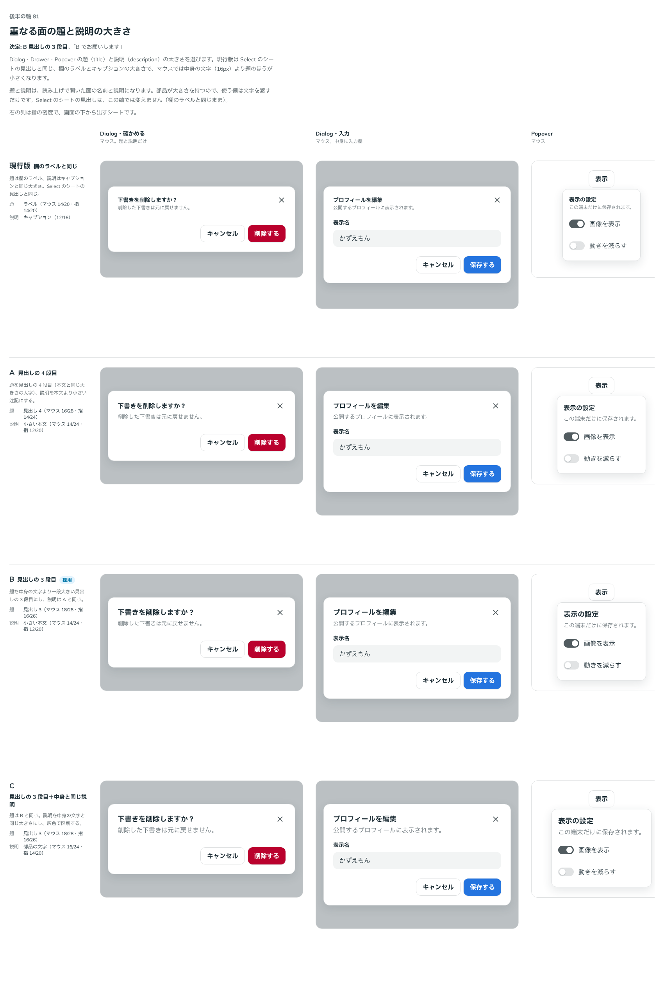

# 0103. 重なる面の題と説明の大きさ

- ステータス: Accepted
- 日付: 2026-09-18
- ラウンド: 後半 軸81

## 背景

Dialog・Drawer・Popover の題（`title`）と説明（`description`）は、作ったときに Select のシートの見出しと同じ大きさ（欄のラベルとキャプション）にしていました。マウスで操作するときは、部品の文字が 16px、ラベルが 14px なので、題が中身の文字より小さくなります。

> Dialog, Drawer, Popover には title と description がありますが、パソコンの場合、それぞれが内包するコンテンツに対して文字サイズが小さすぎます（確かめる（中身なし）など）
> これは内包するコンテンツに任せるとアクセシビリティに大変でしょうか？

「中身に任せる」ことはできますが、題と説明は読み上げで開いた面の名前と説明になります。部品が props で受け取っていれば、部品が読み上げにつなぎます。中身に任せると、使う側が毎回 `aria-labelledby`・`aria-describedby` をつなぐ必要があり、忘れると名前のない面になります。そのため props は変えず、部品が持つ大きさを選び直しました。

原則4（ラベル / 本体 / キャプションの 3 層）と原則11（密度）に関わります。

## 候補

比較は Storybook の `Design Review/81 重なる面の題と説明の大きさ`（決めた時点のコミット `1fc7c93`。`git checkout 1fc7c93 && pnpm storybook` で開けます）です。列は「Dialog・確かめる」「Dialog・入力」「Popover」「シート」で、右の列だけ指の密度です。

| 案     | 題                                   | 説明                                 |
| ------ | ------------------------------------ | ------------------------------------ |
| 現行版 | 欄のラベル（マウス 14/20・指 14/20） | キャプション（12/16）                |
| A      | 見出し 4（マウス 16/28・指 14/24）   | 小さい本文（マウス 14/24・指 12/20） |
| B      | 見出し 3（マウス 18/28・指 16/26）   | 小さい本文（マウス 14/24・指 12/20） |
| C      | 見出し 3（マウス 18/28・指 16/26）   | 部品の文字（マウス 16/24・指 14/20） |

候補の値は、密度で変わる役割（`--text-heading-3` など）を指すので、面そのものに書いて比べました。浮かぶ面は本体の祖先の密度を自分に写し直すため、枠に書いた値では面の中で上書きされます。

## 決定

**B にします。題は見出しの 3 段目、説明は小さい本文です。**

| 項目            | 決定                                                                           |
| --------------- | ------------------------------------------------------------------------------ |
| 題              | 見出しの 3 段目（マウス 18px・指 16px）の太字                                  |
| 説明            | 小さい本文（マウス 14px・指 12px）のグレー                                     |
| 密度            | 指で操作しているときは一段小さくなる（原則11）                                 |
| Select のシート | 見出しの題は欄のラベルと同じ大きさのまま。欄のラベルと同じものを見せているため |
| 置き方          | 右上の × は、大きくなった題の行の中央にそろえる                                |

## 理由

ユーザーのメモです。

> B でお願いします

以下は、メモと比較から読み取れることです。

- **題は中身より一段大きい**: マウスでは中身の文字が 16px なので、題が 18px になって初めて「題」として読めます。見出しの段をそのまま使うので、新しい大きさを持ち込みません
- **説明は小さい本文**: キャプション（12px）のままだと、パソコンでは題との差が大きすぎて読みにくく、部品の文字（16px）にすると題と競います。あいだの小さい本文にします
- **props のまま持つ**: 題と説明を中身に任せると、読み上げの名前と説明を使う側がつなぐことになります。部品が持てば、文字を渡すだけで読み上げにつながります

## 却下した案と理由

- **現行版（欄のラベルと同じ）**: 選ばれませんでした。パソコンでは中身の文字より題が小さく見えます
- **A（見出し 4）**: 選ばれませんでした。マウスでは中身と同じ 16px なので、太字でしか区別できません
- **C（説明を中身と同じ大きさ）**: 選ばれませんでした。説明が題と競います

## 影響

- `src/styles/theme.css`: 密度の規則に `--overlay-title-size`・`--overlay-title-leading`・`--overlay-description-size`・`--overlay-description-leading` を足し、見出し 3 と小さい本文を指すようにしました。密度で変わる値なので、`:root` ではなく密度の規則が入れます
- `design/tokens.css`: 上の 4 つの置き場所と使い方をコメントに書きました
- `src/internal/sheet/sheet-styles.ts`: 題と説明のクラスがこのトークンを読みます。右上の × を題の行の中央にそろえるため、面に `--sheet-title-leading` として題の行の高さを渡します
- `src/components/select/SelectSheetTitle.tsx`: Select のシートの題は、欄のラベルと同じ大きさのままにしました（この軸では変えません）
- Dialog・Drawer・Popover の見た目の基準画像を撮り直しました
- **分かっていること**: 浮かぶ面は本体の祖先の密度を自分に写し直すので、使う側が祖先で `--overlay-title-size` を上書きしても面には届きません。面に `className` で渡す必要があります

## 原則への反映

反映なし。原則4はラベル・本体・キャプションの 3 層と、それぞれの太さ・色・置き場所を書いており、大きさの段は書いていません。今回の決定は、その範囲内で重なる面の題と説明が指す段を選んだものです。

## 比較画像

