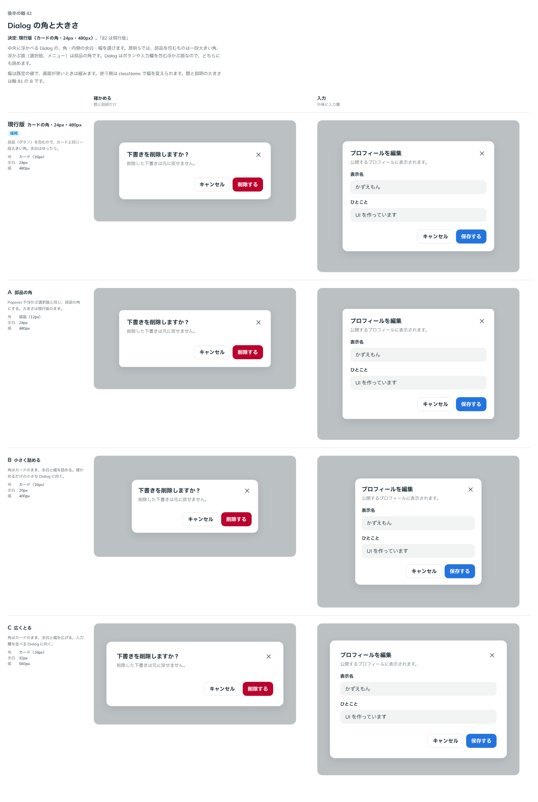

# 0104. Dialog の角と大きさ

- ステータス: Accepted
- 日付: 2026-09-18
- ラウンド: 後半 軸82

## 背景

中央に浮かべる Dialog の角・内側の余白・幅は、作ったときの仮の値（カードの角 16px・余白 24px・幅 480px）でした。

原則5では、部品を包むものは一段大きい角、浮かぶ面（選択肢、メニュー）は部品の角です。Dialog はボタンや入力欄を包む浮かぶ面なので、どちらにも読めます。

## 候補

比較は Storybook の `Design Review/82 Dialog の角と大きさ`（決めた時点のコミット `1fc7c93`。`git checkout 1fc7c93 && pnpm storybook` で開けます）です。列は「確かめる（題と説明だけ）」と「入力（中身に入力欄）」です。

| 案     | 角             | 余白 | 幅    |
| ------ | -------------- | ---- | ----- |
| 現行版 | カード（16px） | 24px | 480px |
| A      | 部品（12px）   | 24px | 480px |
| B      | カード（16px） | 20px | 400px |
| C      | カード（16px） | 32px | 560px |

## 決定

**現行版のままにします。カードの角（16px）・余白 24px・幅 480px です。**

| 項目 | 決定                                            |
| ---- | ----------------------------------------------- |
| 角   | カードと同じ一段大きい角（`--dialog-radius`）   |
| 余白 | 24px（`--dialog-padding`）                      |
| 幅   | 480px（`--dialog-width`）。画面が狭いときは縮む |
| 余り | 画面との間は 16px（`--dialog-margin`）          |

幅を変えたいときは、使う側が `className` で渡します。

## 理由

ユーザーのメモです。

> 82 は現行版

以下は、メモと比較から読み取れることです。

- **包むものの角**: Dialog はボタンと入力欄を包むので、カードと同じ一段大きい角です。浮かぶ面（選択肢・Popover・Tooltip）が部品の角なのと、役割で分かれます
- **余白と幅はそのまま**: 「軽い」（余白は多い）に近いのは現行版と C ですが、C は確かめるだけの Dialog では中身に対して面が大きくなります。現行版が両方の列で収まっていました

## 却下した案と理由

- **A（部品の角）**: 選ばれませんでした。Popover と同じ角になり、包むものと浮かぶ面の区別がなくなります
- **B（小さく詰める）**: 選ばれませんでした。余白が 20px になると「軽い」から遠くなります
- **C（広くとる）**: 選ばれませんでした。確かめるだけの Dialog で面が大きくなります

## 影響

- `design/tokens.css`: `--dialog-width`（480px）・`--dialog-padding`（24px）・`--dialog-margin`（16px）はそのままです。比べるためだけに置いた `--dialog-radius` は、記録のコミットで部品のカードの角に畳んで消します
- `src/components/dialog/Dialog.tsx`: 変更なし（現行版のまま）
- 見た目の基準画像も変わっていません

## 原則への反映

原則5の文を書き換えます。「カードとボトムシートは、部品より大きい角です」に、部品を包む浮かぶ面（ダイアログ）を含め、「浮かぶ面（選択肢、メニュー、Popover、Tooltip）は部品の角」と書き分けます。

## 比較画像

