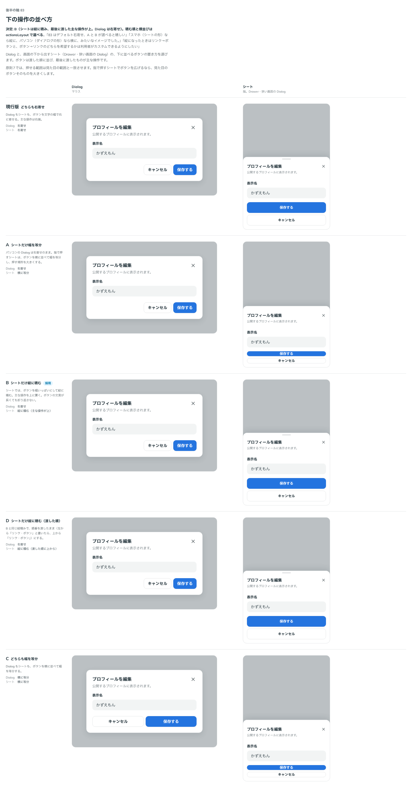

# 0105. 重なる面の下の操作の並べ方

- ステータス: Accepted
- 日付: 2026-09-18
- ラウンド: 後半 軸83

## 背景

Dialog・Drawer の下に並べるボタン（`actions`）は、作ったときは Dialog もシートも右寄せでした。指で押すシートでは、文字の幅のボタンが右下に小さく並びます。

原則7では、押せる範囲は見た目の範囲と一致させます。指で押しやすくするなら、見た目のボタンそのものを大きくします。

「このボタンはどのレイヤーが決めるのか」という問いもありました。

> 83 はデフォルト右寄せ、A と B が選べると嬉しいですが、このボタンはどのレイヤーで指定するものでしょうか？色の指定やアクションの変更（保存を挟むなど）をする場合に、ユーザー側で作るレイアウトなのか、コンポーネント側で責務を持つものなのかによるかなと思いました。

## 候補

比較は Storybook の `Design Review/83 下の操作の並べ方`（決めた時点のコミット `1fc7c93`。`git checkout 1fc7c93 && pnpm storybook` で開けます）です。列は「Dialog（マウス）」と「シート（指）」です。

| 案     | Dialog   | シート                       |
| ------ | -------- | ---------------------------- |
| 現行版 | 右寄せ   | 右寄せ                       |
| A      | 右寄せ   | 横に並べて幅を等分           |
| B      | 右寄せ   | 縦に積む（主な操作が上）     |
| D      | 右寄せ   | 縦に積む（渡した順に上から） |
| C      | 横に等分 | 横に等分                     |

D は、最初の答えのあとに「積む順を選べるようにしたい」という話が出てから足しました。

## 決定

**B にします。シートでは幅いっぱいで縦に積み、最後に渡した主な操作を上にします。Dialog（中央に浮かべる形）は右寄せです。**

| 項目               | 決定                                                                                           |
| ------------------ | ---------------------------------------------------------------------------------------------- |
| 既定（`auto`）     | 下から出すシートは縦に積む（主な操作が上）。横から出すパネルと、中央に浮かべる Dialog は右寄せ |
| `stack`            | 縦に積み、渡した順に上から（左から「リンク・ボタン」と書いたら、上から「リンク・ボタン」）     |
| `stack-reverse`    | 縦に積み、最後に渡した主な操作を上にする（`auto` がシートで選ぶ形）                            |
| `end`              | 横に並べて右に寄せる                                                                           |
| `fill`             | 横に並べて幅を等分する                                                                         |
| 使う側が決めるもの | ボタンの文言・色・数・順番（`actions` に渡す要素のまま）                                       |
| 部品が決めるもの   | 並べ方と、シートかどうかによる切り替え                                                         |

## 理由

ユーザーのメモです（最初の答えと、そのあとの言い直し）。

> 83 はデフォルト右寄せ、A と B が選べると嬉しいですが、このボタンはどのレイヤーで指定するものでしょうか？色の指定やアクションの変更（保存を挟むなど）をする場合に、ユーザー側で作るレイアウトなのか、コンポーネント側で責務を持つものなのかによるかなと思いました。

> 83ですが、スマホ（シートの形）なら縦に、パソコン（ダイアログの形）なら横に、みたいなイメージでした。
> 例えば左からリンク、ボタンと並んだ場合、縦になったときはリンク→ボタンと、ボタン→リンクのどちらを希望するかは利用者がカスタムできるようにしたい感じです。

以下は、メモと比較から読み取れることです。

- **並べ方は部品が持つ**: `presentation="auto"` では、シートになるかどうかを使う側は知りません。出し方で並べ方が変わるなら、その切り替えは部品の仕事です。ボタンの中身（文言・色・数・順番・押したときにすること）は使う側が決めるので、`actions` に渡す要素のままにします
- **シートは縦、Dialog は横**: 指で押すシートでは、幅いっぱいのボタンを縦に積むほうが押しやすく、ボタンの文言が長くても折り返しません。マウスの Dialog は、右下に「取り消し → 進める」の順で並ぶ形が読みやすいままです
- **積む順は選べる**: 縦に積むと、横に並べたときの「左 → 右」が「上 → 下」になります。どちらを上にしたいかは画面によって違うので、`stack`（渡した順）と `stack-reverse`（主な操作が上）の両方を持ちます

## 却下した案と理由

- **現行版（どちらも右寄せ）**: 「スマホ（シートの形）なら縦に」。指で押すシートで、ボタンが右下に小さく並びます
- **A（シートだけ幅を等分）**: `fill` として選べる形に残しました。並べる数が増えると 1 つずつが細くなります
- **D（渡した順に積む）**: `stack` として選べる形に残しました。既定は主な操作が上です
- **C（どちらも幅を等分）**: 選ばれませんでした。マウスの Dialog でボタンが不要に大きくなります

## 影響

- `design/tokens.css`: 比べるためだけに置いた `--dialog-actions-direction`・`-justify`・`-grow` と `--sheet-actions-*` は、記録のコミットで部品の決まった値に畳んで消します
- `src/internal/sheet/SheetPopup.tsx`: 下の操作の並べ方を `footerLayout` で受け取り、`auto` のときは向き（下から・横から）で決めます。縦に積むときは、ボタンを幅いっぱいに伸ばします
- `src/components/drawer/Drawer.tsx`・`src/components/dialog/Dialog.tsx`: `actionsLayout`（`auto`・`end`・`fill`・`stack`・`stack-reverse`、既定は `auto`）を足しました。Dialog の中央に浮かべる形では、この指定を見ずにいつも右寄せです
- `src/index.ts`: `OverlayActionsLayout` の型を公開しました
- Dialog のシートと Drawer の長い中身の見た目の基準画像を撮り直しました（ボタンが縦に積まれた形になりました）
- **分かっていること**: 横から出すパネル（`side="left"`・`"right"`）は、`auto` では右寄せです。幅が 360px なので、縦に積みたいときは `stack` を渡します

## 原則への反映

原則11の文を書き換えます。構造を切り替える話に、「シートでは下の操作を幅いっぱいで縦に積む」を足します。原則7（押せる範囲は見た目の範囲と一致させる）の範囲内で、押す場所を広げるときは見た目のボタンそのものを大きくしています。

## 比較画像

