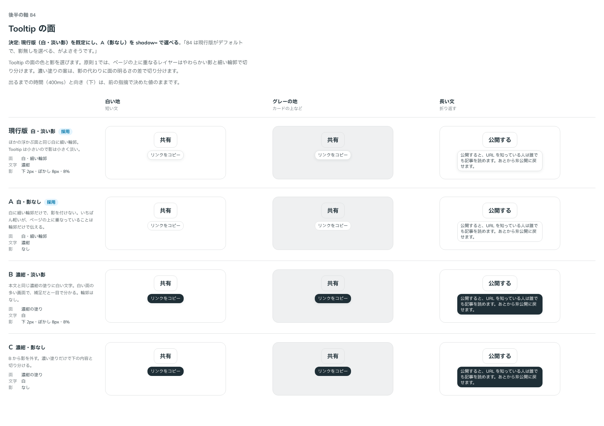

# 0106. Tooltip の面と、出るまでの時間

- ステータス: Accepted
- 日付: 2026-09-18
- ラウンド: 後半 軸84

## 背景

Tooltip は、作ったときはほかの浮かぶ面と同じ白い面に細い輪郭とやわらかい影（`--shadow-overlay`）を付けていました。原則1では、ページの上に重なるレイヤーはやわらかく広い影と細い輪郭で切り分けます。ただ Tooltip は小さいので、ほかの面と同じ影では重く見えます。

出るまでの時間（Base UI の既定の 600ms）と向き（上）も、作ったときの値のままでした。

> Tooltip のデフォルトの出てくるまでの時間はもう少し短めにしたいです。

> Tooltip のブラーがちょっと濃い目だなと思いました。あと、デフォルトの向きは下にしたいです。

この指摘を受けて、影を小さく淡く（下 2px・ぼかし 8px・濃さ 8%）し、向きを下、出るまでの時間を 400ms にしてから、面の色と影を比べました。

## 候補

比較は Storybook の `Design Review/84 Tooltip の面`（決めた時点のコミット `1fc7c93`。`git checkout 1fc7c93 && pnpm storybook` で開けます）です。列は「白い地（短い文）」「グレーの地（カードの上など）」「長い文（折り返す）」です。

| 案     | 面           | 文字 | 影                     |
| ------ | ------------ | ---- | ---------------------- |
| 現行版 | 白・細い輪郭 | 濃紺 | 下 2px・ぼかし 8px・8% |
| A      | 白・細い輪郭 | 濃紺 | なし                   |
| B      | 濃紺の塗り   | 白   | 下 2px・ぼかし 8px・8% |
| C      | 濃紺の塗り   | 白   | なし                   |

## 決定

**現行版（白・細い輪郭・淡い影）を既定にし、A（影なし）を `shadow={false}` で選べるようにします。**

| 項目           | 決定                                                                                      |
| -------------- | ----------------------------------------------------------------------------------------- |
| 面             | 白（`--color-surface`）に細い輪郭（`--color-surface-line`）                               |
| 文字           | 本文と同じ濃紺。大きさは部品のキャプションと同じ                                          |
| 影             | 下 2px・ぼかし 8px・濃さ 8%（`--shadow-tooltip`）。ほかの浮かぶ面より小さく淡い           |
| 角             | 浮かぶ面なので部品の角（原則5）                                                           |
| 影なし         | `shadow={false}` で外せる。細い輪郭だけで下の内容と切り分ける                             |
| 向き           | 下（`side="bottom"`）。画面の端に当たるときは反対側に出す                                 |
| 出るまでの時間 | マウスを載せてから 400ms（`delay`）。キーボードでフォーカスしたときは待たずに出す         |
| 指の長押し     | 500ms（`longPressDelay`）。離したときの押下では本体を実行せず、ほかの場所に触れると閉じる |

## 理由

ユーザーのメモです。

> 84 は現行版がデフォルトで、影無しを選べる、がよさそうです。

> Tooltip のブラーがちょっと濃い目だなと思いました。あと、デフォルトの向きは下にしたいです。

> Tooltip のデフォルトの出てくるまでの時間はもう少し短めにしたいです。

以下は、メモと比較から読み取れることです。

- **白のまま**: 白い面に細い輪郭は、浮かぶ選択肢・Popover と同じ作りです。濃紺の塗りは目を引きますが、ページの中で Tooltip だけが別の系統の見た目になります
- **影は小さく淡く**: 小さい面に広い影を付けると、面より影のほうが目立ちます。下 2px・ぼかし 8px にすると、重なっていることは伝わったまま軽くなります
- **影なしも選べる**: すでに面が重なっている場所（グレーの地やカードの上）では、輪郭だけで足ります
- **向きは下**: 本体の下に出すと、マウスの矢印や指で隠れません
- **時間は 400ms**: Base UI の既定（600ms）は、補足を読みたいときに待たされます

## 却下した案と理由

- **B（濃紺・淡い影）・C（濃紺・影なし）**: 選ばれませんでした。ページの中で Tooltip だけが濃い系統になります
- **影を `--shadow-overlay`（ほかの浮かぶ面と同じ）のまま**: 「ブラーがちょっと濃い目」
- **向きを上のまま・600ms のまま**: 上のメモのとおりです

## 影響

- `design/tokens.css`: `--shadow-tooltip`（下 2px・ぼかし 8px・8%）を足しました。比べるためだけに置いた `--color-tooltip`・`--color-on-tooltip`・`--color-tooltip-line` は、記録のコミットで部品の白・濃紺・細い輪郭に畳んで消します
- `src/components/tooltip/Tooltip.tsx`: `side` の既定を `bottom`、`delay` の既定を 400ms にし、`shadow`（既定 `true`）を足しました。面の見た目は共有の `popupSurfaceClass` から離し、Tooltip の色と影で書きます
- `src/components/tooltip/Tooltip.stories.tsx`: 「影なし」のストーリーを足しました
- Tooltip の見た目の基準画像を撮り直しました
- **分かっていること**: 長押し（500ms）は実機で確かめていません（[ADR-0102](./0102-overlay-components.md) と同じ）

## 原則への反映

原則1の文を書き換えます。重なるレイヤーに Popover・Tooltip を含め、「小さい面（Tooltip）の影は、ほかの重なる面より小さく淡くします」を足します。

## 比較画像

