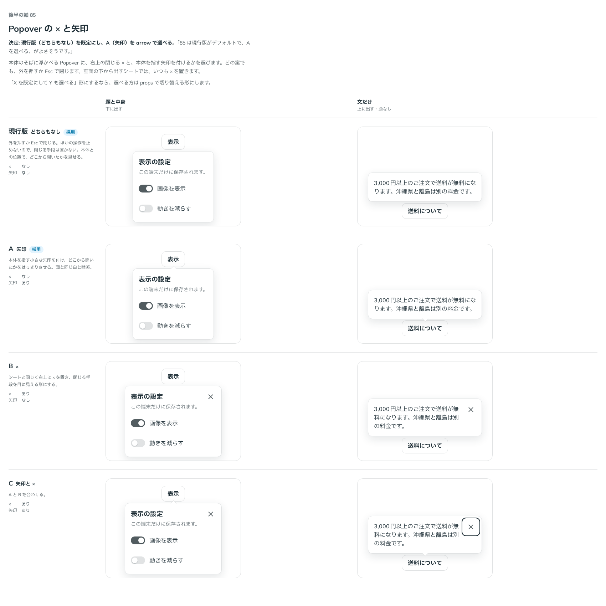

# 0107. Popover の × と矢印

- ステータス: Accepted
- 日付: 2026-09-18
- ラウンド: 後半 軸85

## 背景

Popover を本体のそばに浮かべる形では、作ったときは閉じる × も、本体を指す矢印も置いていませんでした。画面の下から出すシートの形では、シートの決まり（[ADR-0037](./0037-select-sheet.md)）どおり右上に × を置きます。

Popover はほかの操作を止めないので、外を押すか Esc で閉じられます。それでも、閉じる手段を目に見える形にするか、どこから開いたかを矢印で示すかは決めていませんでした。

## 候補

比較は Storybook の `Design Review/85 Popover の × と矢印`（決めた時点のコミット `1fc7c93`。`git checkout 1fc7c93 && pnpm storybook` で開けます）です。列は「題と中身（下に出す）」と「文だけ（上に出す・題なし）」です。

| 案     | ×    | 矢印 |
| ------ | ---- | ---- |
| 現行版 | なし | なし |
| A      | なし | あり |
| B      | あり | なし |
| C      | あり | あり |

矢印は、面と同じ白い四角を 45 度回し、外側の 2 辺だけに輪郭を引いたものです。

## 決定

**現行版（どちらもなし）を既定にし、A（矢印）を `arrow` で選べるようにします。**

| 項目    | 決定                                                        |
| ------- | ----------------------------------------------------------- |
| 既定    | × も矢印も置かない。外を押すか Esc で閉じる                 |
| `arrow` | 本体を指す矢印を付ける。面と同じ白で、外側の 2 辺に細い輪郭 |
| ×       | 浮かぶ形では置かない。シートの形ではいつも置く              |

## 理由

ユーザーのメモです。

> 85 は現行版がデフォルトで、Aを選べる、がよさそうです。

以下は、メモと比較から読み取れることです。

- **既定は何も足さない**: Popover はほかの操作を止めないので、閉じる手段を探させません。本体のそばに出ているので、どこから開いたかも位置で分かります。「軽い」に近いのは現行版です
- **矢印は選べる**: 本体から離れた位置に出るとき（画面の端で反対側に出たときなど）は、矢印があるとどこから開いたかがはっきりします
- **× は置かない**: 題がないときは × が文に重なるので、文の右を × の分だけ空ける必要があります。ほかの操作を止めない面に、その場所を常に取るのは重いと判断しました

## 却下した案と理由

- **B（×）・C（矢印と ×）**: 選ばれませんでした。閉じる手段は外を押すか Esc で足ります。題のない Popover では、× のために文の右を空けることになります

## 影響

- `design/tokens.css`: 比べるためだけに置いた `--popover-arrow-display`・`--popover-close-display`・`--popover-close-space` は、記録のコミットで部品の決まった形に畳んで消します（矢印は `arrow` の props で出し、× の形そのものを部品から消します）
- `src/components/popover/Popover.tsx`: `arrow`（既定 `false`）を足しました。矢印は Base UI の `Popover.Arrow` で、出た側（`data-side`）に合わせて輪郭を引く辺を変えます
- `src/components/popover/Popover.stories.tsx`: Docs に `arrow` の使い分けを書きました
- **分かっていること**: 比較のストーリーでは、開いた直後にフォーカスが × に移るため、× を出した案では × に線が出て見えました。開いた直後のフォーカスは [ADR-0109](./0109-overlay-initial-focus.md) で決めています

## 原則への反映

反映なし。原則1・5 の範囲内（浮かぶ面は白い面に細い輪郭とやわらかい影、角は部品の角）で、付け足すものを選んだ決定です。

## 比較画像

