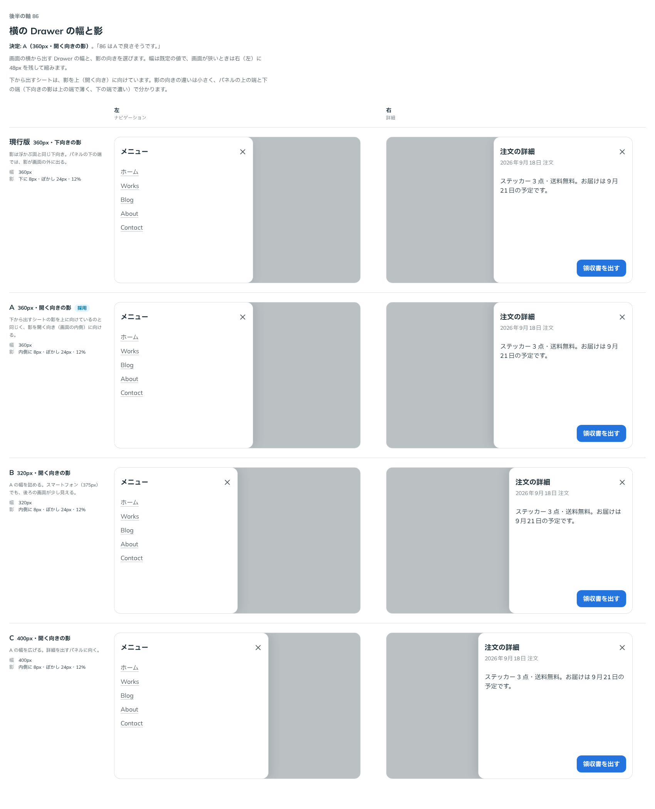

# 0108. 横から出す Drawer の幅と影

- ステータス: Accepted
- 日付: 2026-09-18
- ラウンド: 後半 軸86

## 背景

Drawer を横から出すパネル（`side="left"`・`"right"`）は、作ったときは幅 360px で、影はほかの浮かぶ面と同じ下向き（`--shadow-overlay`）でした。下から出すシートは、影を上（開く向き）に向けています（[ADR-0037](./0037-select-sheet.md)）。横から出すパネルの影を、同じように開く向きへ向けるかは決めていませんでした。

## 候補

比較は Storybook の `Design Review/86 横の Drawer の幅と影`（決めた時点のコミット `1fc7c93`。`git checkout 1fc7c93 && pnpm storybook` で開けます）です。列は「左（ナビゲーション）」と「右（詳細）」です。

| 案     | 幅    | 影                           |
| ------ | ----- | ---------------------------- |
| 現行版 | 360px | 下に 8px・ぼかし 24px・12%   |
| A      | 360px | 内側に 8px・ぼかし 24px・12% |
| B      | 320px | 内側に 8px・ぼかし 24px・12% |
| C      | 400px | 内側に 8px・ぼかし 24px・12% |

## 決定

**A にします。幅 360px、影は開く向き（画面の内側）です。**

| 項目 | 決定                                                                                                                       |
| ---- | -------------------------------------------------------------------------------------------------------------------------- |
| 幅   | 360px（`--sheet-side-width`）。画面が狭いときは、反対側に 48px を残して縮む                                                |
| 影   | 左から出すパネルは右へ、右から出すパネルは左へ 8px・ぼかし 24px・濃さ 12%（`--shadow-sheet-left`・`--shadow-sheet-right`） |

## 理由

ユーザーのメモです。

> 86 はAで良さそうです。

以下は、メモと比較から読み取れることです。

- **影は開く向き**: 下から出すシートの影を上（開く向き）に向けているのと同じ考えです。パネルは画面の端に接しているので、下向きの影は端の外に出てしまい、下の端だけ濃く見えます
- **幅は 360px**: スマートフォン（375px）でも後ろの画面が少し見え、ナビゲーションの項目も詳細の文も収まります。320px では詳細の文が窮屈になり、400px ではスマートフォンで後ろがほとんど見えません

## 却下した案と理由

- **現行版（下向きの影）**: 選ばれませんでした。パネルの下の端だけ影が濃く、上の端では薄くなります
- **B（320px）**: 選ばれませんでした。詳細を出すパネルで文が窮屈になります
- **C（400px）**: 選ばれませんでした。スマートフォンで後ろの画面がほとんど見えません

## 影響

- `design/tokens.css`: `--shadow-sheet-left`・`--shadow-sheet-right` を、開く向き（左のパネルは右へ、右のパネルは左へ）の値にしました。`--sheet-side-width`（360px、画面が狭いときは 100vw − 48px）はそのままです
- `src/internal/sheet/SheetPopup.tsx`: 横から出すときは、この 2 つのトークンから影を描きます
- **分かっていること**: 影の向きの違いは小さく、見た目の回帰テストでは差として出ませんでした（画素の比較のしきい値に収まります）。大きく変えたときは差として出ることを、影を一時的に赤くして確かめています

## 原則への反映

原則1の文を書き換えます。重なるレイヤーに横から出すパネルを含め、シートと同じく影を開く向きに向けることを書きます。

## 比較画像

