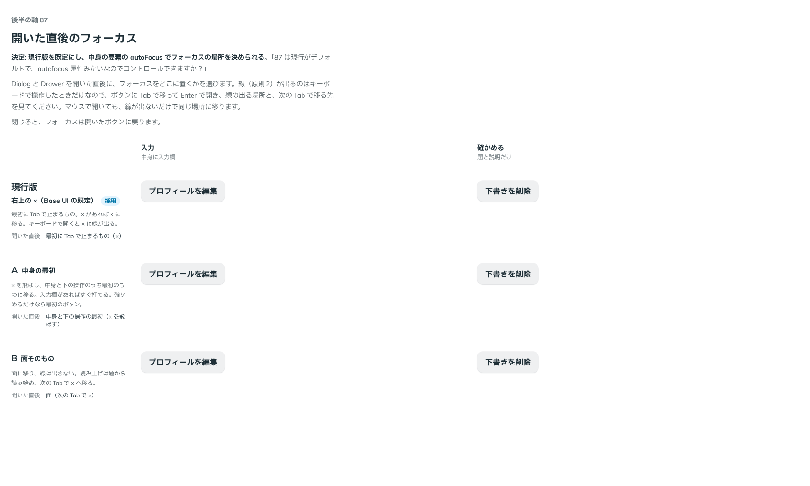

# 0109. 重なる面を開いた直後のフォーカス

- ステータス: Accepted
- 日付: 2026-09-18
- ラウンド: 後半 軸87

## 背景

Dialog・Drawer を開いた直後のフォーカスは、作ったときは Base UI の既定のままでした。Base UI の既定は、Dialog が「最初に Tab で止まるもの（右上の × があれば ×）。ただし指で開いたときは面そのもの」、Drawer が「面そのもの」です。

キーボードで開くと、線（原則2）が × に出ます。そこが最初でよいのかは決めていませんでした。

> 87 は現行がデフォルトで、autofocus 属性みたいなのでコントロールできますか？アクセシビリティ的にどれがいいのかは迷います。

## 候補

比較は Storybook の `Design Review/87 開いた直後のフォーカス`（決めた時点のコミット `1fc7c93`。`git checkout 1fc7c93 && pnpm storybook` で開けます）です。フォーカスは同時に 1 つしか置けないので、開いた状態では並べず、ボタンから開いて確かめる形にしました。列は「入力（中身に入力欄）」と「確かめる（題と説明だけ）」です。

| 案     | 開いた直後                              |
| ------ | --------------------------------------- |
| 現行版 | 最初に Tab で止まるもの（× があれば ×） |
| A      | 中身と下の操作の最初（× を飛ばす）      |
| B      | 面そのもの（次の Tab で × へ移る）      |

## 決定

**現行版（Base UI の既定）を既定にし、中身の要素に付けた `autoFocus` で置き場所を決められるようにします。**

| 項目               | 決定                                                                                                               |
| ------------------ | ------------------------------------------------------------------------------------------------------------------ |
| 既定               | Base UI の既定（Dialog は最初に Tab で止まるもの、指で開いたときは面。Drawer は面）                                |
| 使う側が決めるとき | 中身の要素に `autoFocus` を付ける。キーボードで開いてもマウスで開いても、その要素に移る                            |
| 使い分けの勧め     | 入力を求めるときは最初の入力欄、取り消せない操作を確かめるときは取り消しのボタン、読んでから答えるときは先頭の要素 |
| 閉じたあと         | 開いたボタンにフォーカスが戻る                                                                                     |

Docs にこの使い分けを書き、「確かめる」のストーリーでは取り消しのボタン（キャンセル）に `autoFocus` を付けました。

## 理由

ユーザーのメモです。

> 87 は現行がデフォルトで、autofocus 属性みたいなのでコントロールできますか？アクセシビリティ的にどれがいいのかは迷います。

以下は、メモと調べたことです。

- **場面ごとに置き場所が違う**: WAI-ARIA の Dialog のパターンは、ふだんは最初に押せるもの、入力を求めるときは最初の入力欄、取り消せない操作では取り消しのボタン（うっかり Enter で実行しないため）、中身が長いときは先頭の要素、と勧めています。部品が 1 つに決めきれません
- **使う側が要素で示す**: `autoFocus` は、置き場所を「その要素」で示せます。部品の props で `'content'`・`'popup'` のような名前を増やすより、どこに置くかがそのまま読めます
- **既定は変えない**: 既定を変えると、何も指定しない面の振る舞いが Base UI からずれます

## 却下した案と理由

- **A（中身の最初）を既定にする**: 選ばれませんでした。取り消せない操作では、進めるボタンに先に移ることがあります
- **B（面そのもの）を既定にする**: 選ばれませんでした。Dialog では、次の Tab を押すまでどこにも線が出ません
- **`initialFocus` の props（`first`・`content`・`popup`）を公開する**: 比べるために作りましたが、公開しません。`autoFocus` で同じことができ、置き場所を要素で示せます

## 影響

- `src/internal/overlay/initial-focus.ts`: 開いた直後に、面の中にフォーカスがあれば（React が `autoFocus` の要素を描いたときにフォーカスするため）そこに置いたままにします。HTML の `autofocus` 属性も同じに扱います。どちらもないときは Base UI の既定を写します（Dialog は指で開いたときは面・それ以外は最初に Tab で止まるもの、Drawer は面）
- `src/components/dialog/Dialog.tsx`・`src/components/drawer/Drawer.tsx`・`src/internal/sheet/SheetPopup.tsx`: 面に `data-overlay-id` を付けて、開いたときに探します。比べるために置いた `initialFocus` の props は、記録のコミットで消します
- `src/components/dialog/Dialog.stories.tsx`・`src/components/drawer/Drawer.stories.tsx`: Docs に使い分けを書き、「確かめる（中身なし）」のストーリーでキャンセルに `autoFocus` を付けました
- Dialog の「確かめる（中身なし）」の見た目の基準画像を撮り直しました（線がキャンセルに出ます）
- **分かっていること**: `autoFocus` が効くのは、React が面の中身を描いたときにフォーカスし、そのあと Base UI がフォーカスの場所を決めるためです。キーボードで開いた場合とマウスで開いた場合の両方で、2 つ目の入力欄に移ることを確かめました

## 原則への反映

原則2の文を書き換えます。フォーカスの線の話に、重なる面を開いた直後のフォーカス（既定は最初に Tab で止まるもの、使う側が要素で置き場所を決められる）を足します。

## 比較画像

