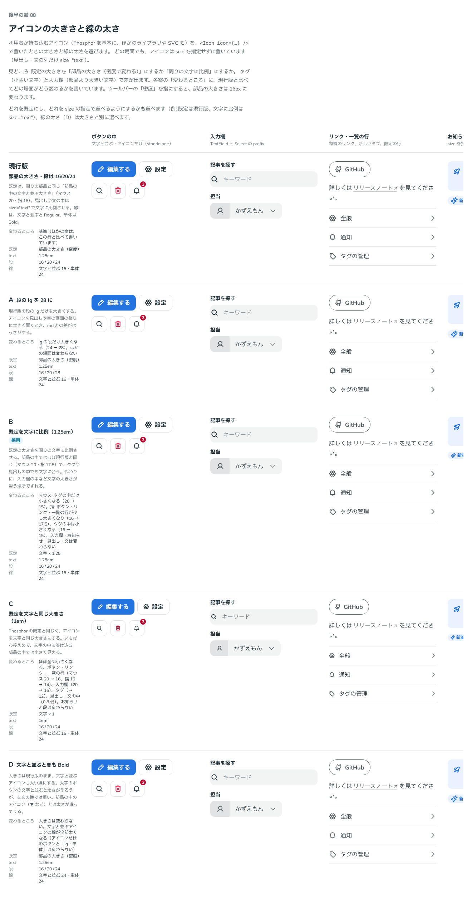

# 0114. Icon の大きさと線の太さ

- ステータス: Accepted
- 日付: 2026-09-18
- ラウンド: 後半 軸88

## 背景

利用者が Phosphor Icons を中心に、任意のアイコンのライブラリや自前の SVG を持ち込める入口として Icon を作ります。部品の中のアイコン（ボタン・入力欄）は密度で変わる大きさにそろっていますが、文の中や見出し、お知らせ、タグ、Badge に置くアイコンの大きさが決まっていませんでした。あわせて、文字と並ぶとき（細い線）とアイコン単体のとき（太い線）の線の太さの出し方も決めます。

## 候補

列は、それぞれの案で見た目が変わる場所です。

| 案     | 内容                                                                                                                                                                                                     |
| ------ | -------------------------------------------------------------------------------------------------------------------------------------------------------------------------------------------------------- |
| 現行版 | 既定は部品の中のアイコンと同じ大きさ（周りの部品にそろえる）。段（sm・md・lg）を持つ。文の中だけ、文字に比例する大きさ                                                                                   |
| A      | lg の段だけ大きくする（lg の場所だけ変わる）                                                                                                                                                             |
| B      | 既定を周りの文字に比例する大きさにする。マウスではタグの中のアイコンだけ小さくなり、指ではボタン・リンク・一覧の行のアイコンが少し大きくなり、タグは小さくなる。入力欄・お知らせ・見出し・文は変わらない |
| C      | 既定を文字と同じ大きさ（1 文字分）にする。ほぼ全部のアイコンが小さくなる                                                                                                                                 |
| D      | 文字と並ぶときもアイコン単体と同じ太い線にする。文字と並ぶアイコンの線が全部太くなる                                                                                                                     |

## 決定

**B を採用します。** 大きさの既定（`size` を書かないとき）を「文」にし、周りの文字の大きさに比例させます。部品の中の文字と並ぶ大きさ（`control`）は、選べる値として残します。段の名前（`control`・`text`・`sm`・`md`・`lg`）はそのまま使います。太さは、文字と並ぶときは細い線、アイコン単体のときは太い線のままです（D は採りません）。

## 理由

ラウンド 1 への返事です。

> 88 は変えた場合にどこが特徴的になるか（全部小さくなる、全部大きくなる、ここだけ小さくなる）を付記して欲しいです。大きさの名前はいいかなと思いましたが、本文中では下に下がって見えるので、もう少し上にずらしたいですね。

ラウンド 2 への返事です。

> 88: B が一番好みです。ちなみに D って逆にウェイトが軽くなっているように見えますが、あってます？

- **B を選んだ理由**: 文字に比例する大きさは、ボタン・リンク・見出し・文のどこに置いても文字となじみます。タグのように密度の高い場所だけ少し小さく、指で押す場所だけ少し大きくする細かい調整も、比の考え方 1 つで説明できました
- **段の名前は変えない**: 「大きさの名前はいいかなと思いました」との返事どおり、`control`・`text`・`sm`・`md`・`lg` の名前と役割は変えていません
- **D は採らない**: 文字と並ぶ場面まで太い線にすると、文中のアイコンが浮いて見えます。文字と並ぶときは細い線、単体のときだけ太い線という今までの区別を保ちました

## 却下した案と理由

- **現行版**: 選ばれませんでした。既定の大きさが部品にそろう形のままだと、文の中でアイコンだけ文字と比が合わない場所が残ります
- **A（lg だけ拡大）**: 選ばれませんでした。段の一部だけを変える案より、既定を文字に比例させる B のほうが、文脈ごとの違いを説明できました
- **C（文字と同じ 1 文字分）**: 選ばれませんでした。ほとんどのアイコンが小さくなりすぎました
- **D（文字と並ぶときも太い線）**: 選ばれませんでした。理由は「理由」の節のとおりです

## 影響

- `src/components/icon/Icon.tsx`: `size`（既定 `'text'`。周りの文字の 1.25 倍）・`standalone`（太さ）・`icon`（渡すアイコンの部品）・`label`（読み上げ）の props を持つ部品にしました。文字と並ぶ大きさの段は `'control'`・`'sm'`・`'md'`・`'lg'` です
- **文中の縦位置の直し**: ラウンド 2 で、文の中のアイコンが下に下がって見える指摘を受けました。「本文中では下に下がって見えるので、もう少し上にずらしたいですね」。アイコンの中心を、ベースラインから漢字の枠の中心の高さに合わせる直しをしました。直す前は、見出しや本文でアイコンの中心が 1.5〜3px ほど下にずれていました
- **hairline の不具合**: D の案を確かめていたとき、「D って逆にウェイトが軽くなっているように見えますが、あってます？」との指摘で見つかった不具合です。文字と並ぶ細い線の太さを `calc()` で 0 にしたとき、Chrome はそれを 0 として扱わず、画面の 1 ピクセル分の細い線（hairline）を描いていました。そのため、等倍の画面では、細い線のはずの現行版の描画が、太い線の D より太く見えていました。線の不透明度を太さに応じて 0 から立ち上げる直しで、太さが 0 のときに線そのものを消しました。ラウンド 2 までの比較画像の現行版の行にも、この hairline が写っています
- `src/index.ts` に `Icon`・`IconProps`・`IconSize` を足しました

## 原則への反映

反映なし（既存の原則の範囲内）。

## 比較画像

比較のストーリーは、決めた時点のコミット `8693e86` にあります（`git checkout 8693e86 && pnpm storybook`）。ただし、この軸で採用した案（B）はコミットする前にトークンへ畳み込んでおり、8693e86 の時点のストーリーでは A〜D の候補を再現できません。比較画像は、ラウンド 2 の状態（B 案を畳む前、hairline の不具合を直す前）から撮りました。そのため画像の現行版の行には、上の「影響」に書いた hairline がそのまま写っています。

