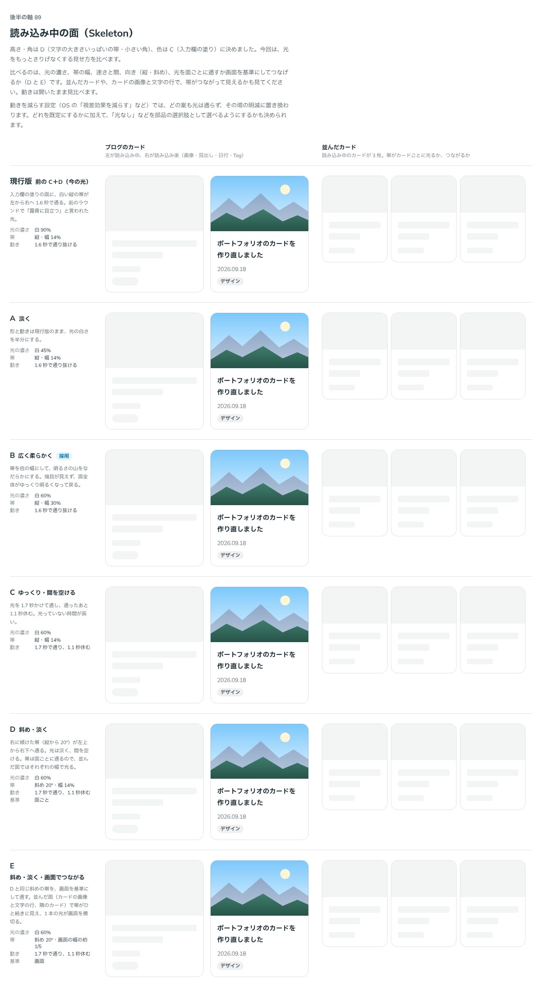

# 0115. 読み込み中の面（Skeleton）

- ステータス: Accepted
- 日付: 2026-09-18
- ラウンド: 後半 軸89

## 背景

読み込む前から、実物と同じ形と大きさの場所取りを置く Skeleton を作ります。角は代わりに置くもの（画像・ボタン・入力欄・タグ・トグル・顔）の角に合わせ、色と、読み込み中であることを伝える動きの見た目を決めます。

## 候補

ラウンド 1 は、色・高さ・角丸・動きの有無を一度に比べました。

| 案     | 内容                                                    |
| ------ | ------------------------------------------------------- |
| 現行版 | 入力欄と同じグレー、白い光が横切って動く、pill の細い帯 |
| A      | 明滅（動きを光の帯ではなく、面の濃さの明滅にする）      |
| B      | 動きなし（面だけを置き、動かさない）                    |
| C      | 淡い面（入力欄より薄いグレー）                          |
| D      | 帯の高さを文字の高さ（1 行分）に、角を小さくする        |

ラウンド 2 は、D の高さ・角丸と C の色を組み合わせた土台の上で、光の見せ方だけを比べました。

| 案     | 内容                                                  |
| ------ | ----------------------------------------------------- |
| 現行版 | 白 90% の光が 1.6 秒で通る                            |
| A      | 光を淡くする（45%）                                   |
| B      | 光を広く柔らかくする（60%・帯を太く）                 |
| C      | 光をゆっくり、間を空けて通す（2.8 秒周期）            |
| D      | 光を斜めに通す                                        |
| E      | 光を斜めに、画面基準でカードをまたいで 1 本につなげる |

## 決定

**ラウンド 1 は D（高さ・角丸）＋ C（色）を採用します。** **ラウンド 2 は B（光を広く柔らかく）を既定にします。** 動きは既定の `sweep`（面ごとに光が通る）のほか、`pulse`（ラウンド 1 の A。面の濃さがゆっくり明滅する）と `sweep-viewport`（E を横向きにした形。画面を基準にした帯が、並んだカードをまたいで 1 本で通る）を選べます。`sweep-viewport` は、transform の付いた要素の中と iOS の Safari では、面ごとに通る光になります。

## 理由

ラウンド 1 への返事です。

> 89 は高さ角丸D、色はCがいいのかなと思いましたが、結構流れる光が露骨に目立つので、もう少しさりげなくしたいです。あと横じゃなくて斜めに通っていくとかはどうでしょうか？追加で比較したいです

ラウンド 2 への返事です。

> 89: B をデフォルトにして、前に合ったゆっくり明暗するパターンと、E のパターン（ただし斜めじゃなくて横で）も選べるようにしたいです。

- **高さ・角丸は D**: 文字の帯を実物の行の高さに合わせたのは、読み込んだときに下の内容が跳ばないようにするためです。角も、代わりに置くものの角に合わせました
- **色は C**: 淡い面のほうが、入力欄と紛れずに「まだ実物ではない」ことが伝わりました
- **光はさりげなく**: 現行版の白 90% の光は目立ちすぎるという指摘を受け、ラウンド 2 で淡さと広さを比べました。B（広く柔らかい光）が既定に選ばれました
- **明滅と、画面をまたぐ帯も選べる形に**: 「ゆっくり明暗するパターン」（ラウンド 1 の A、`pulse`）と、画面をまたいで通る帯（E、ただし斜めではなく横向き）も、選べる動きとして残しました

## 却下した案と理由

- **ラウンド 1 の現行版**: 選ばれませんでした。光が目立ちすぎ、高さ・角丸も実物と揃っていませんでした
- **ラウンド 1 の B（動きなし）**: 選ばれませんでした
- **ラウンド 2 の現行版（白 90%・1.6 秒）**: 選ばれませんでした。理由は「理由」の節のとおりです
- **ラウンド 2 の A（光を淡く）・C（ゆっくり・間を空ける）**: A は光がやや弱すぎ、C は既定にするには間が空きすぎました。C は動きの遅い版として別途検討しましたが、既定には選ばれていません
- **ラウンド 2 の D（斜め・面ごと）**: 選ばれませんでした。斜めの向きは採らず、画面基準でつながる形だけを E の横向き版（`sweep-viewport`）として残しました

## 影響

- `src/components/skeleton/Skeleton.tsx`: `shape`（`block`・`text`・`circle`）・`radius`（`control`・`card`・`pill`・`none`）・`lines`・`animation`（`sweep`・`sweep-viewport`・`pulse`）の props を持つ部品にしました。`aria-hidden` を付け、読み込み中であることは包む側の `aria-busy` と読み上げ用の文で知らせます
- 見た目のクラス列は `src/internal/skeleton-styles.ts` に置き、Image（[ADR-0116](./0116-image.md)）と共有しています
- 動きを減らす設定では、どの動きもその場の明滅に置き換わります
- `tokens.css` に `--skeleton-*` のトークンと、末尾に `skeleton-sweep`・`skeleton-sweep-rest` の keyframes を足しました
- backlog に、`sweep-viewport` が transform のある要素の中と iOS の Safari では面ごとの光になることと、見た目のテスト（pixelmatch の既定のしきい値）が背景に近い薄いグレーの変化を見落とすこと（この色の変更で分かりました）を足しました

## 原則への反映

原則3 の文を書き換えました。「読み込み中の場所取りは、面を横切るやわらかく淡い光で、読み込んでいることを伝えます。光は目立たせすぎず、待っていることが分かる程度にとどめます」を足し、動きを減らす設定の箇条書きに、読み込み中の面の光もその場の明滅に置き換わることを加えました。

## 比較画像

比較のストーリーは、決めた時点のコミット `8693e86` にあります（`git checkout 8693e86 && pnpm storybook`）。ただし、採用した案（D＋C の土台と、光の見せ方の B）はコミットする前にトークンへ畳み込んでおり、8693e86 の時点のストーリーではラウンド 1・2 の候補を再現できません。比較画像は、ラウンド 2 の候補（B 案を畳む前の状態）から撮りました。

