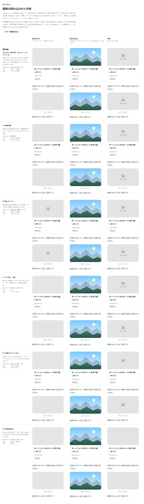

# 0116. 画像の読み込み中と失敗（Image）

- ステータス: Accepted
- 日付: 2026-09-18
- ラウンド: 後半 軸90

## 背景

読み込むまでの見た目、読み込めたときの出し方、失敗したときの見た目を持つ Image を作ります。角と輪郭は [ADR-0087](./0087-figure.md) の Figure の画像と同じにし、Figure の画像は Image に置き換えます。寸法（`width`・`height`・`ratio`）を書かない画像は、読み込む前から枠の高さが決まらないので、読み込み中の枠の取り方もあわせて決めます。

## 候補

| 案     | 内容                                                                                         |
| ------ | -------------------------------------------------------------------------------------------- |
| 現行版 | 読み込み中は Skeleton の面。読み込めたら 200ms でふわっと表示。失敗したらアイコンと alt の文 |
| A      | 読み込み中の面を無地にする                                                                   |
| B      | 読み込み中の面を無地にし、アイコンを添える                                                   |
| C      | 読み込めたら、ふわっとではなくすぐに表示する                                                 |
| D      | 失敗したときはアイコンだけを出す（文はなし）                                                 |
| E      | 失敗したときは面だけを出す（アイコンも文もなし）                                             |

## 決定

**読み込み中は現行版どおり Skeleton と同じ面、読み込めたら C（すぐに表示）、失敗は現行版どおりアイコンと文を採用します。** 失敗したときのアイコンは、破れた画像を表す絵にし、文（`errorText`）は既定を「読み込みに失敗しました」にして、使う側が変えられるようにします。寸法（`width`・`height`・`ratio`）を書かない画像は、読み込み中と失敗のときだけ 16:9 の枠を取り、読み込めたら画像本来の比の高さに変わります。

## 理由

ユーザーの返事の原文です。

> 90 は読み込み中は Skeleton と同じ見た目で、読み込めたら C、読み込めなかったら C の破れたアイコンにしたいですが、キャプションは変更可能でデフォルト「読み込みに失敗しました」とかですかね。幅・高さの無い画像は 16:9 をデフォルトでそこに入る最大サイズに合わせてください。

- **読み込み中は Skeleton のまま**: A・B の無地の案より、ほかの読み込み中の場所取りと見た目をそろえたほうが一貫します
- **読み込めたら C（すぐに表示）**: ふわっと出す動きは、画像が並ぶ場面で遅く感じられました
- **失敗はアイコン＋文**: D（アイコンだけ）・E（面だけ）より、何が起きたかを文でも伝えたほうが親切です。文は既定を持ちつつ変えられるようにし、用途に応じた言い回しを使う側が選べるようにしました

### 誤解と直し（寸法のない画像の枠）

最初の実装では、「幅・高さの無い画像は 16:9 をデフォルトでそこに入る最大サイズに合わせてください」という指示を、読み込めたあとも画像を 16:9 の枠の中に収める（`contain` で描き、縦横比を保ったまま隙間を作る）形だと解釈していました。ラウンド 2 で誤解が分かりました。

> 意図としては、画像のサイズが不定の場合（比率などが指定されていない場合）は 16:9 の画像であると仮定して読み込み表示をする、という意図でした。画像が元から縦長であると明示されているのであれば、縦長に取られるのが正しいです。

正しくは、16:9 は読み込み中・失敗のときだけの仮の枠で、読み込めたら画像本来の比の高さに変える、という意図でした。読み込めた時点で枠の高さが変わり、下の内容が動くことは避けられません。動かしたくないときは、`width`・`height`・`ratio` のいずれかを書きます。

## 却下した案と理由

- **A（読み込み中を無地に）**・**B（無地にアイコンを添える）**: 選ばれませんでした。Skeleton と同じ面のほうが、読み込み中の場所取り全体で見た目がそろいます
- **D（失敗はアイコンだけ）**・**E（失敗は面だけ）**: 選ばれませんでした。何が起きたかを文でも伝える形を採りました

## 影響

- `src/components/image/Image.tsx`: `src`・`alt`・`ratio`・`errorText`（既定「読み込みに失敗しました」）・`outline`（既定 `true`）・`radius`（`card`・`nested`・`none`）・`render` の props を持つ部品にしました。角と輪郭は `src/internal/reading/blocks.ts` の `figureImageStyles` を共有し、面は `src/internal/skeleton-styles.ts` の `skeletonSurface`・`skeletonMotion.sweep` を共有します
- Figure の画像は Image に置き換えました。キャプションの見た目は変えていません
- 状態は枠の `data-status`（`loading`・`loaded`・`error`）で持ちます。サーバーで描いたときで、描いた時点ですでに読み込みが終わっている場合（`idle`）は、面を出さず素の `img` のままにします
- `src/components/image/image-icons.tsx` に、失敗したときに出す破れた画像のアイコンを置きました
- backlog に、寸法のない画像は読み込めたときに高さが変わって下の内容が動くことを足しました

## 原則への反映

原則5 の文を書き換えました。「記事の中の画像はカードと同じ角です」を「画像はカードの角です。記事の中でも外でも変わりません」に直し、Image が記事の中に限らず一般に使われることを反映しました。

## 比較画像

比較のストーリーは、決めた時点のコミット `8693e86` にあります（`git checkout 8693e86 && pnpm storybook`）。ただし、採用した案はコミットする前にトークンへ畳み込んでおり、8693e86 の時点のストーリーではラウンド 1 の候補を再現できません。比較画像は、ラウンド 1 の状態から撮りました。

