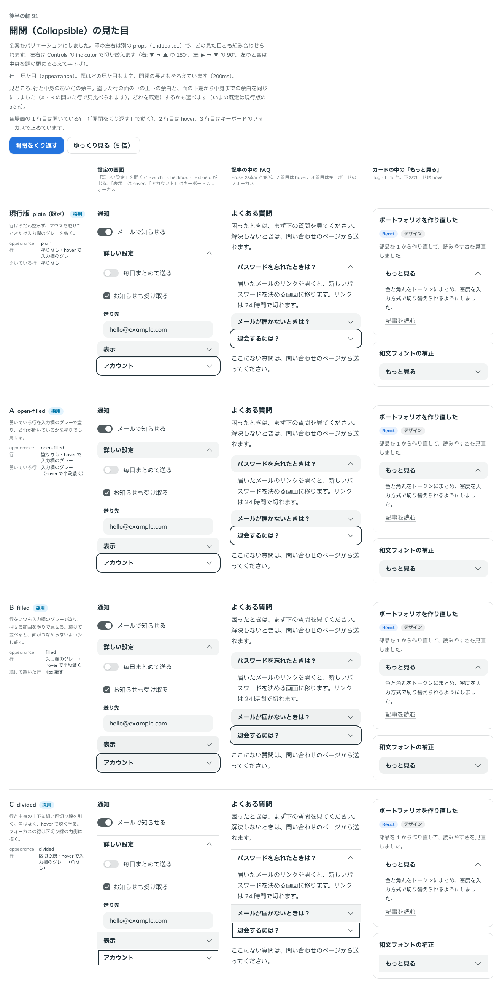

# 0117. 開閉（Collapsible）の見た目

- ステータス: Accepted
- 日付: 2026-09-18
- ラウンド: 後半 軸91

## 背景

Base UI の Collapsible を土台に、押して中身を開閉する行を作ります。詳しい設定・FAQ の答え・「もっと見る」の続きなど、使う場面によって行の塗りが欲しい・区切り線が欲しいと要望が分かれるため、見た目のバリエーションと、開閉の印の位置を決めます。

## 候補

| 案     | 内容                                                           |
| ------ | -------------------------------------------------------------- |
| 現行版 | 塗りなし。hover で入力欄と同じグレーを敷く。印は右で 180° 回る |
| A      | 開いている行をグレーで塗る。印は左で 90° 回る                  |
| B      | いつもグレーで塗る                                             |
| C      | 行と中身の上下に区切り線を引く。角を持たない                   |

## 決定

**現行版・A・B・C の見た目をすべて、選べる `appearance` にします。** `plain`（既定・前の現行版）・`open-filled`（前の A）・`filled`（前の B。続けて置くと少し離す）・`divided`（前の C）です。開閉の印の位置（`indicator`）は見た目とは独立に選べ、`end`（既定、右・180°）・`start`（左・90°、中身を字下げ）です。題はどの見た目でもいつも太字にします。

## 理由

ユーザーの返事の原文です。

> 91 は全部バリエーションとしてほしいです！印左右選択は独立して、それ以外は見た目のバリエーションとしたいです。見出しと内容の余白が小さい気がしたので、ホバー・アクティブでグレーが入った状態で上下の余白が均一になるようにしてほしいです。題は常に太字で良さそう。題の位置は、区切り線アリの場合は左余白最小に設定できると良さそう。

- **全案を選べる形に**: 「全部バリエーションとしてほしいです」との要望どおり、4 つの見た目をどれも捨てずに `appearance` の値にしました
- **印の位置は独立**: 「印左右選択は独立して」との要望どおり、`indicator` を見た目とは別の props にしました
- **題はいつも太字**: 「題は常に太字で良さそう」との返事のとおりにしました
- **余白の均一化**: 「ホバー・アクティブでグレーが入った状態で上下の余白が均一になるように」との指摘を受け、行の上下の余白は行の高さと題の行送りの差の半分、中身の上下の余白はそこから本文と題の行送りの差の半分を引いた値にしました。面を塗った行の中の余白と、面の下端から中身の文字までの余白が同じに見えるようにしています

### 廃止した機能（区切り線のときの左余白）

「区切り線アリの場合は左余白最小に設定できると良さそう」との要望を受け、`divided` のときに題の左余白をなくして端にそろえる機能を一度作りました。しかし、ラウンド 2 で次の指摘を受け、廃止しました。

> 確かにホバーの違和感が大きいですね。端に揃えるはいったん廃止しましょう

行全体を押せる Collapsible では、hover の塗りが題の文字の際まで届く見た目が不自然に見えたためです。

## 却下した案と理由

この軸には、却下した見た目はありません。現行版・A・B・C はすべて `appearance` の選べる形になりました。廃止したのは、区切り線のときに左余白をなくす機能だけです（理由は「理由」の節のとおりです）。

## 影響

- `src/components/collapsible/Collapsible.tsx`: `title`・`trigger`・`appearance`（`plain`・`open-filled`・`filled`・`divided`）・`indicator`（`end`・`start`）・`open`・`defaultOpen`・`onOpenChange`・`disabled`・`hiddenUntilFound`・`keepMounted` の props を持つ部品にしました。振る舞いは Base UI の Collapsible をそのまま使っています
- 見た目のクラス列は `src/components/collapsible/collapsible-styles.ts` に置きました。行の塗りは `--collapsible-row-fill` という登録した変数で動かします（[ADR-0112](./0112-fill-transition-by-registered-property.md)）
- 開閉の長さと緩急は、見た目によらずそろえました
- `src/index.ts` に `Collapsible`・`CollapsibleProps`・`CollapsibleAppearance`・`CollapsibleIndicator` を足しました

## 原則への反映

反映なし（既存の原則の範囲内）。

## 比較画像

比較のストーリーは、決めた時点のコミット `8693e86` にあります（`git checkout 8693e86 && pnpm storybook`）。比較画像は、この軸 91（印は右）の状態を撮りました。

