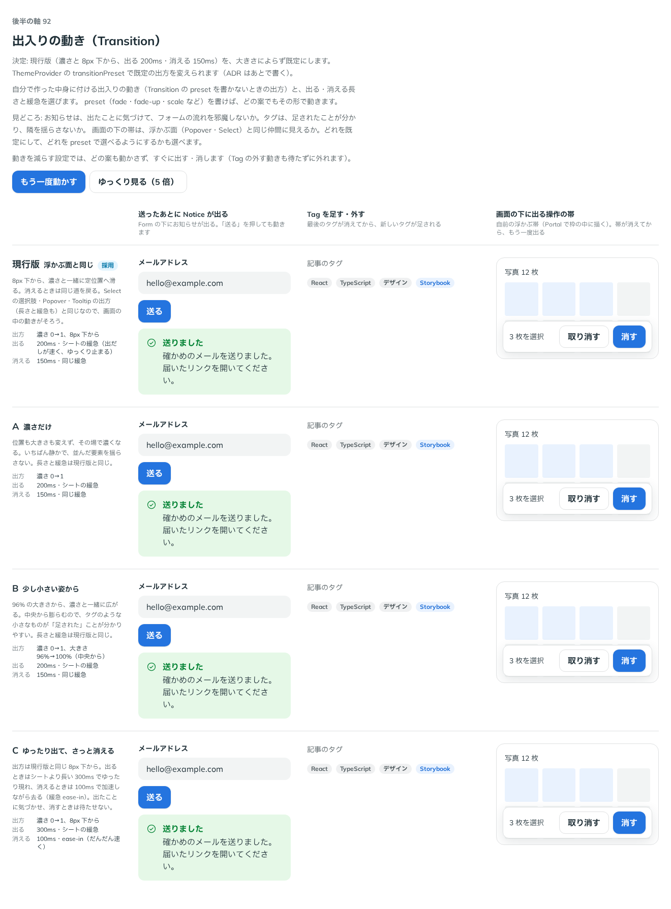

# 0118. 出入りの動き（Transition）

- ステータス: Accepted
- 日付: 2026-09-18
- ラウンド: 後半 軸92

## 背景

自分で作った中身に、@kazuemon/ui の浮かぶ面と同じ出入りの動きを付けられる Transition を作ります。Base UI は、この動きに使う出入りの状態（`useTransitionStatus`）を公開していないため、自前のフックで持ちます。出方の既定（濃さだけか、ずれを伴うか、大きさが変わるか）と、長さ・緩急の候補を比べます。

## 候補

| 案     | 内容                                                                                         |
| ------ | -------------------------------------------------------------------------------------------- |
| 現行版 | 濃さと、下から少しずれた位置から。出る動きは 200ms、消える動きは 150ms、緩急は浮かぶ面と同じ |
| A      | 濃さだけ（ずれを付けない）                                                                   |
| B      | 少し小さい姿（96%）から                                                                      |
| C      | 出る動きを 300ms、消える動きを 100ms・ease-in にする                                         |

## 決定

**現行版を、大きさによらず既定にします。** 出方は `preset` で選べ、`fade`（A の濃さだけの形）・`fade-up`・`fade-down`・`scale`（B の小さい姿から始まる形）・`collapse`（高さを 0 から伸ばす形）を持ちます。`preset` を書かないときの既定は、ThemeProvider の `transitionPreset` で変えられます。

## 理由

ユーザーの返事の原文です。

> 92 デフォルトは全部現行に揃えてでいいと思います。Provider で変更、とかにするといいんですかね。

- **既定は現行版**: 「デフォルトは全部現行に揃えてでいい」との返事どおり、@kazuemon/ui の浮かぶ面と同じ出方を既定にしました
- **Provider で変えられる形に**: 「Provider で変更、とかにするといいんですかね」との提案どおり、ThemeProvider の `transitionPreset` で、部品ごとに `preset` を書かなくても既定の出方をまとめて変えられるようにしました
- **A・B は残す**: 濃さだけの形（A）と小さい姿から始まる形（B）は、それぞれ `fade`・`scale` という選べる出方として残しました。動きを比べる価値がなくなったわけではなく、場面によって選べる形にしています
- **C は採らない**: 出る・消えるの長さと緩急を変える案は、浮かぶ面との一貫性を崩すため採用しませんでした

## 却下した案と理由

- **C（長さと緩急を変える）**: 選ばれませんでした。理由は「理由」の節のとおりです

## 影響

- `src/components/transition/Transition.tsx`: `show`・`preset`（`fade`・`fade-up`・`fade-down`・`scale`・`collapse`）・`keepMounted`・`appear`・`onExitComplete`・`render` の props を持つ部品にしました
- `src/components/transition/use-transition-status.ts` に、Base UI が公開していない出入りの状態を持つ自前のフックを置きました。`data-starting-style`・`data-ending-style` を付けて、浮かぶ面と同じ仕組みで動かします
- 動きを減らす設定では、動かさずにすぐ出す・消します
- `src/internal/ui-config.ts` の `TransitionPreset` 型と `useUIConfig` を、ThemeProvider の `transitionPreset` の受け渡しに使います
- `src/index.ts` に `Transition`・`TransitionProps`・`TransitionPreset` を足しました

## 原則への反映

反映なし。動きの規則（弾ませない、動きを減らす設定ではすぐに出す・消す）の範囲内です。

## 比較画像

比較のストーリーは、決めた時点のコミット `8693e86` にあります（`git checkout 8693e86 && pnpm storybook`）。動きは静止画では比べられないため、比較画像には各案の見た目の姿だけが写っています。長さ・緩急の値は、上の「候補」の表を見てください。

