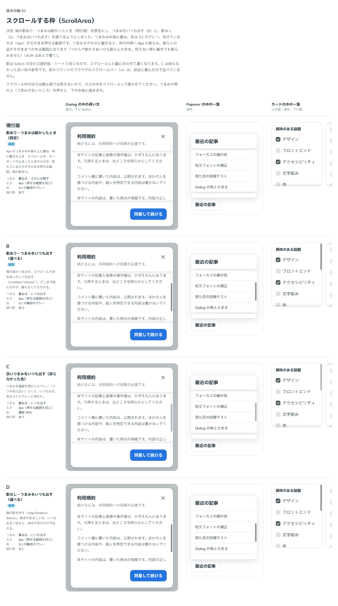

# 0119. スクロールする枠（ScrollArea）

- ステータス: Accepted
- 日付: 2026-09-18
- ラウンド: 後半 軸93

## 背景

Base UI の ScrollArea を土台に、決まった大きさの枠の中で中身をスクロールさせる部品を作ります。続きがあることは、上下の端に内側の影を落として見せます（原則1）。この影は Select の浮かぶ選択肢やシートと同じ仕組み（`useMoreCues`・`SheetMoreCue`）を使い、横方向は `use-inline-cues.ts` で同じ考え方を左右に広げています。あわせて、つまみ（スクロールバー）をいつ・どこに・どの大きさで出すかを決めます。

## 候補

ラウンド 1 の候補です。

| 案     | 内容                                                               |
| ------ | ------------------------------------------------------------------ |
| 現行版 | 細いつまみを中身の上に重ね、ふだんは隠す。載せると太くなる。影あり |
| A      | ブラウザ既定のスクロールバーを使う                                 |
| B      | つまみをいつも出す                                                 |
| C      | 淡いつまみをいつも出す                                             |
| D      | 影を出さず、つまみだけで続きを示す                                 |

## 決定

**影は既定で出し（`edgeShadow`）、つまみは載せたとき・スクロール中・キーボードで止まったときだけ出します（`scrollbar="scroll"`、既定）。影を出さない（`edgeShadow={false}`）ときは、つまみをいつも出します。** つまみの色は 3:1 のコントラストのグレーで、中身の上に重ねます。見た目の太さと押せる範囲は同じにします。ふだんは細く、**つまみそのもの**に載せると枠の内側へ太くなり、つかんでいるあいだも太いままです（見えていない帯の部分に載せても太くなりません）。帯（スクロールバーの土台）自体は押せず、押すと下の中身に届きます。隠れているあいだはつまみも押せません。カーソルは、載せたときはつかめる手、つかんでいるあいだは握った手にします。太くなる動きは動きを減らす設定では動かしません。

## 理由

ユーザーの返事の原文です。

> 93 影無しにした場合は常時つまみ表示、影ありにした場合はつまみ表示選択可（常時・動かしたとき）、デフォルトは影ありつまみ動かしたとき。色は3:1グレー、つまみは重ねるでOK。つまみの見た目と触れる領域は同じにしたいです。

- **影とつまみの出し方の組み合わせ**: 返事のとおり、影があるときはつまみの出し方を選べるようにし（既定は動かしたときだけ）、影がないときはつまみをいつも出す形にしました。影がないと続きがあることを伝える手段がつまみしかなくなるためです
- **色とコントラスト**: 「色は3:1グレー」の指定どおり、状態の色を持たないグレーで、地との比が 3:1 になる濃さにしました
- **つまみは重ねる**: 中身の幅を狭めないよう、帯を中身の上に重ねる形（「つまみは重ねるでOK」）にしました
- **見た目＝触れる範囲**: 「つまみの見た目と触れる領域は同じにしたいです」との指定どおり、帯そのものは押せなくし、見えているつまみの形だけを押せる範囲にしました

### つまみの太さのやり取り

ラウンド 2 で、いったんつまみを常に 6px の固定幅にしましたが、次の指摘を受けて載せたときに太くなる挙動を戻しました。

> カーソルを合わせたときに膨らむ挙動の通りに復活させてほしいです。

太さを 6px から 12px に広げたところ、次の指摘でふだんの太さと膨らんだ太さの組み合わせを見直しました。

> もともと 4px -> 8px に膨らむ じゃなかったでしたっけ

最終的に、ふだん 4px・載せたとき 8px に戻しました。あわせて、次の提案でカーソルの形も変えています。

> つまみに重なってる時、カーソルの形を変えるとかどうですかね？

## 却下した案と理由

- **A（ブラウザ既定のスクロールバー）**: 選ばれませんでした。影・つまみの見た目をそろえられず、OS やブラウザによって太さや色が変わってしまいます
- ラウンド 1 の B・C・D は、単独の案としては採用されていません。「影あり・動かしたときだけつまみ」を既定にしつつ、C・D 相当の「つまみをいつも出す」（`always`、影なしのとき）と「影なし・つまみだけ」（`edgeShadow={false}`）は、選べる形として残っています

## 影響

- `src/components/scroll-area/ScrollArea.tsx`: `edgeShadow`（既定 `true`）・`scrollbar`（`scroll`・`always`、既定 `scroll`）・`label`・`contentClassName`・`viewportRef` の props を持つ部品にしました
- 上下の端の内側の影は `src/internal/sheet/SheetMoreCue.tsx`・`useMoreCues` を共有し、左右は `src/components/scroll-area/use-inline-cues.ts` を新しく置きました。上下と左右で続きの濃さを計算する仕組み（スクロールした量の同じ範囲で濃さが最大になる計算）が重複しているため、横にも広げて internal にまとめるかを backlog に足しました
- キーボードでは、スクロールできるときだけ枠に Tab で止まり、矢印キーでスクロールできます。フォーカスの線は `focusRing` を使います
- backlog に、開いた Popover が横スクロールする親の外に隠れると置き場所を探し続ける Popover 側の問題と、つまみがマウスで狙いにくくないかを実機で確かめることを足しました
- `src/index.ts` に `ScrollArea`・`ScrollAreaProps`・`ScrollAreaScrollbar` を足しました

## 原則への反映

原則1 の文を書き換えました。「一覧が途中で切れるときは、上下の端に内側の影を落として、続きが下にあることを見せます」の直後に、「スクロールする枠のつまみは、ふだんは隠しておき、枠にカーソルを載せたときやスクロールしているときだけ出します。つまみそのものに載せると内側へ膨らみ、つかめることを見せます。内側の影を出さない枠では、続きを伝える手段がほかにないので、つまみをいつも出しておきます」を足しました。

## 比較画像

比較のストーリーは、決めた時点のコミット `8693e86` にあります（`git checkout 8693e86 && pnpm storybook`）。ただし、ラウンド 1 の A（ブラウザ既定のスクロールバー）と、ラウンド 1 の現行版（つまみが 6px だった時点のもの）は、8693e86 の時点ではすでに部品が変わっており再現できません。比較画像は、8693e86 のストーリーから撮りました。

