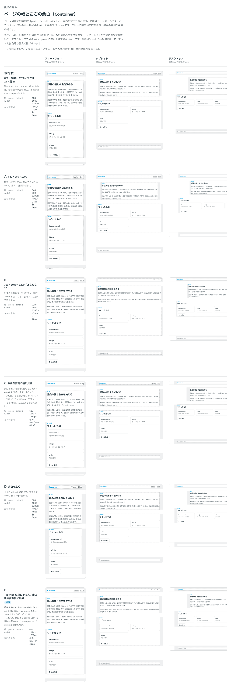

# 0120. ページの幅と左右の余白（Container）

- ステータス: Accepted
- 日付: 2026-09-18
- ラウンド: 後半 軸94

## 背景

本文の幅と左右の余白を決める Container を作ります。中身の幅の上限は、記事のような読みもの（prose）・カードの一覧や設定の画面（default）・表や画像を大きく並べる画面（wide）・上限なし（full）の 4 段です。左右の余白は、画面の端に部品が付かないための空きで、入力方式で変えるかどうかもあわせて決めます。

## 候補

ラウンド 1 の候補です。

| 案     | 幅（prose・default・wide） | 左右の余白                 |
| ------ | -------------------------- | -------------------------- |
| 現行版 | 680・1040・1280            | マウス 24px・指 16px       |
| A      | 640・960・1200             | 現行版と同じ               |
| B      | 720・1040・1280            | マウス・指とも 20px        |
| C      | 680・1040・1280            | 幅の 5%（16〜48px の範囲） |
| D      | 現行版と同じ               | マウス 40px・指 24px       |

ラウンド 2 で、次の案を追加しました。

| 案  | 幅                                                                                                 | 左右の余白                    |
| --- | -------------------------------------------------------------------------------------------------- | ----------------------------- |
| E   | 672・1024・1280（Tailwind の `max-w-2xl`・`5xl`・`7xl` と同じ値。prose は本文 16px で 1 行 42 字） | C と同じ（幅の 5%、16〜48px） |

## 決定

**E を採用します。** 幅は prose 672px・default 1024px・wide 1280px、上限なし（full）も選べます。左右の余白は画面の幅の 5%（16px〜48px の範囲）にし、入力方式（マウス・指）では変えません。

## 理由

ユーザーの返事の原文です。

> 94 サンプル story を作って、版を control で切り替えできる形にしてもらえますか？

比較用に、版を Storybook の control で切り替えられる見本のページを作りました。幅の候補を見比べたときの指摘です。

> 680, 1040, 1280 って結構半端な値ですかね？

この指摘を受けて、Tailwind の既定の幅の段（`max-w-2xl`・`max-w-5xl`・`max-w-7xl`）に合わせた E を追加しました。

> うん、その値で見本のページに足して

> 今は E で行きましょう！

- **E を選んだ理由**: 現行版・A・B・C はどれも @kazuemon/ui 独自の値でしたが、E は Tailwind の既定の幅の段と一致する値です。値の半端さがなくなり、prose も本文の文字の大きさでちょうど 1 行 42 字になりました
- **余白は幅の割合**: C・D では、マウス・指で変える案（D）と、画面の幅の割合にする案（C）を比べました。左右の余白は指で押すものではなく、画面の端に部品が付かないための空きなので、押しやすさを基準にする入力方式ではなく、画面の幅で決める C・E の考え方を採りました

## 却下した案と理由

- **A（640・960・1200）**・**B（720・1040・1280、余白は一律 20px）**: 選ばれませんでした。E のように既存の尺度と一致する値ではありませんでした
- **D（余白をマウス 40px・指 24px にする）**: 選ばれませんでした。左右の余白は押すものではないため、入力方式で変える理由がないと判断しました（原則11 に関わる決定です）

## 影響

- `src/components/container/Container.tsx`: `size`（`prose`・`default`・`wide`・`full`、既定 `default`）・`render` の props を持つ部品にしました。幅は左右の余白を除いた中身の幅の上限で持ちます
- 中に `--container-gutter`・`--container-width` を渡します。これは、画像を余白の外へはみ出させる Bleed を将来作るときの手がかりです。`--container-gutter` は `%` を含む値なので、読む要素の親の幅を基準に解決される点に注意が必要です。Bleed 自体は作っておらず、backlog に足しました
- `src/index.ts` に `Container`・`ContainerProps`・`ContainerSize` を足しました

## 原則への反映

原則11 の文を書き換えました。「部品の高さと余白は、入力方式によらず同じです」の直後に、「ページを囲む左右の余白は、押すものではありません。指で操作しているかどうかではなく、画面の幅で決めます。部品の大きさとは決まる理由が違うので、分けて考えます」を足しました。

## 比較画像

比較のストーリーは、決めた時点のコミット `8693e86` にあります（`git checkout 8693e86 && pnpm storybook`）。ただし、採用した案（E）はコミットする前にトークンへ畳み込んでおり、8693e86 の時点のストーリーでは候補を再現できません。比較画像は、E をトークンへ畳む前の状態から、軸94 の候補を撮りました。

