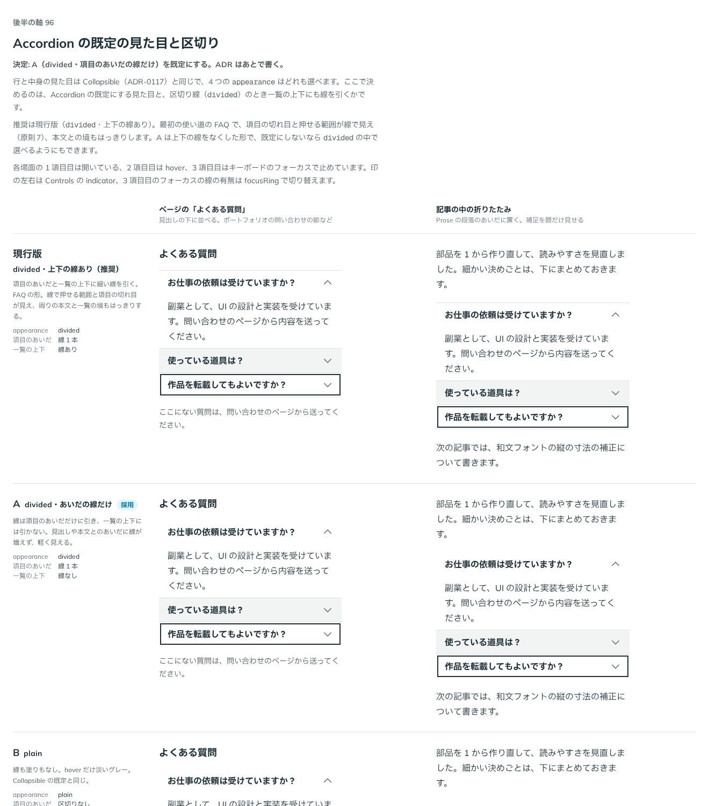

# 0122. Accordion の既定の見た目と、項目のあいだ・一覧の上下の区切り

- ステータス: Accepted
- 日付: 2026-09-19
- ラウンド: 後半 軸96

## 背景

押して中身を開閉する項目を束ねた一覧（Accordion）を作ります。行と中身の見た目、開閉の 4 つの `appearance`（`plain`・`open-filled`・`filled`・`divided`）は [ADR-0117](./0117-collapsible.md) の Collapsible のままです。Accordion で決めるのは、既定にする `appearance` と、`divided` のときに項目のあいだだけでなく一覧の上下にも線を引くかどうかです。あわせて、同時にいくつ開けるか（`multiple`）と、題を包む見出しの段（`headingLevel`）の既定も決めます。

## 候補

| 案     | 内容                                                    |
| ------ | ------------------------------------------------------- |
| 現行版 | `divided`・項目のあいだと一覧の上下に線を引く。FAQ の形 |
| A      | `divided`・線は項目のあいだだけ。一覧の上下には引かない |
| B      | `plain`。線も塗りもなく、hover だけ淡いグレー           |
| C      | `open-filled`。開いている項目だけグレーで塗る           |
| D      | `filled`。いつもグレーで塗り、項目のあいだを少し離す    |

## 決定

**A（`divided`・項目のあいだの線だけ）を既定にします。** 一覧の上下には線を引きません。見出しや本文とのあいだに線が増えず、軽く見えるためです。ほかの 3 つの見た目（現行版・B・C・D）も、`appearance` の値としてどれも選べます。あわせて、`multiple` の既定は `false`（1 つ開くとほかは閉じる）にし、`headingLevel`（題を包む見出しの段）の既定は `3` にして、使う側が変えられるようにします。

## 理由

ユーザーの返事の原文です。

> 96は A デフォルトでお願いします

> 1: 1つのみデフォルト、何個でもも選択可

> 2: h3 既定、変更可

- **既定は A**: 返事のとおり A を既定にしました。一覧の上下の線をなくしたトークン（`--accordion-edge-width` 相当の切り替え）は、決めたので部品に畳んで消し、`first:border-t-0 last:border-b-0` に書き換えました
- **multiple の既定**: 「1つのみデフォルト、何個でもも選択可」のとおり、既定は 1 つだけ開く形にし、`multiple` で複数開けるようにしました
- **headingLevel の既定**: 「h3 既定、変更可」のとおり、既定を `h3` にし、ページの見出しの並びに合わせて `headingLevel` で変えられるようにしました

## 却下した案と理由

- **現行版（一覧の上下にも線）**: 既定としては選ばれませんでした。見出しや本文とのあいだに線が増え、A より重く見えます。`appearance="divided"` に一覧の上下の線を足す形自体は廃止し、比較のストーリーでは現行版の行を `className` で線を描き戻して見た目を再現しています
- **B（plain）・C（open-filled）・D（filled）**: 既定としては選ばれませんでした。どれも `appearance` の値として引き続き選べます

## 影響

- `src/components/accordion/Accordion.tsx`・`AccordionItem`: `appearance`（既定 `divided`）・`indicator`（既定 `end`）・`multiple`（既定 `false`）・`value`・`defaultValue`・`onValueChange`・`disabled`・`hiddenUntilFound`・`keepMounted`・`headingLevel`（既定 `3`）の props を持つ部品にしました。行・印・中身の見た目は Collapsible のクラス列（`src/internal/collapsible-styles.ts`。ADR-0117 で `src/components/collapsible/` から移しました）を共有します
- 一覧の上下の線を切り替えるためだけのトークンは作らず、`divided` の項目の `first:border-t-0 last:border-b-0` で表しました
- `src/index.ts` に `Accordion`・`AccordionItem`・`AccordionProps`・`AccordionItemProps`・`AccordionAppearance`・`AccordionIndicator` を足しました
- backlog に足す未決事項: 入れ子の Accordion（Accordion の中に Accordion）は確かめていません。フォームを送っているあいだ、開閉を止める仕組み（`useFormSubmittingLock` 相当）はまだありません

## 原則への反映

反映なし。見た目そのものは [ADR-0117](./0117-collapsible.md) の範囲内で、既定の選び方だけを決めたものです。

## 比較画像

比較のストーリーは、決めた時点のコミット `2f37f7f` にあります（`git checkout 2f37f7f && pnpm storybook`）。

